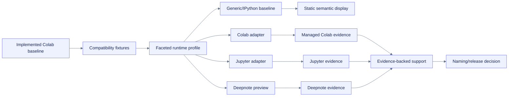

# Map of content: generalize the notebook runtime observer

**Path:** `docs/maps/generalize-notebook-runtime-observer-moc.md`  
**Purpose:** Provide progressive navigation across the baseline dependency, follow-on OpenSpec, research, architecture, tasks, validation, and handoff artifacts.  
**Status:** Active  
**Load/use when:** Orienting to the notebook-runtime generalization plan or selecting the minimum next context.

## Lifecycle boundary

- Current implemented baseline: [[openspec/changes/build-colab-observer/proposal|build-colab-observer proposal]] and [[docs/planning/build-colab-observer/finalization-report|baseline finalization report]]
- Proposed follow-on: [[openspec/changes/generalize-notebook-runtime-observer/proposal|generalization proposal]]
- No product implementation occurred in the planning pass.

## OpenSpec

- [[openspec/changes/generalize-notebook-runtime-observer/proposal|Proposal]]
- [[openspec/changes/generalize-notebook-runtime-observer/design|Design]]
- [[openspec/changes/generalize-notebook-runtime-observer/tasks|Tasks]]
- [[openspec/changes/generalize-notebook-runtime-observer/change-pack.json|Machine change pack]]
- Delta specs:
  - [[openspec/changes/generalize-notebook-runtime-observer/specs/runtime-profiles/spec|Runtime profiles]]
  - [[openspec/changes/generalize-notebook-runtime-observer/specs/measurement-scope/spec|Measurement scope]]
  - [[openspec/changes/generalize-notebook-runtime-observer/specs/platform-adapters/spec|Platform adapters]]
  - [[openspec/changes/generalize-notebook-runtime-observer/specs/storage-profiles/spec|Storage profiles]]
  - [[openspec/changes/generalize-notebook-runtime-observer/specs/notebook-display/spec|Notebook display]]
  - [[openspec/changes/generalize-notebook-runtime-observer/specs/compatibility-support/spec|Compatibility support]]
  - [[openspec/changes/generalize-notebook-runtime-observer/specs/platform-diagnostics/spec|Platform diagnostics]]
  - [[openspec/changes/generalize-notebook-runtime-observer/specs/migration-compatibility/spec|Migration compatibility]]
  - [[openspec/changes/generalize-notebook-runtime-observer/specs/security-policy/spec|Security policy]]

## Product and evidence

- [[docs/planning/generalize-notebook-runtime-observer/README|Planning brief]]
- [[docs/planning/generalize-notebook-runtime-observer/product-brief|Product brief]]
- [[docs/planning/generalize-notebook-runtime-observer/context-map|Context map]]
- [[docs/planning/generalize-notebook-runtime-observer/source-registry|Source registry]]
- [[docs/planning/generalize-notebook-runtime-observer/research|Research brief]]
- [[docs/planning/generalize-notebook-runtime-observer/requirements-map|Requirements map]]
- [[docs/planning/generalize-notebook-runtime-observer/openspec-grounding|OpenSpec grounding]]

## Architecture and decisions

- [[docs/planning/generalize-notebook-runtime-observer/architecture|Architecture]]
- [[docs/planning/generalize-notebook-runtime-observer/runtime-profile-model|Runtime profile model]]
- [[docs/planning/generalize-notebook-runtime-observer/platform-adapter-contract|Platform adapter contract]]
- [[docs/planning/generalize-notebook-runtime-observer/measurement-scope|Measurement scope]]
- [[docs/planning/generalize-notebook-runtime-observer/storage-profiles|Storage profiles]]
- [[docs/planning/generalize-notebook-runtime-observer/display-transport|Display transport]]
- [[docs/planning/generalize-notebook-runtime-observer/platform-diagnostics|Platform diagnostics]]
- [[docs/planning/generalize-notebook-runtime-observer/jupyter-server-extension-boundary|Jupyter Server boundary]]
- [[docs/planning/generalize-notebook-runtime-observer/decision-log|Decision log and ADRs]]
- [[docs/planning/generalize-notebook-runtime-observer/diagram-index|Diagram index]]
- [[docs/planning/generalize-notebook-runtime-observer/naming-packaging-strategy|Naming and packaging]]

## Implementation and validation

- [[docs/planning/generalize-notebook-runtime-observer/implementation-plan|Implementation plan]]
- [[docs/planning/generalize-notebook-runtime-observer/task-graph|Task graph]]
- [[docs/planning/generalize-notebook-runtime-observer/task-graph.json|Machine task graph]]
- [[docs/planning/generalize-notebook-runtime-observer/traceability-matrix|Traceability matrix]]
- [[docs/planning/generalize-notebook-runtime-observer/platform-support-matrix|Platform support matrix]]
- [[docs/planning/generalize-notebook-runtime-observer/compatibility-migration|Compatibility and migration]]
- [[docs/planning/generalize-notebook-runtime-observer/risk-register|Risk register]]
- [[docs/planning/generalize-notebook-runtime-observer/validation|Validation]]
- [[docs/planning/generalize-notebook-runtime-observer/validation-evidence.json|Machine validation evidence]]

## Execution and handoff

- [[docs/planning/generalize-notebook-runtime-observer/grill-me|/grill-me log]]
- [[docs/planning/generalize-notebook-runtime-observer/PLANS|PLANS]]
- [[docs/planning/generalize-notebook-runtime-observer/outer-loop|Outer loop]]
- [[docs/planning/generalize-notebook-runtime-observer/goal|Goal contract]]
- [[docs/planning/generalize-notebook-runtime-observer/goal-prompts|Goal prompts]]
- [[docs/planning/generalize-notebook-runtime-observer/codex-handoff|Codex handoff]]
- [[docs/planning/generalize-notebook-runtime-observer/codex-tooling|Codex tooling proposal]]
- [[docs/planning/generalize-notebook-runtime-observer/qa-checklist|QA checklist]]
- [[docs/planning/generalize-notebook-runtime-observer/finalization-report|Planning finalization report]]

## Architecture flow

## Identity
- [[openspec/changes/generalize-notebook-runtime-observer/specs/package-identity/spec|Identity and packaging]]
