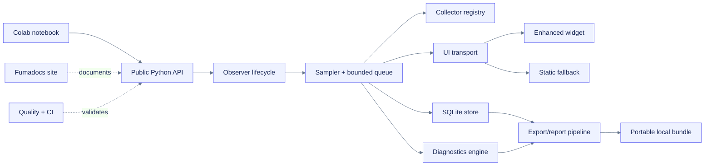
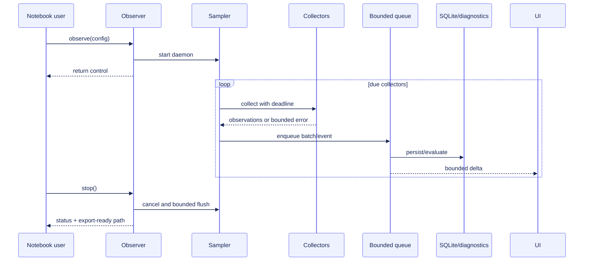
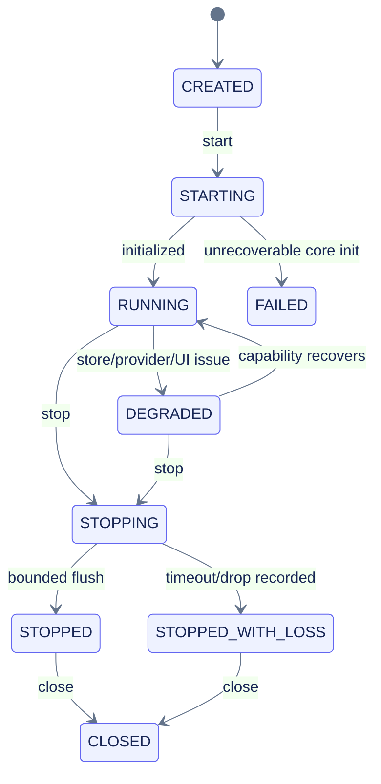
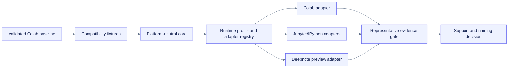

# Architecture deep dive

## System boundary



## Layer responsibilities

| Layer | Owns | Does not own |
|---|---|---|
| Public API/config | Stable ergonomics, validation, lifecycle entry points | Collector/provider details |
| Observer/sampler | Run state, timing, scheduling, backpressure, shutdown | Metric-specific parsing |
| Collectors | Capability probe and bounded observation | Persistence, diagnostics, rendering |
| Store/query | Durable normalized data and history queries | Diagnostic interpretation |
| Diagnostics | Deterministic finding state and evidence | Automatic remediation |
| UI transport | Versioned bounded snapshots/deltas/control messages | Raw unbounded history |
| Dashboard/fallback | Presentation, exploration, accessibility | Source-of-truth persistence |
| Reports/export | Redaction, summaries, formats, bundle integrity | Runtime allocation or uploads |
| Docs/CI | Adoption and verification | Product runtime execution |

## Data flow and failure containment



Failure principles:

- Collector failure becomes capability/event state.
- Store failure degrades to a bounded in-memory buffer and critical warning.
- Widget failure does not affect sampling/storage.
- Diagnostics failure does not discard raw observations.
- Report failure yields a partial bundle, not a false success.
- Shutdown timeout records dropped/pending work count.

## Internal interface sketch

```python
class Collector(Protocol):
    descriptor: CollectorDescriptor
    def probe(self, context: RuntimeContext) -> CapabilityStatus: ...
    def collect(self, context: CollectionContext) -> CollectionResult: ...
    def close(self) -> None: ...

class ObservationStore(Protocol):
    def append(self, batch: ObservationBatch) -> None: ...
    def query(self, request: QueryRequest) -> QueryResult: ...
    def close(self) -> None: ...
```

These are design sketches, not behavior specs. Public compatibility applies only to documented package APIs and exported schemas.

## Dependency posture

### Core

- Python standard library for threading, time, sqlite, JSON, CSV, zip, hashing, paths, and subprocess.
- `psutil` for system/process counters.

### Optional extras

| Extra | Candidate contents | Boundary |
|---|---|---|
| `gpu` | official NVIDIA Python binding | No GPU requirement for core install |
| `ui` | widget transport dependencies | Static fallback remains core-compatible |
| `duckdb` | DuckDB export/query | SQLite remains default store |
| `integrations` | W&B/MLflow/Aim/DVCLive adapters | Explicit outbound configuration |
| `dev` | tests, quality, notebooks | Not shipped as runtime requirements |

Framework collectors should not add PyTorch/TensorFlow/JAX as package dependencies.

## Runtime states



## Evolution boundaries

- Version observation, diagnostic, UI-message, and bundle schemas separately.
- Preserve migration/read compatibility for supported exported schemas.
- Add collectors through registry interfaces, not conditionals in the sampler.
- Add integrations as explicit sinks/exporters, not hidden hooks in core.
- Keep dashboard source private to the repository and compiled assets in the wheel.
- Do not accept a plugin architecture until multiple concrete external collectors justify it.

## Generalization seam and ownership

The current architecture already separates most platform-neutral behavior from Colab-specific concerns. The follow-on change [`generalize-notebook-runtime-observer`](../../../openspec/changes/generalize-notebook-runtime-observer/proposal.md) formalizes that seam without rewriting the baseline.

| Baseline responsibility | Follow-on treatment | Compatibility rule |
|---|---|---|
| Observer lifecycle, sampler, stores, diagnostics, exports | Remain platform-neutral core | No public API/default regression |
| CPU, memory, disk, network, process, GPU, framework collectors | Remain generic providers with explicit evidence scope | Missing or malformed evidence stays unavailable |
| `/content`, mounted Drive, TPU presence, Colab warnings | Move behind a Colab runtime adapter | Colab behavior remains the flagship compatibility fixture |
| Static text/HTML/SVG/table display | Becomes the universal notebook baseline | Works even when no enhanced transport is available |
| Experimental direct comm | Remains Colab-specific and non-default | No promotion without managed-Colab lifecycle evidence |
| Platform identity, scope, storage, transport capability | Added as versioned profile facets | Never infer server/host scope from kernel-local evidence |



The detailed runtime-profile, scope, storage, display, migration, and validation contracts live under `docs/planning/generalize-notebook-runtime-observer/` and the corresponding follow-on OpenSpec change.
