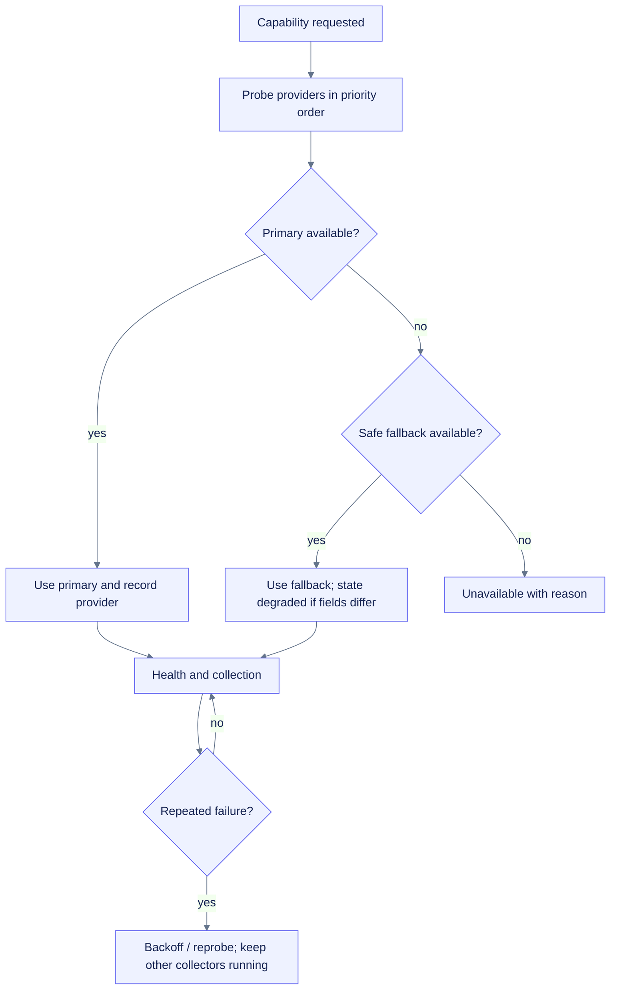

# Collector design

## Contract

Each collector is independently probeable, scheduled, closable, and failure-isolated. A collector returns observations plus structured notices; it never writes to storage or UI directly.

| Contract element | Purpose |
|---|---|
| Descriptor | Stable ID, metrics, cadence, cost class, privacy class |
| Probe | available/degraded/unavailable with provider/reason |
| Collect | bounded result using supplied deadline/context |
| Close | release provider handles without blocking indefinitely |
| Health | last success/error/duration, consecutive failures |

## Core collector table

| Collector | Source | Key observations | Cadence | Important edge cases |
|---|---|---|---:|---|
| Runtime | stdlib/platform | Python, OS/kernel, Colab detection, uptime, safe accelerator inventory | once | Avoid identity/secrets/package dump |
| CPU | psutil | total/per-core utilization, load, logical/physical count | 2 s | First percent sample warm-up; cgroup semantics |
| Memory | psutil | total/available/used, swap, self RSS/USS where supported | 2 s | USS permissions/platform support |
| Disk capacity | psutil/shutil | `/content`, `/tmp`, configured roots, mounted output | 2–10 s | Disappearing mounts, path permissions |
| Disk I/O | psutil | read/write counters and derived rates | 10 s | Counter resets, device aggregation |
| Network | psutil | sent/received counters/rates | 2 s | Interface changes, reset/wrap |
| Process | psutil | self and top-N CPU/RSS/I/O/name | 10 s | Process exit race, access denied, privacy |
| GPU NVML | NVIDIA binding | utilization, VRAM, temp, power, processes | 2 s | driver/provider mismatch, MIG, unsupported fields |
| GPU fallback | `nvidia-smi` | strict selected fields | 2–5 s | timeout, malformed CSV, executable absent |
| PyTorch | lazy framework | allocated/reserved/device metadata | 2 s | framework absent, CUDA unavailable, multiple devices |
| TensorFlow | lazy framework | visible devices and safe memory info if available | 5 s | initialization side effects; avoid forced import where possible |
| JAX | lazy framework | device inventory and supported stats | 5 s | backend initialization, unavailable stats |
| TPU | environment/framework | detection/topology/device metadata | once/refresh | utilization often unavailable |

## Provider selection

## Deadlines and failure policy

- Each collection receives a deadline derived from cadence and global budget.
- Timeouts and exceptions become bounded events with code, provider, and safe details.
- Consecutive failures trigger backoff and optional reprobe, not tight retries.
- A collector cannot enqueue unbounded rows.
- Expensive provider discovery runs at initialization or explicit refresh, not every sample.
- Fallback provider switch is recorded as an event and capability metadata change.

## Privacy classification

| Class | Examples | Default |
|---|---|---|
| Safe operational | CPU %, bytes, temperature, device index | On |
| Potential identity | hostname, username, PID, process name | Minimized/bounded |
| Sensitive context | command line, environment names/values, full paths, package inventory | Off/opt-in |
| Prohibited | notebook source, file contents, secrets/tokens | Never collected by built-ins |

## Test strategy

1. Fake provider unit tests for every supported/unavailable/partial field.
2. Counter reset and time-gap tests.
3. Permissions/process-exit race tests.
4. Timeout and oversized-output tests for subprocess providers.
5. Multi-device and MIG-shaped fixture tests without claiming unsupported semantics.
6. Hardware-gated smoke checks that assert provider and quality, not exact utilization values.
7. Performance tests for collector duration and observer self-overhead.

## Hardened implementation evidence

The local implementation now proves the provider-contract edge cases below. These are local/fake-provider tests, not representative Colab hardware claims.

| Surface | Implemented behavior | Evidence |
|---|---|---|
| Counter rates | First sample unavailable; reset/wrap and non-monotonic time produce bounded events and preserve a safe baseline | `collectors/counters.py`, `test_collector_hardening_extended.py` |
| Disk/network | Raw totals plus derived rates; missing/invalid/unavailable states remain explicit | collector hardening tests |
| Process | Process-exit and permission failures are skipped and counted; own CPU failure is unavailable, not zero | process tests |
| Memory | RSS/USS failures are bounded; RSS growth uses monotonic time and does not replace its baseline after bad time | memory tests |
| Mounted Drive | Read-only presence, capacity, and metadata-latency evidence; no mount/auth/write/API action | Drive fixtures for mounted, unmounted, slow, and permission-denied paths |
| TPU | Presence signal is reported separately from utilization; utilization remains unavailable even when presence is detected | TPU provider tests |
| NVIDIA | Per-field validation preserves valid fields, rejects impossible values, bounds subprocess output, and suppresses raw stderr | NVML and `nvidia-smi` provider tests |
| Collector health | Consecutive failure count is emitted per collector and can drive degraded-telemetry diagnostics | sampler tests |
