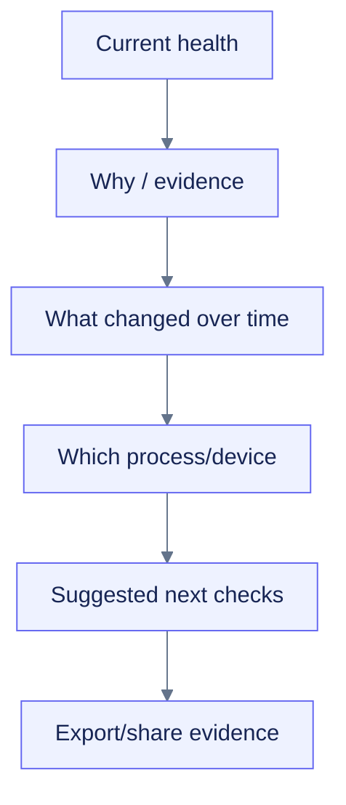

# Dashboard UX and visual design

## Design thesis

Create a **technical observatory**, not a generic admin dashboard: high-information density, calm hierarchy, precise units, clear freshness, and restrained motion. The visual personality should feel modern and crafted through typography, spacing, layered surfaces, subtle depth, high-quality microcharts, and purposeful interaction rather than neon “GPU hacker” decoration.

The dashboard is an instrument panel. It must make the current answer obvious, preserve access to exact evidence, and stay useful in a narrow Colab output cell.

## Experience hierarchy



## Information architecture

| View | Purpose | Primary content |
|---|---|---|
| Overview | Answer “is the runtime healthy?” | uptime, sampler health, CPU/RAM/disk/network, GPU/VRAM, active findings |
| Accelerator | Understand device use | utilization, VRAM, temperature, power, devices/processes, framework memory |
| Memory | Understand host/process pressure | RAM/swap, self memory, top processes, growth evidence |
| Storage & I/O | Understand local/Drive capacity and throughput | capacity, read/write rates, latency evidence, checkpoint growth |
| Processes | Identify resource owners | accessible sortable/filterable bounded table |
| Diagnostics | Explain active/resolved findings | severity, confidence, duration, evidence, limitations, suggestions |
| Events | Reconstruct run changes | capability/provider changes, lag, errors, user markers |
| Reports | Export and inspect privacy | artifact selection, time range, redaction status, progress/result |

## Shell layout

```text
┌───────────────────────────────────────────────────────────────────┐
│ colab-observer · my-run       RUNNING  01:42:18   Pause   Export │
├───────────────────────────────────────────────────────────────────┤
│ Status rail: 1 warning · GPU NVML · samples fresh · DB healthy    │
├─────────────┬─────────────┬─────────────┬─────────────┬───────────┤
│ CPU 87%     │ RAM 74%     │ GPU 8%      │ VRAM 61%    │ Disk 42%  │
│ ▁▂▄▆▇       │ ▁▂▃▄▅       │ ▂▁▂▁▁       │ ▃▄▅▅▅       │ ▁▁▂▂▃     │
├───────────────────────────────────────┬───────────────────────────┤
│ Selected time-series / table toggle   │ Active diagnostic         │
│                                       │ “Likely input bottleneck” │
├───────────────────────────────────────┴───────────────────────────┤
│ Tabs: Overview · Accelerator · Memory · Storage · Processes · …   │
└───────────────────────────────────────────────────────────────────┘
```

This ASCII sketch describes hierarchy only. Semantic structure and responsive reflow are authoritative.

## Visual system

### Foundation

- Neutral canvas and clear surface elevation, with one restrained product accent.
- Tabular or highly legible numeric typography for changing values, with explicit units.
- Minimum useful card chrome; avoid repeated giant labels and empty padding.
- Severity tokens combine text, icon, border/shape, and color.
- Series use color plus line style/marker/pattern identity.
- Charts use SVG and a non-animated default when reduced motion is requested.
- Dark and light themes derive from semantic tokens; high contrast is a first-class token set, not a filter.

### Density modes

- `comfortable`: default Colab output.
- `compact`: more rows/series for large screens.
- Browser zoom and reflow remain supported; no user setting can shrink targets or text below accessibility minima.

## Component inventory

| Component | Required states | Accessibility contract |
|---|---|---|
| Runtime header | starting/running/degraded/stopping/stopped | status text plus icon; no color-only state |
| Metric card | loading/fresh/stale/unavailable/estimated | programmatic label, value, unit, freshness, status |
| Sparkline | valid/gap/stale | textual trend and table path; decorative details hidden |
| Main chart | loading/empty/gaps/error | title, summary, selected range, table, keyboard controls |
| Diagnostic chip/card | active/acknowledged/suppressed/resolved | full severity word, confidence, duration, details button |
| Process table | loading/empty/partial | semantic table, sortable headers, focusable pagination/filter |
| Event timeline | normal/warning/error | list semantics, timestamp, component, concise code/message |
| Export drawer | estimating/writing/partial/success/failure | focus management, progress text, result path, recovery action |
| Capability banner | disabled/degraded/unavailable | reason, effect, docs path, no dismiss-only information loss |

## Interaction rules

- One primary action per view; no hidden critical action in overflow menus.
- “Pause live view” freezes presentation and announcements, not collection; copy explicitly states this.
- Range presets and custom range are keyboard-operable; selected range is always visible in text.
- Series toggles preserve at least one visible series and are represented as checkboxes or equivalent.
- Tooltips supplement focusable exact-value inspection and tables; they never contain unique information.
- Drilldowns open in an in-flow panel or accessible dialog with focus return.
- Export returns concrete paths and allows “copy path” rather than implying browser download semantics that may vary in Colab.
- Refresh/reconnect recovers by sequence snapshot without duplicating findings or data.

## Live-data behavior

| Situation | UI behavior |
|---|---|
| First sample pending | Skeleton plus plain-language initialization status; no fake zero values |
| Metric unavailable | Em dash/“Unavailable,” source/reason, and capability help |
| Stale | Last value optionally retained with age and stale label |
| Gap | Visible gap in chart and missing row state, not interpolation by default |
| Queue lag | Global sampler-health warning and evidence |
| UI disconnected | Collection-status distinction, reconnect/fallback action |
| Run stopped | Frozen final state and export prominence |

## Responsive design

- Below wide-dashboard breakpoints, metric cards become a two-column then one-column summary.
- Diagnostics follow overview, not side-by-side with unreadably small charts.
- Tables remain in a contained scroll region only when columns cannot reflow; key columns stay visible and a card-list alternative may be offered.
- Navigation uses a horizontally scrollable, keyboard-accessible tab list only if all tabs remain discoverable; otherwise use a select/menu with proper semantics.
- No control depends on hover or precise drag.

## Performance budgets to validate

These are spike targets, not yet contractual release guarantees:

- Initial static status under 500 ms after Python-side data is ready.
- Enhanced UI interactive under 1.5 s on a representative Colab runtime after assets load.
- Bounded live payload, no full-history resend per sample.
- Frontend ring buffer and rendered point count capped by selected range/downsampling.
- Live updates do not cause unbounded DOM growth.
- Paused view causes no animation or repeated accessibility announcements.

## Rendered-proof matrix

| Proof | Required |
|---|---|
| CPU-only data, NVIDIA data, partial/unavailable data | Yes |
| starting/running/degraded/stopped states | Yes |
| narrow Colab output, wide screen, 200% zoom | Yes |
| light/dark/high-contrast and reduced-motion | Yes |
| keyboard-only complete path | Yes |
| screen-reader overview and diagnostic drilldown | Yes |
| no-widget static fallback | Yes |
| long run and high point/process counts | Yes |
| malicious/markup-like process and diagnostic text | Yes |

## Avoided patterns

- Gauge walls that make comparison difficult.
- Rainbow series without semantic purpose.
- Auto-rotating panels, continuous pulse/glow, or animated numbers.
- Canvas-only charts with no table.
- Huge cards for every scalar while hiding history.
- Red/yellow/green as the sole health language.
- “Optimize now” controls that mutate workload state.
