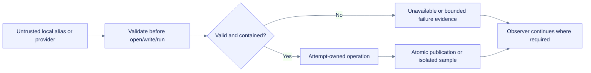

# Final-assurance hardening: filesystem aliases, bounded providers, and collector resilience

**Path:** `docs/planning/build-colab-observer/final-assurance-hardening-20260716.md`  
**Purpose:** Record the material local defects found and repaired in the 2026-07-16 final-assurance pass.  
**Evidence root:** `/mnt/data/colab-observer-final-assurance-evidence-20260716`  
**Decision:** Local product slice `final-with-known-risks`; overall OpenSpec change `one-more-material-loop`.

## Session-start `/grill-me` result

The declared workspace was partial, but the supplied source ZIP matched its expected SHA-256 and reconstructed the complete 312-file baseline. No user question was needed because repository, bundle, and runtime evidence established the safe default: preserve the product hierarchy, perform only local read/write validation, and stop before installs, network resolution, Git/release/deploy actions, or unsupported platform claims.

## Material defects and repairs

| Finding | Before repair | Repair | Regression evidence |
|---|---|---|---|
| Deterministic bundle partial followed a pre-existing symlink | Export could overwrite an unrelated file outside the selected root | Publish through an attempt-owned unique same-directory temporary file, flush/fsync, then `os.replace`; clean only owned temps | `bundle-partial-symlink-before.log`, `bundle-partial-symlink-after.log` |
| Generated per-run export directory could be a symlink | Reports/tabular output could escape the chosen export root | Central generated-directory preparation rejects symlink/non-directory collisions and resolved-parent escape | `nested-run-directory-symlink-before.log`, `nested-run-directory-symlink-after.log` |
| SQLite main or sidecar path could alias another file | Starting the observer could mutate an unrelated SQLite database | Reject symlinks, non-regular files, hard-link aliases, and unsafe sidecars on read/write/backup paths | `sqlite-main-symlink-before.log`, `sqlite-main-symlink-after.log`, SQLite containment tests |
| `nvidia-smi` provider buffered all output before enforcing a parser limit | A hostile or broken executable could consume unbounded memory or stderr buffers | Timeout-aware streaming stdout reader kills at the configured cap and discards untrusted stderr | optional-provider executable fixtures |
| Missing or impossible CPU evidence could become an exact zero or invalid percentage | Unknown capacity/use could appear measured | Emit explicit unavailable observations for unknown/non-positive counts and non-finite/out-of-range percentages | collector boundary regressions |
| Built-in collector construction could abort registry creation | One optional or broken provider could prevent unrelated CPU-only monitoring | Isolate each constructor/probe and emit a bounded unavailable capability state | registry failure-isolation tests |
| Colab/NVML module discovery could raise on malformed import metadata | Runtime inventory or optional GPU selection could fail fatally | Bounded module-discovery helper treats metadata exceptions as unavailable and prioritizes explicit runtime markers | runtime/NVML malformed-spec regressions |
| Disk/network counters could emit non-finite evidence | Downstream rates and reports could preserve invalid values | Validate counters before rate calculation and emit unavailable state for missing/non-finite evidence | counter boundary regressions |

## Observable behavior added to OpenSpec

The behavior specs now require:

- Provider-invalid values to remain unavailable rather than fabricated.
- Collector construction/probe failures to remain isolated.
- Generated export directories and attempt-local publication paths to resist pre-existing aliases.
- SQLite main and sidecar paths to remain contained under the selected local persistence boundary.

The active change now contains **73 requirements and 82 scenarios**. Implementation mechanics remain in design/tasks/source, not in behavior specs.

## Local validation

| Surface | Result |
|---|---:|
| Repository gate | 235 tests pass with `ResourceWarning` promoted to failure |
| Combined line-and-branch coverage | 87.3213%, gate 85% |
| TypeScript/Node protocol | 9/9 pass |
| Chromium | 21/21 pass; zero remote requests, page errors, or dialogs |
| Local Jupyter | 10/10; 950 observations; zero drops |
| Lifecycle/export smoke | 2,198 observations; zero drops; 17 entries; 16 verified checksums |
| Default two-second benchmark | 415 observations; zero drops; 2.0885% one-core signal |
| Thirty-second soak | 15,439 observations; zero drops; bounded history; clean SQLite source/backup checks |
| PyTorch / JAX | Local CPU pass |
| TensorFlow | Absent and truthfully skipped |
| Managed-Colab harness | Fails closed outside Colab; explicit local mode is non-representative |

## Evidence boundary

These repairs prove local Linux/Python 3.13.5 behavior only. They do not establish managed Colab, NVIDIA hardware, TPU, mounted Drive, Python 3.11/3.12 execution, reviewed dependency locks, manual assistive-technology conformance, publication, or deployment readiness.

## Hardening flow

