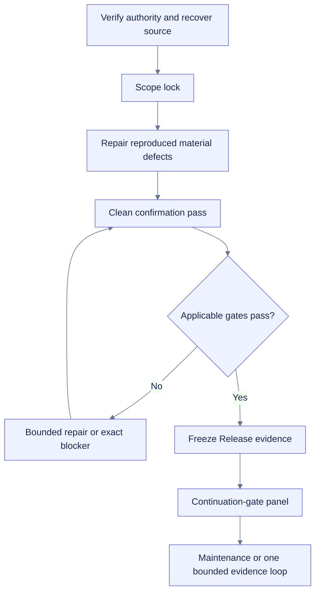

# Finalization report: runtime-evidence hardening

## Finalization decision

| Field | Value |
|---|---|
| Local product slice | `final-with-known-risks` |
| Overall OpenSpec change | `one-more-material-loop` |
| Planning layer | `final-assured maintenance` after artifact freeze |
| Direct comm | Experimental, explicit, non-default, not promoted |
| Publication/deployment | Not performed; separately approval-gated |

The loop repaired reproduced product defects and exhausted the locally substitutable work available under the no-install/no-network boundary. Representative runtime, compatibility, accessibility, lock/toolchain, and public-release evidence remain real blockers rather than inferred gaps.

## Material findings and repairs

1. Terminal/fatal observers accepted controls that could not drain. Repaired by active/healthy lifecycle checks.
2. Fatal sampler state could appear running until stop. Repaired with immediate failed/non-running status and loss-aware shutdown.
3. Global active-observer state could remain stale. Repaired with idempotent terminal cleanup.
4. Public flush deadlines accepted ambiguous values. Repaired with strict finite non-negative validation.
5. Writer close failure could escape daemon cleanup. Repaired with sanitized loss evidence.
6. Provider fields were too coercive/all-or-nothing. Repaired with strict field-level helpers and valid-sibling retention.
7. Per-core CPU and NVML device cardinality were provider-controlled. Repaired with explicit caps and bounded evidence.
8. Extreme export elapsed ranges could overflow. Repaired with pre-write datetime and SQLite-domain checks.

Detailed evidence: `runtime-evidence-hardening-20260725.md`.

## Scope preservation

The loop did not add a feature, dependency, hosted service, telemetry path, public endpoint, runtime CDN, automatic remediation, keepalive, anti-idle, reconnect automation, timeout bypass, quota circumvention, deployment, or publication workflow. Fumadocs, CI/CD, Vercel, and public identity remained downstream support or deferred human decisions.

## OpenSpec and task reconciliation

| Surface | State |
|---|---:|
| Domains | 11 |
| Requirements | 73 |
| Scenarios | 93 |
| Implementation tasks | 45 |
| ADRs | 9 |
| Task rollup | 17 complete / 24 partial / 4 blocked-deferred |

Seven scenarios were added to existing behavior requirements. No new requirement was created because the repairs refine existing lifecycle, collector, and export contracts.

## Validation summary

| Gate | Result |
|---|---|
| Hermetic repository gate | 249 tests pass |
| Combined line-and-branch coverage | 87.4176%, gate 85% |
| TypeScript/Node | 9/9 and no-emit pass |
| Local Chromium | 21/21, zero remote requests/errors/dialogs |
| Local Jupyter | 10/10, zero drops |
| Local smoke/default/stress/isolated soak | Pass, zero drops in recorded runs |
| PyTorch/JAX | Local CPU pass |
| TensorFlow | Truthfully skipped; absent |
| Managed-Colab harness | Fails closed outside Colab; local mode non-representative |
| Package/archive | Pass at release freeze; exact hashes remain in external audit/delivery evidence to avoid self-reference |

## Runtime and compatibility boundary

Only local Linux/Python 3.13.5, local Jupyter, local Chromium, and extracted-wheel evidence may be claimed after the final package gate. Managed Colab CPU/NVIDIA/TPU/Drive, Python 3.11/3.12 execution, direct-comm lifecycle, and manual assistive-technology evidence remain blocked.

## Known risks and exact unblockers

| Risk | Exact unblocker |
|---|---|
| Managed Colab behavior unknown | Run the passive harness and bounded soak in real CPU/NVIDIA/TPU/Drive sessions |
| Python 3.11/3.12 runtime unknown | Execute source and clean-wheel matrix under those interpreters |
| Dependency/toolchain review absent | Approve isolated online resolution, generate/review uv/pnpm locks, run Ruff/ty/pre-commit/docs build |
| Manual accessibility incomplete | Representative notebook browsers and assistive technologies |
| Direct comm unpromoted | Managed-Colab comm/iframe/network/loss evidence |
| Public identity/release undecided | Human owner/license/repository/namespace/support/release decisions |

## Finalization criteria

- [x] Reproduced local material defects have bounded repairs and regression tests.
- [x] OpenSpec remains behavior-level and maps to tasks/validation.
- [x] Local product and security gates pass.
- [x] Unsupported surfaces remain explicit.
- [x] Final manifest, distributions, source/validation/distribution ZIPs, and clean-extraction evidence are regenerated after the last source patch.
- [x] Exact delivery hashes are frozen in the external artifact audit and delivery manifest.

## Major-cycle finalization rule and source awareness

**Scope lock:** after the authority/evidence inventory, this loop accepted only reproduced correctness, safety, validation, packaging, compatibility, and acceptance defects. It rejected new feature scope and cosmetic churn.

**clean confirmation pass and Release evidence:** the final source is subject to a complete repository, package, manifest, archive, clean-extraction, and byte-comparison pass after the last patch. Any later source change restarts that pass. Exact hashes remain in the external delivery manifest to avoid self-reference.

**Maintenance:** preserve the frozen artifacts unless an explicit user request, failed validation/package drift, installed-runtime defect, security/hierarchy regression, stale behavior-changing fact, missing release evidence, or a newly available representative evidence surface triggers bounded work.

**Source-aware artifact boundary:** validate the target repo, vault, and any available source Project config actually in scope. This is a nested product repository and docs vault, not the flat 40-file source Project config. If a declared source directory is missing or partial, recover it from the source bundle zip. Link the docs vault zip and source bundle actually in scope; do not claim regeneration of an unavailable source Project config.

## Finalization flow

## Continuation-gate panel

The final response uses Completion Gatekeeper, Continuation Prompt Reviewer, Evidence/Validation Auditor, Safety/Hierarchy Reviewer, and User-Value/Noise Reviewer. The allowed decisions are `SUPPRESS_CONTINUATION_PROMPT`, `OUTPUT_CONTINUATION_PROMPT`, and `REPAIR_THEN_REVIEW_AGAIN`.

## Continuation-gate input

A future run still needs exact restart state because useful bounded work remains when a managed runtime, compatibility interpreter, approved dependency environment, accessibility surface, public ownership decision, failed validation, or material defect appears. Until then, preserve the frozen artifacts and avoid cosmetic churn.

## Follow-on generalization

The current Colab-first product definition remains the implemented baseline. A separate additive change, [[openspec/changes/generalize-notebook-runtime-observer/proposal|`generalize-notebook-runtime-observer`]], plans a platform-neutral core, evidence-gated Jupyter/Deepnote adapters, explicit measurement scope, storage profiles, and a deferred naming decision. It does not reopen or rewrite this change.
