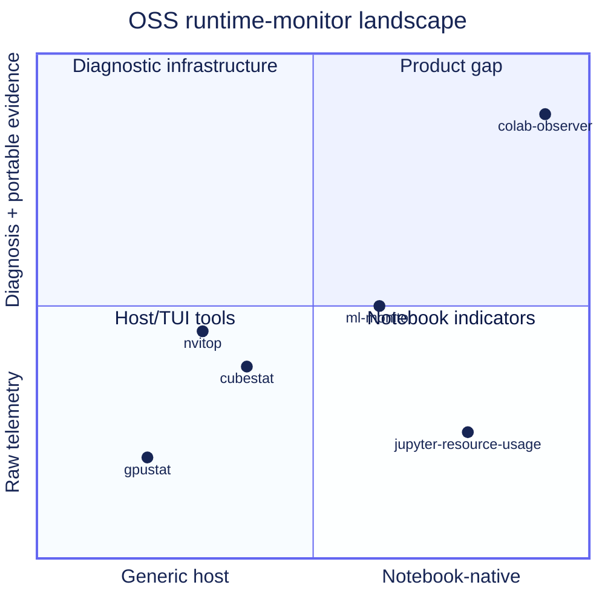

# GitHub ecosystem audit

**Checked:** 2026-07-11  
**Question:** What existing OSS projects cover pieces of a Colab monitor, and what remains unserved?

## Comparative projects

| Project | Useful pattern | Gap relative to `colab-observer` | Role in plan |
|---|---|---|---|
| [Smankusors/colab_monitor](https://github.com/Smankusors/colab_monitor) | Colab-specific resource monitoring concept | Small/old project, hosted/backend-oriented structure, no modern release or accessibility/product contract | Historical inspiration only |
| [wiatrak2/ml_monitor](https://github.com/wiatrak2/ml_monitor) | Colab → Drive → Prometheus/Grafana pipeline | Heavy infrastructure and auth path for notebook users | Optional exporter inspiration |
| [XuehaiPan/nvitop](https://github.com/XuehaiPan/nvitop) | Rich NVML GPU/process model, live history, process awareness | Terminal/GPU-centric rather than notebook/full-system/report-first | GPU collector and diagnostics benchmark |
| [wookayin/gpustat](https://github.com/wookayin/gpustat) | Small GPU CLI/API and JSON-friendly snapshot | GPU-only and limited notebook UX | Minimal provider/API inspiration |
| [okuvshynov/cubestat](https://github.com/okuvshynov/cubestat) | Dense terminal time-series display and explicit Colab usage | Terminal/xterm path, no notebook report bundle | Visualization-density inspiration |
| [lablup/all-smi](https://github.com/lablup/all-smi) | Cross-accelerator and remote monitoring breadth | Broader infrastructure scope than a Colab-local package | Future accelerator-adapter reference |
| [jupyter-server/jupyter-resource-usage](https://github.com/jupyter-server/jupyter-resource-usage) | Notebook/Jupyter resource indicators | Server-extension/JupyterLab orientation, not Colab-local diagnosis/reporting | Notebook integration comparison |
| [googlecolab/colab-vscode issue #326](https://github.com/googlecolab/colab-vscode/issues/326) | User demand for persistent CPU/RAM/GPU/disk/runtime indicators | Feature request, not reusable package | Confirms product gap |
| [ComfyUI-Crystools](https://github.com/crystian/ComfyUI-Crystools) | Clear CPU/GPU/RAM/VRAM/disk cards and workflow-native UI | ComfyUI-specific and not a general notebook monitor | UI and diagnostic-copy inspiration |
| [Netdata](https://github.com/netdata/netdata) / [DCGM exporter](https://github.com/NVIDIA/dcgm-exporter) | Deep infrastructure telemetry | Service/Prometheus infrastructure, excessive for normal Colab | Explicit non-goal and optional future exporter |

## Ecosystem pattern

The chart is illustrative positioning, not a quantitative benchmark. The accessible table above is authoritative.

## Product gap

No reviewed project combines all of the following as a coherent default:

- Colab/notebook-native install and lifecycle;
- CPU/RAM/disk/network/process plus accelerator/framework observations;
- local durable data and self-contained report bundle;
- evidence-bearing diagnostics;
- accessible live charts with semantic table parity;
- no account, backend, public tunnel, or keepalive behavior;
- source-controlled copyable notebook snippets;
- release-grade schema, privacy, and quality contracts.

## Differentiators to defend

1. **Local-first evidence bundle**, not only a live screen.
2. **Accessible by design**, not an afterthought around a canvas.
3. **Graceful capability states**, especially for GPU/framework/TPU absence.
4. **Explainable diagnostics**, not opaque recommendations.
5. **Policy-safe Colab posture**, explicitly avoiding runtime-extension hacks.
6. **Notebook ergonomics**, with safe reruns and no long-running blocking cell.
7. **Small core**, with extras instead of importing an experiment platform.

## Avoided copying

The plan borrows problem-solving patterns, not code or trade dress. Before implementation, review licenses for any direct dependency, code adaptation, icon set, or copied test fixture. Product visuals should not imitate a specific existing monitor.
