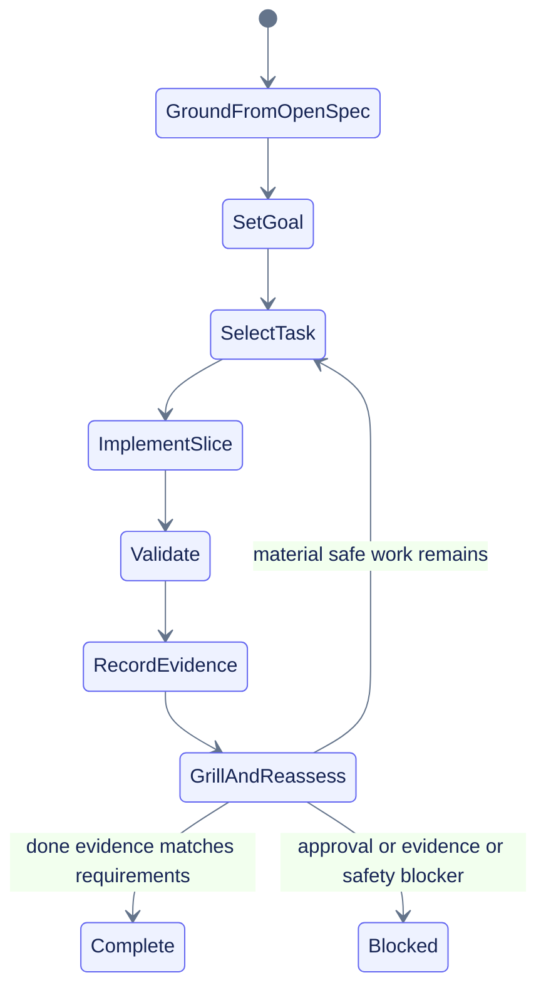

# Goal-mode orchestration contract

## Availability and setup checks

Current official Codex documentation was checked on 2026-07-11 and presents Goal mode in the Codex app, IDE extension, and CLI. Confirm `/goal` appears in the current surface before relying on it. If unavailable, recheck current version/help and official docs. Compatibility builds may mention `features.goals = true` or `codex features enable goals`; any Codex config mutation, installation, or upgrade requires explicit approval. A normal OpenSpec handoff remains the fallback.

For Grok Build, verify current native Goal lifecycle controls separately. Do not install, upgrade, sign in, subscribe, or run network setup automatically. Fall back to the generic OpenSpec goal contract when unavailable.

## OpenSpec grounding

Read [[docs/planning/build-colab-observer/openspec-grounding|openspec-grounding.md]] and use these sources:

| Goal field | Source |
|---|---|
| Outcome and scope | proposal |
| Observable behavior | eleven delta specs |
| Approach and tradeoffs | design plus ADRs |
| Work order | tasks plus task graph |
| Evidence | validation plus PLANS |
| Stops | handoff plus security policy |

## Universal goal contract

- **Outcome:** Implement OpenSpec change `build-colab-observer` into a release-candidate-quality local Colab monitor.
- **Done when:** Approved tasks are complete, requirements and evidence agree, representative Colab/runtime/artifact/accessibility/security checks pass, and release/deploy remain separate approvals.
- **Initial write scope:** Wave A evidence and contract paths only until target-repo conventions are confirmed.
- **Constraints:** Local-first, no default upload, no secrets, no keepalive/anti-idle/reconnect/timeout-bypass/quota behavior, no automatic remediation, and chart/table/text parity.
- **Iteration policy:** Inspect, choose the smallest unblocked task, implement, validate, update PLANS and traceability, then run `/grill-me` reassessment.
- **Blocked stop:** Stop for approval, missing repo/runtime evidence, scope contradiction, unsafe action, or validation with no safe interpretation.

## Goal lifecycle controls

| Surface | Start | Status | Pause | Resume | Clear | Note |
|---|---|---|---|---|---|---|
| Codex | `/goal <objective>` | `/goal` | `/goal pause` | `/goal resume` | `/goal clear` | Recheck exact current syntax before use. |
| Grok Build | `/goal <objective>` | `/goal status` | `/goal pause` | `/goal resume` | `/goal clear` | Verify availability; do not perform setup automatically. |
| Generic goal-capable agent | Native goal/task command | Native status | Native pause/stop | Native resume/retry | Native clear/cancel | Preserve the OpenSpec contract even when command names differ. |

## Goal flow

Use [[docs/planning/build-colab-observer/goal-prompts|goal-prompts.md]] for copyable prompts and [[docs/planning/build-colab-observer/PLANS|PLANS]] for durable status.

Compatibility safety marker: do not install, upgrade, sign in, subscribe, or run network setup automatically; use the generic OpenSpec goal contract instead.
