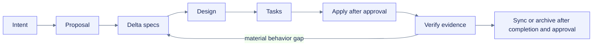

# OpenSpec grounding

> [!source] Grounding rule
> OpenSpec is the planning source of truth. Derived architecture notes, goal prompts, diagrams, task graphs, reports, and handoffs must map to the proposal, delta specs, design, tasks, validation, or durable loop state. They may add implementation detail but may not invent product behavior.

## Authority map

| Concern | Source of truth | Derived artifacts |
|---|---|---|
| Intent, scope, non-goals | `proposal.md` | product brief, README, goal, handoff |
| Observable behavior | eleven delta `spec.md` files | tests, traceability, docs acceptance |
| Technology and tradeoffs | `design.md` plus ADRs | architecture and task implementation details |
| Work order and write scopes | `tasks.md` | task graph, PLANS, Codex handoff |
| Completion evidence | `validation.md` plus test/runtime/artifact logs | finalization and release decision |
| Current execution state | `PLANS.md` plus `outer-loop.md` | continuation and goal prompts |

## Drift checks

- Public API or schema changes update proposal, specs, design, tasks, and generated goal prompts before code is treated as complete.
- Diagnostic behavior changes its requirement, rule catalog, fixtures, traceability, and docs page.
- Canonical snippet changes update generated notebook and documentation copies.
- Dashboard behavior changes accessibility and fallback verification as applicable.
- Workflow or deploy changes preserve approval and security requirements.
- No planning artifact claims implementation, verify/sync, archive, publish, or deploy completion without evidence.

## Lifecycle

OpenSpec work is iterative. Material implementation discoveries may revise upstream artifacts, followed by downstream consistency review.
