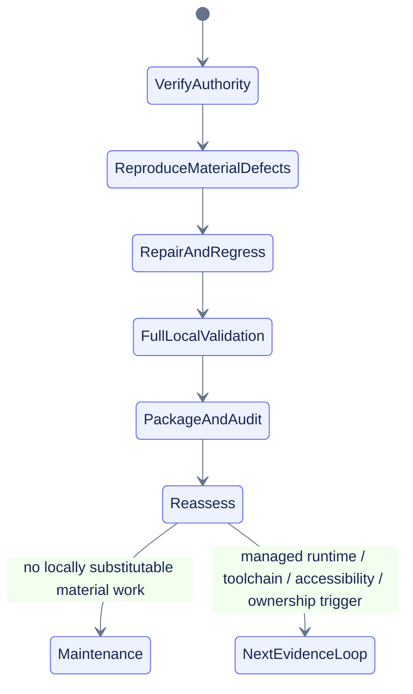

# Outer loop: runtime evidence and release assurance

## Current iteration

| Field | Value |
|---|---|
| Iteration objective | Repair reproduced lifecycle/provider/export-boundary defects, validate the complete local product slice, then regenerate deterministic unpublished artifacts |
| Current decision | Local product slice `final-with-known-risks`; overall OpenSpec change `one-more-material-loop` |
| Assurance mode | `final-assured maintenance` after clean artifact validation |
| Direct comm | Experimental, explicit, non-default, not promoted |
| Success criterion | Every queued item is complete, blocked with exact evidence/unblocker, or explicitly deferred; no claim exceeds captured evidence |

## Session-start `/grill-me`

The source, validation, and distribution bundles matched their declared SHA-256 values and passed ZIP integrity checks. The declared workspace was partial, so the source ZIP was reconstructed into an isolated working directory before mutation. No new managed-Colab, Python 3.11/3.12, lock/toolchain, assistive-technology, or ownership surface was available. The explicit run request plus reproduced lifecycle/provider defects supplied the material trigger; no user question was required.

## Completed this loop

- Verified all supplied July 17 bundle hashes and recovered the authoritative source without overwriting prior artifacts.
- Inventoried the local environment: Python 3.13.5, uv, Node, TypeScript, Jupyter, and Chromium available; Python 3.11/3.12, Ruff, ty, pre-commit executable, pnpm, OpenSpec CLI, managed Colab, ownership metadata, and install/network approval unavailable.
- Repaired post-terminal control acceptance, fatal-worker status truthfulness, stale active-observer registration, invalid flush deadlines, and writer-close failure containment.
- Added strict field-level provider values with valid-sibling retention across core, process, Drive, NVML, and optional-framework collectors.
- Capped per-core CPU output and NVML device enumeration.
- Rejected export elapsed ranges outside supported datetime/SQLite domains before artifact writes.
- Added seven behavior scenarios and matching tests, change-pack scenario IDs, task evidence, and traceability updates.
- Passed 249 tests, 87.4176% combined coverage, TypeScript/Node 9/9, Chromium 21/21, Jupyter 10/10, local smoke/bench/isolated soak, PyTorch/JAX, and fail-closed Colab-harness checks.
- Completed final package, manifest, archive, delivery-evidence, clean-extraction, and byte-comparison regeneration from the reconciled source.

## Todo queue: current-loop 25-task disposition

| Task | Disposition | Evidence / unblocker |
|---|---|---|
| A1 verify/recover | Complete | Uploaded hashes and ZIP integrity matched; source recovered from canonical ZIP |
| A2 inventory surfaces | Complete | Local interpreter/tool/runtime inventory recorded |
| A3 classify trigger | Complete | Explicit request plus reproduced lifecycle/provider/export defects |
| A4 current-source recheck | Complete | Official Colab runtime/policy/widget sources checked only for claims used in this loop |
| A5 reconcile contracts | Complete | Seven scenarios, change pack, traceability, tasks, tests |
| B1 managed Colab CPU | Blocked | No managed runtime; harness fails closed outside Colab |
| B2 managed Colab soak | Blocked | No managed runtime |
| B3 mounted Drive | Partial/blocker | Local classification/provider regressions pass; no mounted managed Drive |
| B4 NVIDIA Colab | Partial/blocker | NVML cardinality/field/provider contracts pass; no representative hardware |
| B5 frameworks/TPU | Partial/blocker | Local PyTorch/JAX pass; TensorFlow absent; TPU presence only; no managed runtime |
| C1 managed direct comm | Blocked | No managed Colab browser/comm surface |
| C2 transport promotion decision | Complete | Preserve experimental/non-default status |
| C3 Python 3.11/3.12/3.13 matrix | Partial/blocker | 3.13 runtime passes; 3.11 grammar parses; 3.11/3.12 runtime unavailable |
| C4 reviewed locks/full toolchain | Blocked | Requires approved isolated dependency-resolution environment |
| C5 interactive failure matrix | Partial | Local malformed/stale/cross-run/offline/static-fallback checks pass; managed comm loss unavailable |
| D1 examples | Partial | CPU, degraded, PyTorch, JAX local evidence; TensorFlow/NVIDIA/Drive/TPU representative runs blocked |
| D2 accessibility | Partial | Automated local Chromium passes; manual AT/managed notebook/multi-browser unavailable |
| D3 frozen docs build | Blocked | No reviewed pnpm lock or approved resolution |
| D4 package/release evidence | Complete | Reproducible package and archive evidence generated after source settlement |
| D5 public identity | Deferred | Human owner/license/repo/namespace/release decisions not yet release-critical |
| E1 security/privacy negatives | Complete locally | 249-test suite and policy/secret/provider/path/overflow failures pass |
| E2 final audits | Complete | Full repo, pack, applicable machine-schema, manifest, package, ZIP, and clean-extract checks |
| E3 unpublished candidate | Complete | Wheel/sdist/SBOM/provenance/checksums, no publication |
| E4 reconciliation | Complete | OpenSpec, tasks, PLANS, validation, manifest, and bundles synchronized |
| E5 release decision | Complete at closeout | `final-with-known-risks`; no approval-gated operation crossed |

## Reassessment

The local defect cluster has been exhausted to the current evidence boundary. Remaining work is not locally substitutable:

- managed Colab CPU/NVIDIA/TPU/Drive/direct comm;
- Python 3.11/3.12 execution;
- reviewed uv/pnpm locks and full lint/type/pre-commit/docs build;
- representative browser and assistive-technology review;
- public ownership/license/repository/release decisions.

After artifact validation, preserve the bundle in final-assured maintenance. Reopen only for a material defect, failed validation/package drift, installed-runtime defect, stale authoritative fact that changes behavior, unsafe drift, missing release evidence, or explicit user request.

## Loop state

## Stop conditions

- Stop before installs, network resolution, Git/remote mutation, publication, deployment, secrets, account/DNS/payment/permission changes, or OpenSpec verify/sync/archive without approval.
- Stop when a platform, compatibility, accessibility, performance, or security claim cannot be demonstrated safely.
- Stop when no material safe action has positive marginal utility.

## Next loop recommendation

Begin another loop only when a managed runtime, compatibility runtime, approved dependency environment, accessibility surface, ownership decision, material defect, failed validation, stale behavioral fact, unsafe drift, missing release evidence, or explicit request exists. Otherwise verify and preserve the frozen bundle.

## Follow-on generalization

The current Colab-first product definition remains the implemented baseline. A separate additive change, [[openspec/changes/generalize-notebook-runtime-observer/proposal|`generalize-notebook-runtime-observer`]], plans a platform-neutral core, evidence-gated Jupyter/Deepnote adapters, explicit measurement scope, storage profiles, and a deferred naming decision. It does not reopen or rewrite this change.
