# Product brief: `colab-observer`

## Product promise

Understand what a Colab runtime is doing, why it may be struggling, and what evidence to keep, from inside the notebook, without an account or a monitoring backend.

## Primary users and jobs

| User | Job to be done | Existing friction |
|---|---|---|
| ML practitioner | Verify accelerator, memory, data pipeline, and checkpoint health while training | `nvidia-smi`, notebook indicators, and framework logs are fragmented. |
| Data/AI engineer | Diagnose CPU, RAM, disk, Drive I/O, and process bottlenecks | System tools are terminal-first or disappear with the runtime. |
| Notebook author | Give users a safe monitoring snippet and reproducible support bundle | Ad hoc scripts drift and may contain unsafe keepalive behavior. |
| OSS maintainer/supporter | Ask for actionable evidence instead of screenshots | Reports lack schema, timing, environment, and redaction guarantees. |
| Accessibility-focused user | Read and operate live runtime status without depending on color or chart perception | Most monitor dashboards are pointer- and canvas-centric. |

## Critical user journey

```mermaid
%%{init: {"theme": "base", "themeVariables": {"primaryColor": "#eef2ff", "primaryBorderColor": "#6366f1", "primaryTextColor": "#172554", "lineColor": "#64748b", "tertiaryColor": "#f8fafc", "fontFamily": "Inter, ui-sans-serif, system-ui"}, "flowchart": {"curve": "basis", "padding": 12}}}%%
flowchart LR
    A[Open Colab] --> B[Install and start]
    B --> C[Continue workload]
    C --> D[Read live status]
    D --> E[Inspect diagnostic evidence]
    E --> F[Adjust workload manually]
    F --> G[Stop and export]
    G --> H[Share redacted bundle]
```

## Differentiation

`colab-observer` combines capabilities that existing projects usually separate:

- Colab-native lifecycle and copy-paste adoption.
- Full-system plus accelerator observations.
- Local persistence rather than ephemeral charts only.
- Evidence-bearing diagnostics rather than raw numbers only.
- Accessible chart alternatives and keyboard-first interaction.
- No account/backend/public tunnel requirement.
- Explicit no-keepalive/no-bypass boundary.
- Portable support bundle with schema, manifest, redaction state, and checksums.

## Product principles

1. **Observe, do not manipulate.** No workload or platform-policy automation.
2. **Evidence before inference.** Every diagnosis includes the evidence and uncertainty.
3. **Local by default.** Integrations are opt-in adapters.
4. **Graceful degradation.** Missing GPU, provider, framework, TPU telemetry, widget manager, Drive mount, or JavaScript never becomes a false value.
5. **The table is a feature.** A chart is never the only way to understand data.
6. **Ephemeral-runtime economics matter.** Keep install, startup, wheel size, and overhead small.
7. **Exports are support interfaces.** A report must explain what was collected, omitted, estimated, and redacted.

## MVP and release slices

| Slice | User value | Required before moving on |
|---|---|---|
| S0: contracts | Stable schema/API/privacy boundary | Fixture and schema review |
| S1: core observer | CPU/RAM/disk/network/process + SQLite + text status | Lifecycle and failure-isolation tests |
| S2: accelerator | NVIDIA + framework adapters + honest degraded states | Provider fallback tests and GPU smoke |
| S3: evidence | diagnostics + reports + bundle | False-positive and redaction review |
| S4: dashboard | accessible enhanced UI + static fallback | Keyboard/table parity/Colab smoke |
| S5: ecosystem | snippets, examples, docs, CI, preview deploy | Release candidate validation |

## Non-goal pressure tests

Reject or defer a proposal when it primarily adds:

- hosted accounts, team dashboards, remote agents, or central ingestion;
- runtime-extension/reconnection behavior;
- arbitrary process control or file cleanup;
- automatic batch/worker/framework tuning;
- unbounded metric cardinality or plugin systems;
- another frontend/runtime dependency without measurable notebook value.

## Success measures

### Product correctness

- Clean CPU-only and representative NVIDIA Colab runs complete start → observe → display/fallback → stop → export.
- Missing providers/frameworks yield explicit capability states and no run failure.
- Export manifests and checksums validate.

### User utility

- A first-time user can find the likely bottleneck and relevant evidence without reading source code.
- Supporters can inspect a redacted bundle and reproduce the displayed diagnostic logic.
- Dashboard and report users can access equivalent data without relying on charts or color.

### Operational quality

- Idle and active overhead budgets are benchmarked before the first stable release.
- No critical/high privacy, policy, accessibility, or supply-chain issue remains unresolved.
- Docs examples, source snippet, public API, schemas, and generated AI indexes are drift-checked.

## Follow-on generalization

The current Colab-first product definition remains the implemented baseline. A separate additive change, [[openspec/changes/generalize-notebook-runtime-observer/proposal|`generalize-notebook-runtime-observer`]], plans a platform-neutral core, evidence-gated Jupyter/Deepnote adapters, explicit measurement scope, storage profiles, and a deferred naming decision. It does not reopen or rewrite this change.
