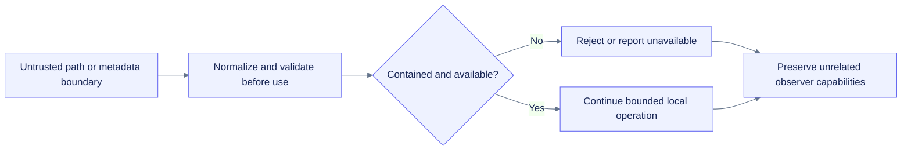

# Runtime-boundary hardening: path normalization, generated export roots, optional discovery, and hermetic test gates

**Path:** `docs/planning/build-colab-observer/runtime-boundary-hardening-20260717.md`  
**Purpose:** Record the material local defects found and repaired in the July 17 representative-runtime loop.  
**Evidence root:** `/mnt/data/colab-observer-runtime-boundary-evidence-20260717`  
**Decision:** Local product slice `final-with-known-risks`; overall OpenSpec change `one-more-material-loop`.

## Session-start `/grill-me` result

The declared workspace contained only a partial handoff, while the supplied source ZIP matched its declared SHA-256 and contained the full 313-file source tree. No user question was needed. The safe default was to recover into a new working directory, preserve all prior bundles, inventory available tools and runtimes, and mutate only after reproducing bounded product defects.

No new managed-Colab session, Python 3.11/3.12 interpreter, reviewed dependency environment, assistive-technology surface, or public ownership/release decision was available. The explicit run request therefore served as the material audit trigger.

## Material defects and repairs

| Finding | Before repair | Repair | Regression evidence |
|---|---|---|---|
| Generated Observer export root followed a pre-created symlink | `output_dir/exports` could redirect report and bundle writes outside the selected root | Create and validate the package-generated `exports` directory through the same contained-child boundary used by per-run directories; reject symlink and collision aliases before write | `runtime-boundary-reproductions-after.log`; `test_observer_rejects_symlinked_generated_exports_root` |
| Drive preflight did not normalize dot segments | `/content/other/../drive/...` bypassed the unmounted-Drive preflight | Normalize lexical dot segments before classifying the path and reuse the normalized path in privacy-safe path descriptions | `test_drive_preflight_normalizes_dot_segments`; standalone after-repair reproduction |
| Ordinary import-system metadata errors could abort optional capability detection | A third-party meta-path finder raising `RuntimeError` could terminate runtime or comm detection | Centralize non-importing discovery through `module_available()` and contain all ordinary exceptions as unavailable capability evidence | parameterized runtime-discovery regressions; comm shell metadata regression |
| Framework smoke discovery used a separate fragile path | Evidence tooling could fail before truthfully reporting an absent framework | Reuse the package discovery boundary in the framework smoke harness | compilation, package import, and framework-smoke evidence |
| Default tests inherited ambient pytest plugins | Globally installed plugins could alter or delay repository-gate completion independently of project code | Disable plugin auto-loading for default test gates and explicitly enable `pytest-cov` for coverage | `test_makefile_uses_hermetic_pytest_plugin_loading`; `pytest-runner-isolation.json`; final `make check` exit 0 |

## Observable OpenSpec behavior

Four scenarios were added without moving implementation mechanics into behavior specs:

1. Optional module metadata lookup failures remain non-fatal and private exception text is not rendered or persisted.
2. Dot-segment paths that resolve under `/content/drive` receive the same unmounted-Drive preflight as direct Drive paths.
3. A symbolic-link package-generated export root is rejected before report or bundle publication.
4. Unrelated globally installed test-runner plugins do not alter the repository gate, while required project plugins are enabled explicitly.

The active change now contains **73 requirements and 86 scenarios** across eleven domains.

## Validation

| Surface | Result |
|---|---:|
| Targeted runtime regressions | 38 passed |
| Hermetic test-entry contract | 4 passed in focused file; one new regression |
| Full dependency-free gate | 240 tests passed; hermetic `make check` exit 0 |
| Combined line-and-branch coverage | 87.3176%, gate 85% |
| TypeScript/Node protocol | 9/9 pass |
| Chromium | 21/21 pass; zero remote requests, page errors, or dialogs |
| Local Jupyter | 10/10; 950 observations; zero drops |
| Lifecycle/export smoke | 2,198 observations; zero drops; 17 bundle entries; 16 verified checksums |
| Default two-second benchmark | 415 observations; zero drops; 2.2479% one-core signal |
| Stress 200 ms benchmark | 1,627 observations; zero drops; 14.0309% one-core signal |
| Thirty-second isolated soak | 15,448 persisted observations; zero drops; bounded history; clean source/backup SQLite checks |
| PyTorch / JAX | Local CPU pass |
| TensorFlow | Absent and truthfully skipped |
| Managed-Colab harness | Fails closed outside Colab; explicit local mode remains non-representative |

The quality-gate hardening responds to intermittent aggregate post-summary non-exit observations without claiming a deterministic third-party-plugin root cause. A standalone ambient run also exited normally; the project now removes that environmental variable from its default gate.

The first combined benchmark shell reached its outer execution limit after earlier commands emitted large evidence. The durability soak completed cleanly when rerun in isolation. This is recorded as orchestration evidence rather than a product failure.

## Evidence boundary

These repairs and results establish local Linux/Python 3.13.5 behavior only. They do not establish managed Colab, NVIDIA hardware, TPU, mounted Drive, direct-comm lifecycle, Python 3.11/3.12 execution, reviewed dependency locks, manual assistive-technology conformance, package publication, or deployment readiness.

## Hardening flow

