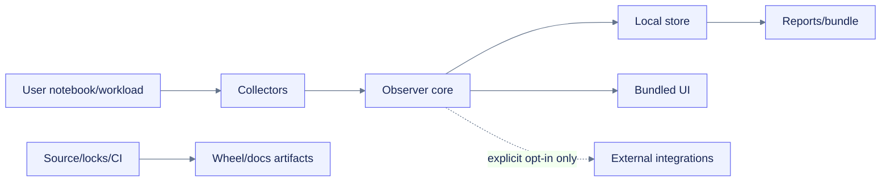

# Security, privacy, and Colab policy plan

## Threat model

### Protected assets

- notebook secrets, tokens, cells, and file contents;
- user identity and process context;
- local/mounted output and report integrity;
- notebook availability and performance;
- release/package/docs supply chain;
- user trust in diagnostic claims.

### Trust boundaries

Collected OS/provider data is untrusted input even when local. Process names, paths, provider output, labels, and user markers must be bounded and escaped.

## Default privacy posture

| Data | Default |
|---|---|
| Resource counters, units, device indices | Collect |
| Process PID/name and bounded counters | Collect/minimize |
| Username/hostname | Omit unless essential and then redact |
| Full paths | Normalize to approved roots or basename/context |
| Full command lines | Off, explicit opt-in |
| Package inventory | Off or bounded summary, explicit opt-in for full |
| Environment variable names/values | Values never; names omitted by default |
| Notebook cells/output/history | Never collect |
| File contents | Never collect |
| Product usage telemetry | None by default |

## STRIDE-style risks

| Risk | Example | Control |
|---|---|---|
| Spoofing/provenance | fallback value presented as NVML | provider/quality on every observation |
| Tampering | report file edited after creation | manifest and checksums |
| Repudiation | diagnosis changed without rule version | rule/schema/package version in finding |
| Information disclosure | process command contains token | command capture off, redaction/escaping |
| Denial of service | sampler queue or UI history grows forever | bounded queues/buffers, downsampling, backoff |
| Elevation/injection | shell interpolation of provider args | fixed executable/argv, no shell, strict parser |
| Supply-chain | compromised action/dependency/remote asset | locks, SHA pins, local assets, artifact audit |
| Policy abuse | reconnect/keepalive logic | hard non-goal, scanners, manual release audit |

## Subprocess controls

- Discover executables through controlled path lookup and record path/version safely.
- Use argument arrays, no `shell=True`.
- Fixed query fields and output format.
- Timeout, maximum bytes/rows, encoding strategy, and strict parser.
- No user-provided arbitrary flags.
- Redact provider errors before reports.
- Backoff repeated failures.

## Rendering/report controls

- Treat metric labels, process names, paths, user markers, and errors as text.
- Escape HTML and serialize JSON safely.
- Bundle frontend assets locally and prohibit unreviewed runtime CDN/script injection.
- Self-contained reports avoid active remote requests.
- Provide an export content/field summary before optional sensitive fields.
- Do not auto-open a public port or tunnel.

## Integration controls

External integrations are separate opt-in sinks:

- user names destination/config explicitly;
- adapter declares fields and outbound network behavior;
- env-var **names** only in docs/example config;
- no credential reads beyond the named adapter configuration;
- disable path and failure isolation;
- no change to core local functionality when absent.

## Colab policy boundary

The project observes and diagnoses. It does not:

- simulate activity or click notebook UI;
- reconnect automatically;
- play hidden media or use workers to avoid idle state;
- claim to extend runtime limits;
- manipulate allocation, quotas, or billing;
- select expensive accelerators automatically.

Docs may explain these prohibitions without containing executable bypass examples.

## Supply-chain controls

- Review license/provenance of direct dependencies and bundled assets.
- Lock Python and Node development dependencies.
- Pin third-party GitHub Actions to immutable SHAs.
- Separate untrusted PR checks from release/deploy identity.
- Prefer PyPI Trusted Publishing/OIDC over long-lived upload tokens after approval.
- Inspect wheel/sdist/docs bundles, generate hashes, and optionally attest public release artifacts.
- Publish `SECURITY.md` with private reporting guidance.

## Security validation

- malicious provider output and process-name fixtures;
- HTML/JSON-LD/report escaping tests;
- subprocess timeout/oversize/malformed tests;
- secret and artifact-content scans;
- outbound-network negative test under default config;
- prohibited-behavior scan and manual notebook review;
- low-disk/queue-overflow/slow-provider denial-of-service tests;
- dependency/license/action pin review;
- export redaction snapshot and opt-in field tests.
