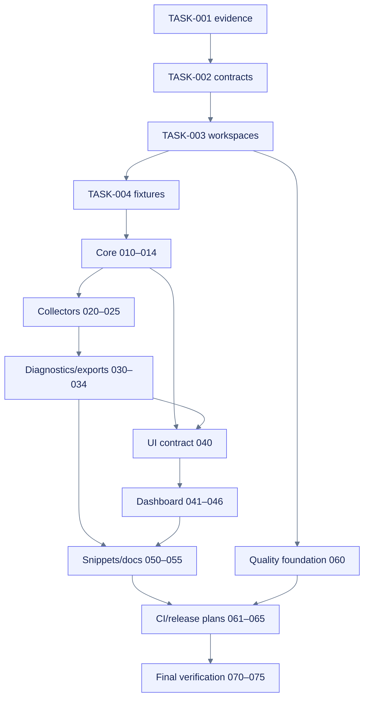

# Task graph

**Machine graph:** `docs/planning/build-colab-observer/task-graph.json`  
**Canonical checklist:** `openspec/changes/build-colab-observer/tasks.md`

## Wave summary

| Wave | Tasks |
|---|---:|
| Wave 0 — Preflight and contracts | 4 |
| Wave 1 — Core observer and persistence | 5 |
| Wave 2 — Collectors | 6 |
| Wave 3 — Diagnostics and exports | 5 |
| Wave 4 — Accessible notebook dashboard | 7 |
| Wave 5 — Notebook adoption and documentation | 6 |
| Wave 6 — Quality, CI/CD, release readiness | 6 |
| Wave 7 — Final verification and handoff | 6 |

## Dependency architecture

## Parallelism rules

- `[P]` tasks have distinct paths and dedicated validation.
- A task cannot run parallel merely because it is small.
- Generated artifacts have one source owner and one generation owner.
- Dependencies that define schemas, public API, UI messages, or root configuration serialize downstream work.
- Parallel work reports exact files and does not modify shared lockfiles or workflow permissions without coordination.

## Task execution record

Use [[docs/planning/build-colab-observer/PLANS]] for current task, evidence, changed files, commands/results, discoveries, blocked state, and reassessment. The JSON graph is planning metadata, not completion evidence.
