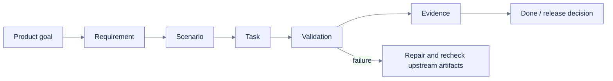

# Requirement traceability matrix

**Coverage:** 73 requirements and 93 scenarios across 11 domains.  
**Machine sources:** `openspec/changes/build-colab-observer/change-pack.json`, `docs/planning/build-colab-observer/task-graph.json`.

| Requirement | Domain | Capability | Scenarios | Implementation tasks | Verification surface | Risks |
|---|---|---|---:|---|---|---|
| `REQ-ACCESSIBILITY-01` | accessibility | WCAG 2.2 AA target | 1 | `TASK-043-implement-dashboard-accessibility`, `TASK-045-build-static-fallback`, `TASK-046-run-dashboard-integration`, `TASK-055-audit-docs-accessibility`, `TASK-062-add-ui-docs-ci`, `TASK-073-run-final-accessibility-audit` | local Chromium accessibility-tree semantics, keyboard/reflow, 24-pixel target geometry, contrast, reduced-motion/forced-colors, and semantic table parity; managed notebook browser, screen-reader, zoom, and multi-browser audit pending | R-012 |
| `REQ-ACCESSIBILITY-02` | accessibility | Complete keyboard operation | 1 | `TASK-043-implement-dashboard-accessibility`, `TASK-045-build-static-fallback`, `TASK-046-run-dashboard-integration`, `TASK-055-audit-docs-accessibility`, `TASK-062-add-ui-docs-ci`, `TASK-073-run-final-accessibility-audit` | local Chromium accessibility-tree semantics, keyboard/reflow, 24-pixel target geometry, contrast, reduced-motion/forced-colors, and semantic table parity; managed notebook browser, screen-reader, zoom, and multi-browser audit pending | R-012 |
| `REQ-ACCESSIBILITY-03` | accessibility | Semantic names, roles, states, and structure | 1 | `TASK-043-implement-dashboard-accessibility`, `TASK-045-build-static-fallback`, `TASK-046-run-dashboard-integration`, `TASK-055-audit-docs-accessibility`, `TASK-062-add-ui-docs-ci`, `TASK-073-run-final-accessibility-audit` | local Chromium accessibility-tree semantics, keyboard/reflow, 24-pixel target geometry, contrast, reduced-motion/forced-colors, and semantic table parity; managed notebook browser, screen-reader, zoom, and multi-browser audit pending | R-012 |
| `REQ-ACCESSIBILITY-04` | accessibility | Equivalent access to chart data | 1 | `TASK-043-implement-dashboard-accessibility`, `TASK-045-build-static-fallback`, `TASK-046-run-dashboard-integration`, `TASK-055-audit-docs-accessibility`, `TASK-062-add-ui-docs-ci`, `TASK-073-run-final-accessibility-audit` | local Chromium accessibility-tree semantics, keyboard/reflow, 24-pixel target geometry, contrast, reduced-motion/forced-colors, and semantic table parity; managed notebook browser, screen-reader, zoom, and multi-browser audit pending | R-012 |
| `REQ-ACCESSIBILITY-05` | accessibility | Non-color status encoding | 1 | `TASK-043-implement-dashboard-accessibility`, `TASK-045-build-static-fallback`, `TASK-046-run-dashboard-integration`, `TASK-055-audit-docs-accessibility`, `TASK-062-add-ui-docs-ci`, `TASK-073-run-final-accessibility-audit` | local Chromium accessibility-tree semantics, keyboard/reflow, 24-pixel target geometry, contrast, reduced-motion/forced-colors, and semantic table parity; managed notebook browser, screen-reader, zoom, and multi-browser audit pending | R-012 |
| `REQ-ACCESSIBILITY-06` | accessibility | Controlled live updates and motion | 2 | `TASK-043-implement-dashboard-accessibility`, `TASK-045-build-static-fallback`, `TASK-046-run-dashboard-integration`, `TASK-055-audit-docs-accessibility`, `TASK-062-add-ui-docs-ci`, `TASK-073-run-final-accessibility-audit` | local Chromium accessibility-tree semantics, keyboard/reflow, 24-pixel target geometry, contrast, reduced-motion/forced-colors, and semantic table parity; managed notebook browser, screen-reader, zoom, and multi-browser audit pending | R-012 |
| `REQ-ACCESSIBILITY-07` | accessibility | Adequate target size and hover independence | 1 | `TASK-043-implement-dashboard-accessibility`, `TASK-045-build-static-fallback`, `TASK-046-run-dashboard-integration`, `TASK-055-audit-docs-accessibility`, `TASK-062-add-ui-docs-ci`, `TASK-073-run-final-accessibility-audit` | local Chromium accessibility-tree semantics, keyboard/reflow, 24-pixel target geometry, contrast, reduced-motion/forced-colors, and semantic table parity; managed notebook browser, screen-reader, zoom, and multi-browser audit pending | R-012 |
| `REQ-CI_CD-01` | ci-cd | Least-privilege pull-request CI | 1 | `TASK-061-add-python-ci`, `TASK-062-add-ui-docs-ci`, `TASK-063-add-notebook-policy-ci`, `TASK-064-plan-vercel-deployment`, `TASK-065-plan-package-release`, `TASK-074-build-release-candidate` | workflow lint + fork-safety + artifact/release/deploy dry-run gates | R-014,R-015 |
| `REQ-CI_CD-02` | ci-cd | Supported-runtime matrix | 1 | `TASK-061-add-python-ci`, `TASK-062-add-ui-docs-ci`, `TASK-063-add-notebook-policy-ci`, `TASK-064-plan-vercel-deployment`, `TASK-065-plan-package-release`, `TASK-074-build-release-candidate` | workflow lint + fork-safety + artifact/release/deploy dry-run gates | R-014,R-015 |
| `REQ-CI_CD-03` | ci-cd | Package and frontend artifact verification | 1 | `TASK-061-add-python-ci`, `TASK-062-add-ui-docs-ci`, `TASK-063-add-notebook-policy-ci`, `TASK-064-plan-vercel-deployment`, `TASK-065-plan-package-release`, `TASK-074-build-release-candidate` | workflow lint + fork-safety + artifact/release/deploy dry-run gates | R-014,R-015 |
| `REQ-CI_CD-04` | ci-cd | Documentation validation and previews | 1 | `TASK-061-add-python-ci`, `TASK-062-add-ui-docs-ci`, `TASK-063-add-notebook-policy-ci`, `TASK-064-plan-vercel-deployment`, `TASK-065-plan-package-release`, `TASK-074-build-release-candidate` | workflow lint + fork-safety + artifact/release/deploy dry-run gates | R-014,R-015 |
| `REQ-CI_CD-05` | ci-cd | Approval-gated releases | 1 | `TASK-061-add-python-ci`, `TASK-062-add-ui-docs-ci`, `TASK-063-add-notebook-policy-ci`, `TASK-064-plan-vercel-deployment`, `TASK-065-plan-package-release`, `TASK-074-build-release-candidate` | workflow lint + fork-safety + artifact/release/deploy dry-run gates | R-014,R-015 |
| `REQ-CI_CD-06` | ci-cd | Pinned and auditable automation | 1 | `TASK-061-add-python-ci`, `TASK-062-add-ui-docs-ci`, `TASK-063-add-notebook-policy-ci`, `TASK-064-plan-vercel-deployment`, `TASK-065-plan-package-release`, `TASK-074-build-release-candidate` | workflow lint + fork-safety + artifact/release/deploy dry-run gates | R-014,R-015 |
| `REQ-DASHBOARD_UX-01` | dashboard-ux | Notebook-local dashboard | 1 | `TASK-040-freeze-ui-message-contract`, `TASK-041-build-dashboard-shell`, `TASK-042-build-charts-tables-controls`, `TASK-044-integrate-widget-transport`, `TASK-045-build-static-fallback`, `TASK-046-run-dashboard-integration`, `TASK-070-run-performance-soak`, `TASK-072-run-colab-smoke-matrix` | Python/JSON-Schema/TypeScript contract, 9/9 compiled Node runtime checks, 21/21 local Chromium static/direct-comm checks, and local Jupyter display/export; managed Colab lifecycle pending | R-002,R-011 |
| `REQ-DASHBOARD_UX-02` | dashboard-ux | Operational overview | 1 | `TASK-040-freeze-ui-message-contract`, `TASK-041-build-dashboard-shell`, `TASK-042-build-charts-tables-controls`, `TASK-044-integrate-widget-transport`, `TASK-045-build-static-fallback`, `TASK-046-run-dashboard-integration`, `TASK-070-run-performance-soak`, `TASK-072-run-colab-smoke-matrix` | Python/JSON-Schema/TypeScript contract, 9/9 compiled Node runtime checks, 21/21 local Chromium static/direct-comm checks, and local Jupyter display/export; managed Colab lifecycle pending | R-002,R-011 |
| `REQ-DASHBOARD_UX-03` | dashboard-ux | Time-series exploration | 1 | `TASK-040-freeze-ui-message-contract`, `TASK-041-build-dashboard-shell`, `TASK-042-build-charts-tables-controls`, `TASK-044-integrate-widget-transport`, `TASK-045-build-static-fallback`, `TASK-046-run-dashboard-integration`, `TASK-070-run-performance-soak`, `TASK-072-run-colab-smoke-matrix` | Python/JSON-Schema/TypeScript contract, 9/9 compiled Node runtime checks, 21/21 local Chromium static/direct-comm checks, and local Jupyter display/export; managed Colab lifecycle pending | R-002,R-011 |
| `REQ-DASHBOARD_UX-04` | dashboard-ux | Diagnostic drilldown | 1 | `TASK-040-freeze-ui-message-contract`, `TASK-041-build-dashboard-shell`, `TASK-042-build-charts-tables-controls`, `TASK-044-integrate-widget-transport`, `TASK-045-build-static-fallback`, `TASK-046-run-dashboard-integration`, `TASK-070-run-performance-soak`, `TASK-072-run-colab-smoke-matrix` | Python/JSON-Schema/TypeScript contract, 9/9 compiled Node runtime checks, 21/21 local Chromium static/direct-comm checks, and local Jupyter display/export; managed Colab lifecycle pending | R-002,R-011 |
| `REQ-DASHBOARD_UX-05` | dashboard-ux | Export and copy controls | 1 | `TASK-040-freeze-ui-message-contract`, `TASK-041-build-dashboard-shell`, `TASK-042-build-charts-tables-controls`, `TASK-044-integrate-widget-transport`, `TASK-045-build-static-fallback`, `TASK-046-run-dashboard-integration`, `TASK-070-run-performance-soak`, `TASK-072-run-colab-smoke-matrix` | Python/JSON-Schema/TypeScript contract, 9/9 compiled Node runtime checks, 21/21 local Chromium static/direct-comm checks, and local Jupyter display/export; managed Colab lifecycle pending | R-002,R-011 |
| `REQ-DASHBOARD_UX-06` | dashboard-ux | Responsive and theme-aware presentation | 1 | `TASK-040-freeze-ui-message-contract`, `TASK-041-build-dashboard-shell`, `TASK-042-build-charts-tables-controls`, `TASK-044-integrate-widget-transport`, `TASK-045-build-static-fallback`, `TASK-046-run-dashboard-integration`, `TASK-070-run-performance-soak`, `TASK-072-run-colab-smoke-matrix` | Python/JSON-Schema/TypeScript contract, 9/9 compiled Node runtime checks, 21/21 local Chromium static/direct-comm checks, and local Jupyter display/export; managed Colab lifecycle pending | R-002,R-011 |
| `REQ-DIAGNOSTICS-01` | diagnostics | Evidence-bearing findings | 1 | `TASK-030-implement-diagnostics-engine`, `TASK-031-implement-diagnostic-catalog`, `TASK-033-implement-reports`, `TASK-046-run-dashboard-integration`, `TASK-053-write-product-docs`, `TASK-070-run-performance-soak` | activation/negative/recovery/flapping/alternative fixtures | R-006 |
| `REQ-DIAGNOSTICS-02` | diagnostics | Stable activation and recovery | 1 | `TASK-030-implement-diagnostics-engine`, `TASK-031-implement-diagnostic-catalog`, `TASK-033-implement-reports`, `TASK-046-run-dashboard-integration`, `TASK-053-write-product-docs`, `TASK-070-run-performance-soak` | activation/negative/recovery/flapping/alternative fixtures | R-006 |
| `REQ-DIAGNOSTICS-03` | diagnostics | Common bottleneck coverage | 1 | `TASK-030-implement-diagnostics-engine`, `TASK-031-implement-diagnostic-catalog`, `TASK-033-implement-reports`, `TASK-046-run-dashboard-integration`, `TASK-053-write-product-docs`, `TASK-070-run-performance-soak` | activation/negative/recovery/flapping/alternative fixtures | R-006 |
| `REQ-DIAGNOSTICS-04` | diagnostics | Uncertainty-aware language | 1 | `TASK-030-implement-diagnostics-engine`, `TASK-031-implement-diagnostic-catalog`, `TASK-033-implement-reports`, `TASK-046-run-dashboard-integration`, `TASK-053-write-product-docs`, `TASK-070-run-performance-soak` | activation/negative/recovery/flapping/alternative fixtures | R-006 |
| `REQ-DIAGNOSTICS-05` | diagnostics | No automatic remediation | 1 | `TASK-030-implement-diagnostics-engine`, `TASK-031-implement-diagnostic-catalog`, `TASK-033-implement-reports`, `TASK-046-run-dashboard-integration`, `TASK-053-write-product-docs`, `TASK-070-run-performance-soak` | activation/negative/recovery/flapping/alternative fixtures | R-006 |
| `REQ-DIAGNOSTICS-06` | diagnostics | Configurable and suppressible rules | 1 | `TASK-030-implement-diagnostics-engine`, `TASK-031-implement-diagnostic-catalog`, `TASK-033-implement-reports`, `TASK-046-run-dashboard-integration`, `TASK-053-write-product-docs`, `TASK-070-run-performance-soak` | activation/negative/recovery/flapping/alternative fixtures | R-006 |
| `REQ-DOCS_SITE-01` | docs-site | Product-first documentation | 1 | `TASK-052-scaffold-fumadocs-site`, `TASK-053-write-product-docs`, `TASK-054-add-seo-ai-ready-docs`, `TASK-055-audit-docs-accessibility`, `TASK-062-add-ui-docs-ci`, `TASK-064-plan-vercel-deployment` | build + links + metadata/JSON-LD + generated content + accessibility | R-013,R-020 |
| `REQ-DOCS_SITE-02` | docs-site | Complete documentation surfaces | 1 | `TASK-052-scaffold-fumadocs-site`, `TASK-053-write-product-docs`, `TASK-054-add-seo-ai-ready-docs`, `TASK-055-audit-docs-accessibility`, `TASK-062-add-ui-docs-ci`, `TASK-064-plan-vercel-deployment` | build + links + metadata/JSON-LD + generated content + accessibility | R-013,R-020 |
| `REQ-DOCS_SITE-03` | docs-site | Accessible and searchable content | 1 | `TASK-052-scaffold-fumadocs-site`, `TASK-053-write-product-docs`, `TASK-054-add-seo-ai-ready-docs`, `TASK-055-audit-docs-accessibility`, `TASK-062-add-ui-docs-ci`, `TASK-064-plan-vercel-deployment` | build + links + metadata/JSON-LD + generated content + accessibility | R-013,R-020 |
| `REQ-DOCS_SITE-04` | docs-site | Conventional discovery metadata | 1 | `TASK-052-scaffold-fumadocs-site`, `TASK-053-write-product-docs`, `TASK-054-add-seo-ai-ready-docs`, `TASK-055-audit-docs-accessibility`, `TASK-062-add-ui-docs-ci`, `TASK-064-plan-vercel-deployment` | build + links + metadata/JSON-LD + generated content + accessibility | R-013,R-020 |
| `REQ-DOCS_SITE-05` | docs-site | AI-readable documentation aids | 1 | `TASK-052-scaffold-fumadocs-site`, `TASK-053-write-product-docs`, `TASK-054-add-seo-ai-ready-docs`, `TASK-055-audit-docs-accessibility`, `TASK-062-add-ui-docs-ci`, `TASK-064-plan-vercel-deployment` | build + links + metadata/JSON-LD + generated content + accessibility | R-013,R-020 |
| `REQ-DOCS_SITE-06` | docs-site | Preview and production distinction | 1 | `TASK-052-scaffold-fumadocs-site`, `TASK-053-write-product-docs`, `TASK-054-add-seo-ai-ready-docs`, `TASK-055-audit-docs-accessibility`, `TASK-062-add-ui-docs-ci`, `TASK-064-plan-vercel-deployment` | build + links + metadata/JSON-LD + generated content + accessibility | R-013,R-020 |
| `REQ-EXPORT_REPORTING-01` | export-reporting | Local multi-format export | 1 | `TASK-013-implement-sqlite-store`, `TASK-032-implement-tabular-exports`, `TASK-033-implement-reports`, `TASK-034-implement-bundle-export`, `TASK-050-create-colab-snippets`, `TASK-070-run-performance-soak`, `TASK-071-run-security-privacy-audit`, `TASK-074-build-release-candidate` | inclusive range/filter/summary controls + overflow rejection before writes + deterministic/redacted/alias-contained publication; optional DuckDB and real-run budgets pending | R-005,R-007,R-019 |
| `REQ-EXPORT_REPORTING-02` | export-reporting | Portable report bundle | 1 | `TASK-013-implement-sqlite-store`, `TASK-032-implement-tabular-exports`, `TASK-033-implement-reports`, `TASK-034-implement-bundle-export`, `TASK-050-create-colab-snippets`, `TASK-070-run-performance-soak`, `TASK-071-run-security-privacy-audit`, `TASK-074-build-release-candidate` | inclusive range/filter/summary controls + overflow rejection before writes + deterministic/redacted/alias-contained publication; optional DuckDB and real-run budgets pending | R-005,R-007,R-019 |
| `REQ-EXPORT_REPORTING-03` | export-reporting | Redacted-by-default output | 1 | `TASK-013-implement-sqlite-store`, `TASK-032-implement-tabular-exports`, `TASK-033-implement-reports`, `TASK-034-implement-bundle-export`, `TASK-050-create-colab-snippets`, `TASK-070-run-performance-soak`, `TASK-071-run-security-privacy-audit`, `TASK-074-build-release-candidate` | inclusive range/filter/summary controls + overflow rejection before writes + deterministic/redacted/alias-contained publication; optional DuckDB and real-run budgets pending | R-005,R-007,R-019 |
| `REQ-EXPORT_REPORTING-04` | export-reporting | Partial-failure integrity | 1 | `TASK-013-implement-sqlite-store`, `TASK-032-implement-tabular-exports`, `TASK-033-implement-reports`, `TASK-034-implement-bundle-export`, `TASK-050-create-colab-snippets`, `TASK-070-run-performance-soak`, `TASK-071-run-security-privacy-audit`, `TASK-074-build-release-candidate` | inclusive range/filter/summary controls + overflow rejection before writes + deterministic/redacted/alias-contained publication; optional DuckDB and real-run budgets pending | R-005,R-007,R-019 |
| `REQ-EXPORT_REPORTING-05` | export-reporting | Stable schema and compatibility metadata | 1 | `TASK-013-implement-sqlite-store`, `TASK-032-implement-tabular-exports`, `TASK-033-implement-reports`, `TASK-034-implement-bundle-export`, `TASK-050-create-colab-snippets`, `TASK-070-run-performance-soak`, `TASK-071-run-security-privacy-audit`, `TASK-074-build-release-candidate` | inclusive range/filter/summary controls + overflow rejection before writes + deterministic/redacted/alias-contained publication; optional DuckDB and real-run budgets pending | R-005,R-007,R-019 |
| `REQ-EXPORT_REPORTING-06` | export-reporting | Bounded export size controls | 2 | `TASK-013-implement-sqlite-store`, `TASK-032-implement-tabular-exports`, `TASK-033-implement-reports`, `TASK-034-implement-bundle-export`, `TASK-050-create-colab-snippets`, `TASK-070-run-performance-soak`, `TASK-071-run-security-privacy-audit`, `TASK-074-build-release-candidate` | inclusive range/filter/summary controls + overflow rejection before writes + deterministic/redacted/alias-contained publication; optional DuckDB and real-run budgets pending | R-005,R-007,R-019 |
| `REQ-EXPORT_REPORTING-07` | export-reporting | Filesystem-safe artifact naming | 3 | `TASK-002-freeze-public-contracts`, `TASK-032-implement-tabular-exports`, `TASK-033-implement-reports`, `TASK-034-implement-bundle-export`, `TASK-071-run-security-privacy-audit`, `TASK-074-build-release-candidate` | inclusive range/filter/summary controls + overflow rejection before writes + deterministic/redacted/alias-contained publication; optional DuckDB and real-run budgets pending | R-005,R-019,R-023 |
| `REQ-EXPORT_REPORTING-08` | export-reporting | Atomic artifact publication | 2 | `TASK-032-implement-tabular-exports`, `TASK-033-implement-reports`, `TASK-034-implement-bundle-export`, `TASK-071-run-security-privacy-audit`, `TASK-074-build-release-candidate` | inclusive range/filter/summary controls + overflow rejection before writes + deterministic/redacted/alias-contained publication; optional DuckDB and real-run budgets pending | R-005,R-007,R-019,R-023 |
| `REQ-EXPORT_REPORTING-09` | export-reporting | Offline schema identity | 1 | `TASK-002-freeze-public-contracts`, `TASK-004-add-contract-fixtures`, `TASK-010-implement-models-config`, `TASK-034-implement-bundle-export`, `TASK-074-build-release-candidate` | inclusive range/filter/summary controls + overflow rejection before writes + deterministic/redacted/alias-contained publication; optional DuckDB and real-run budgets pending | R-005,R-019 |
| `REQ-METRICS_COLLECTORS-01` | metrics-collectors | Core resource observations | 3 | `TASK-004-add-contract-fixtures`, `TASK-010-implement-models-config`, `TASK-020-core-system-collectors`, `TASK-021-process-collector`, `TASK-022-nvidia-collectors`, `TASK-023-framework-collectors`, `TASK-024-tpu-drive-collectors`, `TASK-025-integrate-collector-registry`, `TASK-070-run-performance-soak`, `TASK-072-run-colab-smoke-matrix` | strict provider fields + valid-sibling retention + per-core/NVML cardinality bounds + provider construction/probe isolation + degraded capability matrix; hardware-gated smoke pending | R-003,R-004,R-008,R-009,R-010 |
| `REQ-METRICS_COLLECTORS-02` | metrics-collectors | Bounded process visibility | 1 | `TASK-004-add-contract-fixtures`, `TASK-010-implement-models-config`, `TASK-020-core-system-collectors`, `TASK-021-process-collector`, `TASK-022-nvidia-collectors`, `TASK-023-framework-collectors`, `TASK-024-tpu-drive-collectors`, `TASK-025-integrate-collector-registry`, `TASK-070-run-performance-soak`, `TASK-072-run-colab-smoke-matrix` | strict provider fields + valid-sibling retention + per-core/NVML cardinality bounds + provider construction/probe isolation + degraded capability matrix; hardware-gated smoke pending | R-003,R-008,R-009,R-010 |
| `REQ-METRICS_COLLECTORS-03` | metrics-collectors | NVIDIA provider fallback | 2 | `TASK-004-add-contract-fixtures`, `TASK-010-implement-models-config`, `TASK-020-core-system-collectors`, `TASK-021-process-collector`, `TASK-022-nvidia-collectors`, `TASK-023-framework-collectors`, `TASK-024-tpu-drive-collectors`, `TASK-025-integrate-collector-registry`, `TASK-070-run-performance-soak`, `TASK-072-run-colab-smoke-matrix` | strict provider fields + valid-sibling retention + per-core/NVML cardinality bounds + provider construction/probe isolation + degraded capability matrix; hardware-gated smoke pending | R-003,R-008,R-009,R-010 |
| `REQ-METRICS_COLLECTORS-04` | metrics-collectors | Optional framework observations | 2 | `TASK-004-add-contract-fixtures`, `TASK-010-implement-models-config`, `TASK-020-core-system-collectors`, `TASK-021-process-collector`, `TASK-022-nvidia-collectors`, `TASK-023-framework-collectors`, `TASK-024-tpu-drive-collectors`, `TASK-025-integrate-collector-registry`, `TASK-070-run-performance-soak`, `TASK-072-run-colab-smoke-matrix` | strict provider fields + valid-sibling retention + per-core/NVML cardinality bounds + provider construction/probe isolation + degraded capability matrix; hardware-gated smoke pending | R-003,R-008,R-009,R-010 |
| `REQ-METRICS_COLLECTORS-05` | metrics-collectors | Honest TPU detection | 1 | `TASK-004-add-contract-fixtures`, `TASK-010-implement-models-config`, `TASK-020-core-system-collectors`, `TASK-021-process-collector`, `TASK-022-nvidia-collectors`, `TASK-023-framework-collectors`, `TASK-024-tpu-drive-collectors`, `TASK-025-integrate-collector-registry`, `TASK-070-run-performance-soak`, `TASK-072-run-colab-smoke-matrix` | strict provider fields + valid-sibling retention + per-core/NVML cardinality bounds + provider construction/probe isolation + degraded capability matrix; hardware-gated smoke pending | R-003,R-008,R-009,R-010 |
| `REQ-METRICS_COLLECTORS-06` | metrics-collectors | Versioned observation envelope | 2 | `TASK-004-add-contract-fixtures`, `TASK-010-implement-models-config`, `TASK-020-core-system-collectors`, `TASK-021-process-collector`, `TASK-022-nvidia-collectors`, `TASK-023-framework-collectors`, `TASK-024-tpu-drive-collectors`, `TASK-025-integrate-collector-registry`, `TASK-070-run-performance-soak`, `TASK-072-run-colab-smoke-matrix` | strict provider fields + valid-sibling retention + per-core/NVML cardinality bounds + provider construction/probe isolation + degraded capability matrix; hardware-gated smoke pending | R-003,R-008,R-009,R-010 |
| `REQ-METRICS_COLLECTORS-07` | metrics-collectors | Independent collector cadence | 1 | `TASK-004-add-contract-fixtures`, `TASK-010-implement-models-config`, `TASK-020-core-system-collectors`, `TASK-021-process-collector`, `TASK-022-nvidia-collectors`, `TASK-023-framework-collectors`, `TASK-024-tpu-drive-collectors`, `TASK-025-integrate-collector-registry`, `TASK-070-run-performance-soak`, `TASK-072-run-colab-smoke-matrix` | strict provider fields + valid-sibling retention + per-core/NVML cardinality bounds + provider construction/probe isolation + degraded capability matrix; hardware-gated smoke pending | R-003,R-008,R-009,R-010 |
| `REQ-NOTEBOOK_SNIPPET-01` | notebook-snippet | Three-cell quickstart | 1 | `TASK-050-create-colab-snippets`, `TASK-051-create-example-notebooks`, `TASK-063-add-notebook-policy-ci`, `TASK-072-run-colab-smoke-matrix` | snippet drift/policy scan + clean notebook start/display/stop/export | R-018,R-005 |
| `REQ-NOTEBOOK_SNIPPET-02` | notebook-snippet | Safe defaults and rerun behavior | 1 | `TASK-050-create-colab-snippets`, `TASK-051-create-example-notebooks`, `TASK-063-add-notebook-policy-ci`, `TASK-072-run-colab-smoke-matrix` | snippet drift/policy scan + clean notebook start/display/stop/export | R-018,R-005 |
| `REQ-NOTEBOOK_SNIPPET-03` | notebook-snippet | Mounted output option | 2 | `TASK-050-create-colab-snippets`, `TASK-051-create-example-notebooks`, `TASK-063-add-notebook-policy-ci`, `TASK-072-run-colab-smoke-matrix` | direct and dot-segment Drive preflight regressions + snippet drift/policy scan + clean notebook start/display/stop/export | R-018,R-005 |
| `REQ-NOTEBOOK_SNIPPET-04` | notebook-snippet | UI activation disclosure | 1 | `TASK-050-create-colab-snippets`, `TASK-051-create-example-notebooks`, `TASK-063-add-notebook-policy-ci`, `TASK-072-run-colab-smoke-matrix` | snippet drift/policy scan + clean notebook start/display/stop/export | R-018,R-005 |
| `REQ-NOTEBOOK_SNIPPET-05` | notebook-snippet | Policy-safe behavior | 1 | `TASK-050-create-colab-snippets`, `TASK-051-create-example-notebooks`, `TASK-063-add-notebook-policy-ci`, `TASK-072-run-colab-smoke-matrix` | snippet drift/policy scan + clean notebook start/display/stop/export | R-018,R-005 |
| `REQ-QUALITY_AUTOMATION-01` | quality-automation | Fast pre-commit gate | 1 | `TASK-003-scaffold-workspaces`, `TASK-004-add-contract-fixtures`, `TASK-060-configure-pre-commit`, `TASK-061-add-python-ci`, `TASK-062-add-ui-docs-ci`, `TASK-063-add-notebook-policy-ci`, `TASK-071-run-security-privacy-audit`, `TASK-074-build-release-candidate` | pre-commit full/negative suite + local/CI command parity | R-014,R-018 |
| `REQ-QUALITY_AUTOMATION-02` | quality-automation | Heavy-check separation | 1 | `TASK-003-scaffold-workspaces`, `TASK-004-add-contract-fixtures`, `TASK-060-configure-pre-commit`, `TASK-061-add-python-ci`, `TASK-062-add-ui-docs-ci`, `TASK-063-add-notebook-policy-ci`, `TASK-071-run-security-privacy-audit`, `TASK-074-build-release-candidate` | pre-commit full/negative suite + local/CI command parity | R-014,R-018 |
| `REQ-QUALITY_AUTOMATION-03` | quality-automation | Language-specific quality parity | 2 | `TASK-003-scaffold-workspaces`, `TASK-004-add-contract-fixtures`, `TASK-060-configure-pre-commit`, `TASK-061-add-python-ci`, `TASK-062-add-ui-docs-ci`, `TASK-063-add-notebook-policy-ci`, `TASK-071-run-security-privacy-audit`, `TASK-074-build-release-candidate` | pre-commit full/negative suite + local/CI command parity + hermetic pytest plugin-discovery regression | R-014,R-018 |
| `REQ-QUALITY_AUTOMATION-04` | quality-automation | Notebook hygiene | 1 | `TASK-003-scaffold-workspaces`, `TASK-004-add-contract-fixtures`, `TASK-060-configure-pre-commit`, `TASK-061-add-python-ci`, `TASK-062-add-ui-docs-ci`, `TASK-063-add-notebook-policy-ci`, `TASK-071-run-security-privacy-audit`, `TASK-074-build-release-candidate` | pre-commit full/negative suite + local/CI command parity | R-014,R-018 |
| `REQ-QUALITY_AUTOMATION-05` | quality-automation | Prohibited-behavior guard | 1 | `TASK-003-scaffold-workspaces`, `TASK-004-add-contract-fixtures`, `TASK-060-configure-pre-commit`, `TASK-061-add-python-ci`, `TASK-062-add-ui-docs-ci`, `TASK-063-add-notebook-policy-ci`, `TASK-071-run-security-privacy-audit`, `TASK-074-build-release-candidate` | pre-commit full/negative suite + local/CI command parity | R-014,R-018 |
| `REQ-QUALITY_AUTOMATION-06` | quality-automation | Generated-asset integrity | 1 | `TASK-003-scaffold-workspaces`, `TASK-004-add-contract-fixtures`, `TASK-060-configure-pre-commit`, `TASK-061-add-python-ci`, `TASK-062-add-ui-docs-ci`, `TASK-063-add-notebook-policy-ci`, `TASK-071-run-security-privacy-audit`, `TASK-074-build-release-candidate` | pre-commit full/negative suite + local/CI command parity | R-014,R-018 |
| `REQ-RUNTIME_OBSERVABILITY-01` | runtime-observability | Non-blocking observer lifecycle | 4 | `TASK-010-implement-models-config`, `TASK-011-implement-observer-lifecycle`, `TASK-012-implement-sampler-queue`, `TASK-014-wire-core-pipeline`, `TASK-070-run-performance-soak`, `TASK-072-run-colab-smoke-matrix`, `TASK-075-finalize-verify-sync-readiness` | terminal-aware lifecycle + invalid-flush rejection + immediate fatal-worker truthfulness + stale-active cleanup + bounded collector/writer failures + clean/loss-aware shutdown + local CPU/Jupyter smoke; managed-Colab pending | R-001,R-007 |
| `REQ-RUNTIME_OBSERVABILITY-02` | runtime-observability | Explicit run identity and time context | 1 | `TASK-010-implement-models-config`, `TASK-011-implement-observer-lifecycle`, `TASK-012-implement-sampler-queue`, `TASK-014-wire-core-pipeline`, `TASK-070-run-performance-soak`, `TASK-072-run-colab-smoke-matrix`, `TASK-075-finalize-verify-sync-readiness` | terminal-aware lifecycle + invalid-flush rejection + immediate fatal-worker truthfulness + stale-active cleanup + bounded collector/writer failures + clean/loss-aware shutdown + local CPU/Jupyter smoke; managed-Colab pending | R-001,R-007 |
| `REQ-RUNTIME_OBSERVABILITY-03` | runtime-observability | Capability-aware status | 1 | `TASK-010-implement-models-config`, `TASK-011-implement-observer-lifecycle`, `TASK-012-implement-sampler-queue`, `TASK-014-wire-core-pipeline`, `TASK-070-run-performance-soak`, `TASK-072-run-colab-smoke-matrix`, `TASK-075-finalize-verify-sync-readiness` | terminal-aware lifecycle + invalid-flush rejection + immediate fatal-worker truthfulness + stale-active cleanup + bounded collector/writer failures + clean/loss-aware shutdown + local CPU/Jupyter smoke; managed-Colab pending | R-001,R-007 |
| `REQ-RUNTIME_OBSERVABILITY-04` | runtime-observability | Failure isolation and backpressure visibility | 4 | `TASK-010-implement-models-config`, `TASK-011-implement-observer-lifecycle`, `TASK-012-implement-sampler-queue`, `TASK-014-wire-core-pipeline`, `TASK-070-run-performance-soak`, `TASK-072-run-colab-smoke-matrix`, `TASK-075-finalize-verify-sync-readiness` | terminal-aware lifecycle + invalid-flush rejection + immediate fatal-worker truthfulness + stale-active cleanup + bounded collector/writer failures + clean/loss-aware shutdown + local CPU/Jupyter smoke; managed-Colab pending | R-001,R-003,R-007 |
| `REQ-RUNTIME_OBSERVABILITY-05` | runtime-observability | Honest session boundary | 1 | `TASK-010-implement-models-config`, `TASK-011-implement-observer-lifecycle`, `TASK-012-implement-sampler-queue`, `TASK-014-wire-core-pipeline`, `TASK-070-run-performance-soak`, `TASK-072-run-colab-smoke-matrix`, `TASK-075-finalize-verify-sync-readiness` | terminal-aware lifecycle + invalid-flush rejection + immediate fatal-worker truthfulness + stale-active cleanup + bounded collector/writer failures + clean/loss-aware shutdown + local CPU/Jupyter smoke; managed-Colab pending | R-001,R-007 |
| `REQ-SECURITY_POLICY-01` | security-policy | Local-first and no telemetry by default | 1 | `TASK-010-implement-models-config`, `TASK-021-process-collector`, `TASK-022-nvidia-collectors`, `TASK-033-implement-reports`, `TASK-034-implement-bundle-export`, `TASK-044-integrate-widget-transport`, `TASK-050-create-colab-snippets`, `TASK-060-configure-pre-commit`, `TASK-063-add-notebook-policy-ci`, `TASK-071-run-security-privacy-audit`, `TASK-074-build-release-candidate` | no-network default + malicious input + secret/artifact/policy scans | R-005,R-014,R-015,R-018,R-019 |
| `REQ-SECURITY_POLICY-02` | security-policy | Data minimization and redaction | 1 | `TASK-010-implement-models-config`, `TASK-021-process-collector`, `TASK-022-nvidia-collectors`, `TASK-033-implement-reports`, `TASK-034-implement-bundle-export`, `TASK-044-integrate-widget-transport`, `TASK-050-create-colab-snippets`, `TASK-060-configure-pre-commit`, `TASK-063-add-notebook-policy-ci`, `TASK-071-run-security-privacy-audit`, `TASK-074-build-release-candidate` | no-network default + malicious input + secret/artifact/policy scans | R-005,R-014,R-015,R-018,R-019 |
| `REQ-SECURITY_POLICY-03` | security-policy | Safe subprocess execution | 1 | `TASK-010-implement-models-config`, `TASK-021-process-collector`, `TASK-022-nvidia-collectors`, `TASK-033-implement-reports`, `TASK-034-implement-bundle-export`, `TASK-044-integrate-widget-transport`, `TASK-050-create-colab-snippets`, `TASK-060-configure-pre-commit`, `TASK-063-add-notebook-policy-ci`, `TASK-071-run-security-privacy-audit`, `TASK-074-build-release-candidate` | no-network default + malicious input + secret/artifact/policy scans | R-005,R-014,R-015,R-018,R-019 |
| `REQ-SECURITY_POLICY-04` | security-policy | No runtime-extension behavior | 1 | `TASK-010-implement-models-config`, `TASK-021-process-collector`, `TASK-022-nvidia-collectors`, `TASK-033-implement-reports`, `TASK-034-implement-bundle-export`, `TASK-044-integrate-widget-transport`, `TASK-050-create-colab-snippets`, `TASK-060-configure-pre-commit`, `TASK-063-add-notebook-policy-ci`, `TASK-071-run-security-privacy-audit`, `TASK-074-build-release-candidate` | no-network default + malicious input + secret/artifact/policy scans | R-005,R-014,R-015,R-018,R-019 |
| `REQ-SECURITY_POLICY-05` | security-policy | Local frontend assets and bounded rendering | 1 | `TASK-010-implement-models-config`, `TASK-021-process-collector`, `TASK-022-nvidia-collectors`, `TASK-033-implement-reports`, `TASK-034-implement-bundle-export`, `TASK-044-integrate-widget-transport`, `TASK-050-create-colab-snippets`, `TASK-060-configure-pre-commit`, `TASK-063-add-notebook-policy-ci`, `TASK-071-run-security-privacy-audit`, `TASK-074-build-release-candidate` | no-network default + malicious input + secret/artifact/policy scans | R-005,R-014,R-015,R-018,R-019 |
| `REQ-SECURITY_POLICY-06` | security-policy | Explicit sensitive opt-ins | 1 | `TASK-010-implement-models-config`, `TASK-021-process-collector`, `TASK-022-nvidia-collectors`, `TASK-033-implement-reports`, `TASK-034-implement-bundle-export`, `TASK-044-integrate-widget-transport`, `TASK-050-create-colab-snippets`, `TASK-060-configure-pre-commit`, `TASK-063-add-notebook-policy-ci`, `TASK-071-run-security-privacy-audit`, `TASK-074-build-release-candidate` | no-network default + malicious input + secret/artifact/policy scans | R-005,R-014,R-015,R-018,R-019 |
| `REQ-SECURITY_POLICY-07` | security-policy | Supply-chain and release integrity | 1 | `TASK-010-implement-models-config`, `TASK-021-process-collector`, `TASK-022-nvidia-collectors`, `TASK-033-implement-reports`, `TASK-034-implement-bundle-export`, `TASK-044-integrate-widget-transport`, `TASK-050-create-colab-snippets`, `TASK-060-configure-pre-commit`, `TASK-063-add-notebook-policy-ci`, `TASK-071-run-security-privacy-audit`, `TASK-074-build-release-candidate` | no-network default + malicious input + secret/artifact/policy scans | R-005,R-014,R-015,R-018,R-019 |
| `REQ-SECURITY_POLICY-08` | security-policy | Responsible vulnerability handling | 1 | `TASK-010-implement-models-config`, `TASK-021-process-collector`, `TASK-022-nvidia-collectors`, `TASK-033-implement-reports`, `TASK-034-implement-bundle-export`, `TASK-044-integrate-widget-transport`, `TASK-050-create-colab-snippets`, `TASK-060-configure-pre-commit`, `TASK-063-add-notebook-policy-ci`, `TASK-071-run-security-privacy-audit`, `TASK-074-build-release-candidate` | no-network default + malicious input + secret/artifact/policy scans | R-005,R-014,R-015,R-018,R-019 |
| `REQ-SECURITY_POLICY-09` | security-policy | Export path containment | 2 | `TASK-002-freeze-public-contracts`, `TASK-032-implement-tabular-exports`, `TASK-033-implement-reports`, `TASK-034-implement-bundle-export`, `TASK-071-run-security-privacy-audit`, `TASK-074-build-release-candidate` | traversal and separator/reserved/Unicode run-ID regressions + package-generated export-root symlink rejection + output-root audit + manifest logical-ID check | R-005,R-018,R-019 |
| `REQ-SECURITY_POLICY-10` | security-policy | Local persistence path containment | 2 | `TASK-002-freeze-public-contracts`, `TASK-013-implement-sqlite-store`, `TASK-034-implement-bundle-export`, `TASK-071-run-security-privacy-audit`, `TASK-074-build-release-candidate` | SQLite main/sidecar symlink, non-regular, write/read hard-link alias, backup-preflight, and external-target-preservation regressions | R-007,R-022,R-023 |

## Product-hardening implementation evidence overlay

This overlay records the current local implementation evidence without replacing the requirement-to-task matrix above. “Partial” means at least one release boundary remains unproven even when the CPU-first local path is strong.

| Domain | Current state | Implemented evidence | Remaining release evidence |
|---|---|---|---|
| runtime-observability | Partial, strong local slice | Public lifecycle, same-cell rerun, terminal control rejection, finite flush deadlines, immediate fatal-worker state, stale-active cleanup, bounded queue/history, monotonic sampling, clean and loss-aware stop/export | Long representative soak and real Colab lifecycle behavior |
| metrics-collectors | Partial, strong provider-contract slice | Runtime/CPU/memory/disk/network/process; strict field-level unavailability with valid sibling retention; reset-safe rates; per-core/NVML cardinality bounds; read-only Drive capacity/latency; TPU presence without fabricated utilization; fake-tested NVML/`nvidia-smi`; passive frameworks | Real NVIDIA/TPU/framework and mounted-Drive runtime matrix |
| notebook-snippet | Partial, strong static slice | Three canonical cells, clean notebook, rerun idempotence, local Jupyter-kernel static display, persistence, clean stop, reports, and bundle export | Published/frozen install path and managed Colab execution |
| diagnostics | Complete at local catalog-contract boundary | Twelve deterministic rules; companion freshness; activation/recovery; hysteresis/cooldown; stable IDs; evidence, confidence, limitations, non-destructive guidance | Representative threshold calibration and real accelerator evidence remain under performance/runtime tasks |
| export-reporting | Partial, strong local slice | Inclusive elapsed ranges, metric filters, summary-only and artifact controls, overflow/domain rejection before writes, estimates, CSV/JSONL/summary/Markdown/script-free HTML/SQLite, manifest 1.1.0, checksums, deterministic ZIP, opaque-ID path containment, safe artifact naming, atomic partial cleanup, low-disk/corruption and partial-failure tests | Optional DuckDB adapter is explicitly deferred; large real-run export budgets remain unmeasured |
| dashboard-ux | Partial, strong local static and transport-candidate slice | Versioned Python/JSON-Schema/TypeScript contract; responsive script-free cards/SVG trends; semantic table parity; diagnostics; explicit direct comm history/filter/pause/CSV controls; local Chromium network-blocked interaction, malformed-message isolation/recovery, and 320 px reflow; no network/polling/reconnect | Managed-Colab comm lifecycle, iframe behavior, process drilldown, representative browser performance, and promotion evidence |
| accessibility | Partial, strong automated local slice | Semantic regions/tables, native controls, accessibility-tree role/name checks, complete tested tab order, visible focus, reduced motion, forced colors, non-color labels, SVG/table parity, escaped user text, 320 px reflow, 24-pixel minimum target geometry, and tested light/dark contrast | Managed notebook-browser keyboard, screen-reader, zoom, live-region, multi-browser, and promoted dynamic chart/table parity audit |
| quality-automation | Partial, strong local gates | Repository/policy/secrets/4-schema/notebook/OpenSpec/AGENTS/docs/import/protocol/distribution checks, 249 tests, 87.4176% combined line-and-branch coverage, 104 files parsed with Python 3.11 grammar, 9/9 TypeScript/Node runtime checks, warning escalation | Ruff, ty, executable pre-commit, reviewed lockfiles, Python 3.11/3.12 runtime matrix |
| ci-cd | Partial, authored only | Least-privilege immutable-action workflow and frozen-sync posture | Hosted run, reviewed locks, web/docs execution, protected release evidence |
| security-policy | Partial, strong local slice | Local-only defaults, fixed subprocess args, redaction, formula/HTML/CSV escaping, opaque-ID output-root containment, atomic backup/publication cleanup, bounded control parser, no-network/polling/reconnect scans | Reviewed dependency/advisory evidence and real managed-Colab/browser attack surface |
| docs-site | Partial source scaffold | Fumadocs/shadcn/Tailwind source, 15 pages including dashboard protocol, metadata/JSON-LD/sitemap/robots and AI-reader contracts | Reviewed pnpm lock, type/lint/build, links, browser accessibility, approved Vercel preview |

Evidence paths: `runtime-evidence-hardening-20260725.md`, `representative-runtime-hardening-20260716.md`, `contract-lifecycle-hardening.md`, `release-evidence-hardening.md`, `representative-evidence-hardening.md`, `evidence-gated-hardening.md`, `hardening-evidence.md`, `widget-transport-spike.md`, `validation.md`, `validation-evidence.json`, external browser/Jupyter/TypeScript/managed-Colab-harness evidence, source code, tests, and unpublished development distributions.

## Traceability invariants

- Every requirement has at least one scenario and one task mapping.
- Tasks map back to requirement domains through the change-pack JSON.
- Validation evidence is recorded in [[docs/planning/build-colab-observer/PLANS]] and [[docs/planning/build-colab-observer/validation]] rather than inferred from checkboxes.
- A changed requirement triggers review of design, tasks, tests, docs, diagnostic catalog, and exports as applicable.
- Requirements are considered implemented only to the extent shown in the product-hardening overlay and executable evidence; release completion remains blocked where evidence is partial or absent.

## Flow

