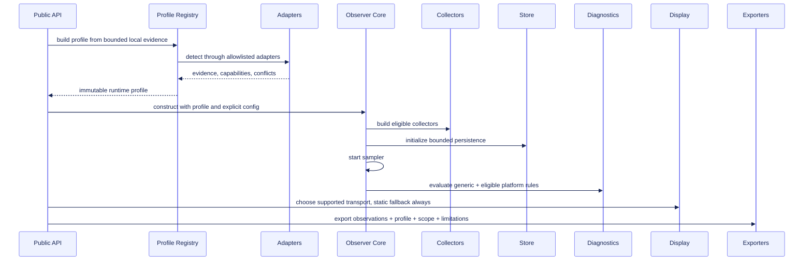
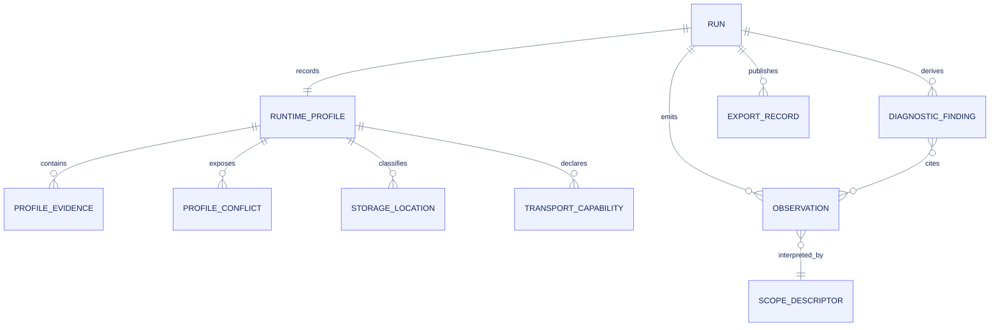
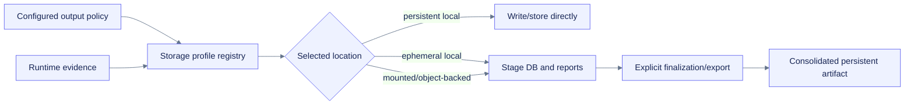

# Architecture

**Path:** `docs/planning/generalize-notebook-runtime-observer/architecture.md`  
**Purpose:** Give implementers a precise component, control-flow, data-flow, failure, migration, and ownership model for the neutral core and first-party platform adapters.  
**Status:** Proposed

## Architectural thesis

The package is a Python runtime observer with notebook-aware presentation, not a universal notebook-server monitor. The core observes the active Python runtime and evidence visible to it. Additional platform or server evidence is contributed through explicit, bounded adapters.

The key design move is to replace implicit Colab assumptions with three explicit layers:

1. **Runtime profile:** what environment and capabilities can be evidenced.
2. **Measurement scope:** what each value actually covers.
3. **Behavior registries:** which collectors, storage guidance, diagnostics, and display transports may activate from that evidence.

## Component ownership

| Component | Owns | Does not own |
|---|---|---|
| Public API | Observer construction, lifecycle, display, export entry points | Platform detection internals |
| Observer core | State machine, sampler, stores, diagnostics, exports, cleanup | Provider-specific policy or mutation |
| Profile registry | Evidence collection, merge, conflicts, capabilities | Sampling loop, persistence, automatic installs |
| Generic collectors | System/process/GPU/framework evidence | Platform identity |
| Platform adapters | Provider/frontend/storage/transport evidence and optional collectors/rules | Core lifecycle or unrestricted plugin loading |
| Storage registry | Location classification and advisory output policy | Mounting, migrating, deleting, or copying without explicit policy |
| Display selector | Capability-based text/static/enhanced transport selection | Keepalive, hidden reconnect, session control |
| Optional server provider | Explicit authenticated server evidence | Kernel entitlement, implicit enablement, public binding |
| Support evidence registry | Validation artifacts and support tier derivation | Marketing claims without evidence |

## Control flow



## Proposed source layout

The exact implementation may preserve nearby conventions, but the plan targets a narrow first-party adapter layer rather than broad platform branching.

```text
src/nbops/
├── api.py
├── observer.py
├── sampler.py
├── models.py
├── runtime.py                  # public profile helpers / generic evidence façade
├── profiles.py                 # profile/evidence/conflict/support models
├── adapters/
│   ├── base.py
│   ├── registry.py
│   ├── generic.py
│   ├── ipython.py
│   ├── colab.py
│   ├── jupyter.py
│   └── deepnote.py
├── storage_profiles.py
├── collectors/
├── diagnostics/
│   ├── generic catalog
│   └── platform/storage catalogs
├── ui/
│   ├── notebook.py
│   ├── dashboard.py
│   ├── transport registry
│   └── colab_comm.py
├── stores/
├── exports/
└── schemas/
```

The optional server provider should remain outside the default core import graph and may live in a companion package/workspace until accepted.

## Runtime profile lifecycle

1. Capture immutable generic process/runtime context.
2. Construct first-party adapters independently.
3. Run bounded detection, preserving failures as unavailable evidence.
4. Canonicalize and merge evidence.
5. Record conflicts without silently overriding high-confidence claims.
6. Derive capability and support metadata.
7. Freeze the profile for the run.
8. Permit explicit profile refresh only as a separate action, not every sample.
9. Persist the profile and digest once; observations reference profile/scope efficiently.

## Data model relationships



## Detection boundaries

### Allowed initial evidence

- Python and operating-system metadata already available to the process.
- Allowlisted module-spec availability without importing absent frameworks.
- Allowlisted environment-variable presence or reduced values.
- Known local path existence/type/capability checks with existing path safety.
- IPython active-shell and display capability.
- cgroup/rlimit evidence already used for resource scope.
- Explicit user configuration labeled as user-supplied.

### Disallowed by default

- Network calls.
- Account or workspace APIs.
- Secret/token/connection-file reads.
- Notebook source inspection.
- Jupyter server discovery through credential scraping.
- Mount or storage mutation.
- Framework/package installation.
- Device allocation or runtime restart.
- Public server startup.

## Adapter selection

Adapters are not mutually exclusive. A Deepnote runtime may also provide IPython and Jupyter-compatible behaviors. The registry combines facets:

```text
generic-python
+ ipython-display
+ deepnote-provider
+ object-backed-workspace-storage
+ static-html/svg/table transports
= one runtime profile
```

This avoids `if platform == ...` behavior scattered throughout the core.

## Storage data flow



No copy occurs merely because a persistent location exists. The user/config must request finalization or choose the destination.

## Display architecture

One semantic dashboard model feeds all presentations:

```text
DashboardModel
├── summary cards
├── diagnostics
├── capability/support state
├── bounded time series
├── process table
├── exact data table
└── export descriptors
```

Renderers:

- text renderer;
- static semantic HTML/SVG/table renderer;
- experimental direct-comm renderer;
- future optional widget renderer.

Transport failure never affects sampling or persistence. All renderers consume bounded, sanitized model data.

## Optional server integration architecture

The server provider is deliberately separate because it changes authority:

```text
Kernel package <authenticated local request> Jupyter Server extension
```

The extension may expose bounded:

- server process-tree usage;
- kernel/session identifiers reduced to non-sensitive references;
- resource limits/quotas when configured;
- existing `jupyter-resource-usage` evidence when available.

It must not expose:

- server tokens;
- connection files;
- notebook content;
- unrelated user data;
- arbitrary process commands;
- mutation endpoints.

## Failure model

| Failure | Required behavior |
|---|---|
| Adapter constructor fails | Record bounded unavailable evidence; continue generic core. |
| Detector times out | Record timeout/limitations; continue. |
| Claims conflict | Preserve conflict; disable behavior requiring a resolved facet. |
| Storage classification unknown | Use conservative generic policy; make no durability claim. |
| Platform collector fails | Isolate field/collector; preserve sibling evidence. |
| Enhanced transport fails | Fall back to static/text; no reconnect loop. |
| Server provider unavailable | Kernel-local behavior remains complete. |
| Legacy profile missing | Read as legacy/unknown; do not infer. |
| Support evidence stale | Downgrade claim until revalidated. |

## Migration stages

| Stage | Compatibility posture |
|---|---|
| 0 — baseline | Freeze current API, Colab defaults, schemas, bundles, and evidence. |
| 1 — internal profile | Add internal read-only profile without persisted schema change. |
| 2 — Colab extraction | Route current Colab behavior through adapter with compatibility fixtures. |
| 3 — generic/IPython | Validate provider-neutral operation and static display. |
| 4 — persisted profile | Version schemas and preserve legacy readers. |
| 5 — Jupyter/Deepnote | Add evidence-gated preview/validated support. |
| 6 — optional server | Accept/defer/reject spike based on demand/security evidence. |
| 7 — public identity | Separate explicit decision; no implicit rename. |

## Observability of the observer

The profile/adapter system must report its own behavior:

- adapter run duration and outcome;
- evidence count and truncation;
- conflicts;
- selected capabilities and reason;
- storage policy and reason;
- display transport and fallback reason;
- support tier and evidence reference;
- profile schema version and digest.

These are local run metadata, not remote telemetry.

## Definition of architectural completion

- No generic core module requires Colab to import or operate.
- Colab behavior passes frozen compatibility fixtures through the adapter path.
- Platform adapters are bounded, deterministic, local, and failure-isolated.
- Every metric family has interpretable scope.
- Storage and display behavior follows explicit capabilities.
- Legacy artifacts remain readable.
- No public support or naming claim exceeds representative evidence.


## Focused design references

- [`platform-adapter-contract.md`](platform-adapter-contract.md) defines adapter evidence, merge, boundedness, failure, and side-effect rules.
- [`platform-diagnostics.md`](platform-diagnostics.md) defines profile-gated rule activation, copy, migration, and false-positive validation.
