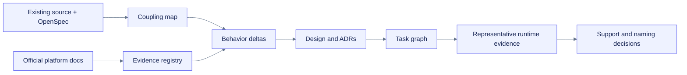

# Context map

**Path:** `docs/planning/generalize-notebook-runtime-observer/context-map.md`  
**Purpose:** Map authoritative source paths, current facts, assumptions, decisions, exclusions, and context-loading triggers.  
**Status:** Proposed  

## Source-of-truth hierarchy

1. Current user decision: generalize carefully in plan docs.
2. Existing validated `build-colab-observer` OpenSpec and repository evidence.
3. This follow-on proposal and behavior delta specs.
4. Current official Jupyter, IPython, Deepnote, Colab, Jupyter Server, and WCAG sources.
5. Planning inference and recommendations, labeled as such.

## Read-first repository evidence

| Path | Supports | Current finding |
|---|---|---|
| `src/nbops/observer.py`, `sampler.py`, `models.py` | Core lifecycle/evidence behavior | Primarily platform-neutral |
| `src/nbops/collectors/` | System/GPU/framework collection | Mostly generic; Drive/TPU/provider edges are platform-specific |
| `src/nbops/runtime.py` | Runtime detection | Contains Colab detection and generic runtime evidence |
| `src/nbops/config.py` | Output defaults/preflight | `/content` and Drive assumptions are concentrated here |
| `src/nbops/ui/notebook.py`, `fallback.py`, `dashboard.py` | Display baseline | IPython/static/text behavior is reusable |
| `src/nbops/ui/colab_comm.py` | Enhanced transport | Colab-specific, experimental, explicit, non-default |
| `scripts/run_jupyter_smoke.py` | Local Jupyter evidence | Current core already runs through a real local Jupyter kernel |
| `openspec/changes/build-colab-observer/` | Current behavior authority | Must remain unchanged by this planning pass |
| `docs/planning/build-colab-observer/finalization-report.md` | Evidence/status boundary | Local final-with-known-risks; managed runtime gaps remain |

## Facts

- The current engine already separates most lifecycle, collectors, stores, diagnostics, exports, and static display from Colab-specific behavior.
- Colab coupling is concentrated and can be moved behind compatibility-preserving adapters.
- A kernel-side Python package cannot assume Jupyter Server, sibling-kernel, workspace-quota, or physical-host visibility.
- Deepnote documents core Jupyter compatibility, an object-backed `/work` workspace, and fast ephemeral `/tmp` storage.
- Jupyter already has `jupyter-resource-usage`; generic CPU/RAM gauge behavior is not enough differentiation.

## Assumptions

- `ASSUMPTION-GEN-001`: One Python distribution remains preferable until separate platform dependencies or ownership justify splitting.
- `ASSUMPTION-GEN-002`: Local JupyterLab/Notebook 7 and Deepnote are the first two non-Colab naming-gate targets.
- `ASSUMPTION-GEN-003`: Static semantic display is acceptable as the initial supported path on every platform.
- `ASSUMPTION-GEN-004`: Optional Jupyter Server evidence can be evaluated without making it a core dependency.
- `ASSUMPTION-GEN-005`: Public API additions remain read-only and additive during the first implementation wave.

## Decisions

- Separate change ID: `generalize-notebook-runtime-observer`.
- Preserve Colab-first positioning and package identity during architecture work.
- Use faceted profile evidence, not exclusive platform branching.
- Promote support only from representative evidence.
- Treat server integration as a separate trust/deployment boundary.

## Unknowns

- Exact stable detection signals for Deepnote and managed Jupyter deployments.
- Whether a server provider should interoperate with `jupyter-resource-usage` or remain independent.
- Whether managed Colab direct comm satisfies the local-only/no-runtime-CDN contract in practice.
- Whether neutral naming materially improves discovery enough to justify migration cost.

## Excluded context

- Full historical validation logs are linked, not duplicated.
- Raw environment variables, account/workspace identifiers, notebook contents, and server credentials are unnecessary and excluded.
- Future Kaggle, Databricks, SageMaker, VS Code, and non-Python kernel plans are candidates, not current scope.

## Context acquisition flow

