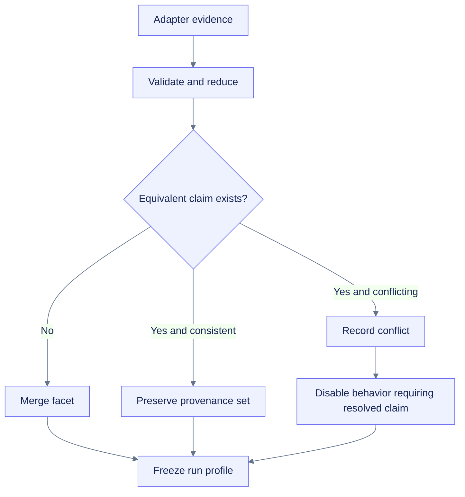

# Platform adapter contract

**Path:** `docs/planning/generalize-notebook-runtime-observer/platform-adapter-contract.md`  
**Purpose:** Define the first-party adapter responsibilities, evidence shape, merge behavior, boundedness, side-effect prohibitions, cleanup, and implementation validation.  
**Status:** Proposed  
**Load/use when:** Implementing TASK-112 or any generic, IPython, Colab, Jupyter, Deepnote, or future first-party runtime adapter.

## Contract objective

Adapters translate bounded local evidence into profile facets and optional platform capabilities. They do not own the observer lifecycle, sampler, stores, generic collectors, exports, or support labels.

An adapter answers:

1. What evidence can this process safely observe?
2. Which profile facet does that evidence support?
3. What confidence, freshness, scope, and limitations apply?
4. Which optional collectors, diagnostics, storage hints, or display transports become eligible?
5. What remains unknown or conflicted?

## Conceptual interface

```python
class RuntimeAdapter(Protocol):
    descriptor: AdapterDescriptor

    def detect(self, context: DetectionContext) -> AdapterResult: ...
    def close(self) -> None: ...
```

This is a design sketch, not a frozen public API. The observable obligations remain in the `platform-adapters` and `runtime-profiles` delta specs.

## Adapter descriptor

| Field | Meaning | Required constraint |
|---|---|---|
| `adapter_id` | Stable first-party adapter identity | Bounded, version-independent identifier |
| `adapter_version` | Evidence-production contract version | Changes when semantics change |
| `facets` | Profile facets the adapter may contribute | Explicit allowlist |
| `priority` | Merge hint for equivalent evidence | Cannot silently discard conflicts |
| `timeout_s` | Detection deadline | Finite and bounded |
| `max_evidence_items` | Cardinality cap | Enforced before accumulation |
| `max_evidence_bytes` | Serialized evidence cap | Enforced before persistence/export |
| `cleanup_required` | Whether resources are opened | Cleanup failure becomes bounded evidence |

## Evidence item

Each contribution should contain:

```text
facet
claim
source
source_version
confidence
observed_at
freshness_policy
scope
limitations
privacy_class
raw_evidence_digest
```

Raw environment values, tokens, notebook source, connection files, and unrestricted provider output are not evidence payloads. Store only reduced allowlisted facts and a digest when useful.

## Merge and conflict rules



Rules:

- Higher priority does not erase contradictory evidence.
- A user-supplied override is labeled `user-supplied`; it cannot fabricate measurement scope or support tier.
- Provider identity, frontend identity, kernel identity, storage type, and display capability are independent facets.
- Unknown values remain unknown.
- Conflicts are visible in the profile and export bundle.
- Support tier is derived separately from validation evidence, not adapter confidence alone.

## Side-effect boundary

Adapters MUST NOT by default:

- access network or account APIs;
- install/import absent heavyweight frameworks;
- mount storage;
- start a server or bind a port;
- read notebook source or arbitrary environment values;
- read Jupyter connection files or tokens;
- change accelerator allocation;
- restart or keep alive a runtime;
- create reconnect or polling loops;
- mutate observer configuration after profile freeze.

An optional Jupyter Server provider is a separately installed, authenticated, explicitly enabled integration with its own security and deployment boundary.

## Detection cadence

Profile detection occurs at run initialization and is frozen for that run. An explicit refresh may be designed later, but it must:

- create a new profile revision or clearly versioned evidence set;
- preserve the original profile used for prior observations;
- avoid implicit repeated platform probing on every sample;
- maintain bounded time, cardinality, and payload size.

## First-party adapter responsibilities

| Adapter | Contributes | Does not claim |
|---|---|---|
| Generic Python | Python/runtime/OS/process-visible facets | Notebook frontend or hosted provider |
| IPython | Active shell and rich-display capability | Jupyter Server, Colab, or Deepnote identity |
| Colab | Managed Colab provider evidence, `/content`, Drive/TPU capability hints, Colab transport eligibility | Stable quotas, session lifetime, or accelerator utilization |
| Jupyter | Jupyter-compatible kernel/frontend evidence available locally | Server-wide usage, sibling kernels, or authenticated server access |
| Deepnote | Reduced provider evidence and storage-profile hints | Exact Jupyter frontend parity or durable `/tmp` storage |
| Optional server provider | Authenticated bounded server-level evidence | Kernel entitlement or cross-user visibility |

## Failure containment

| Failure | Required outcome |
|---|---|
| Constructor/import metadata fails | Adapter unavailable; generic core continues |
| Detector exceeds deadline | Timeout evidence; no global startup failure |
| Payload exceeds cap | Truncate/reject with explicit limitation |
| Field malformed | Field unavailable; valid sibling evidence survives |
| Cleanup fails | Bounded warning/event; other adapters continue |
| Claims conflict | Conflict retained; dependent behavior disabled or conservative |
| Platform disappears/changes after start | Original profile remains the run contract; later evidence is separate |

## Task mapping

| Contract area | Primary tasks |
|---|---|
| Models/evidence/conflicts | TASK-110, TASK-111 |
| Registry and merge | TASK-112 |
| Generic/IPython/Colab adapters | TASK-120, TASK-121, TASK-122 |
| Deepnote/Jupyter adapters | TASK-125, TASK-126 |
| Optional server provider | TASK-127 |
| Contract matrix | TASK-150 |
| Security negatives | TASK-156 |

## Validation matrix

- Constructor, detection, cleanup, timeout, size, and cardinality failures are isolated.
- Equivalent evidence merges deterministically.
- Conflicting evidence remains visible.
- Adapter ordering does not change semantic results when evidence is equivalent.
- Unknown provider plus IPython still yields a usable generic profile.
- Explicit overrides are labeled and cannot widen scope/support.
- No detector performs network, mount, server, install, notebook-source, or secret operations.
- Profile serialization is deterministic and bounded.
- Old Colab behavior passes through the extracted adapter unchanged.

## Definition of done

The adapter layer is complete only when the core imports and operates without Colab, every first-party adapter has negative/failure tests, Colab compatibility fixtures pass, profile conflicts are observable, and representative runtime evidence supports any promoted platform claim.
