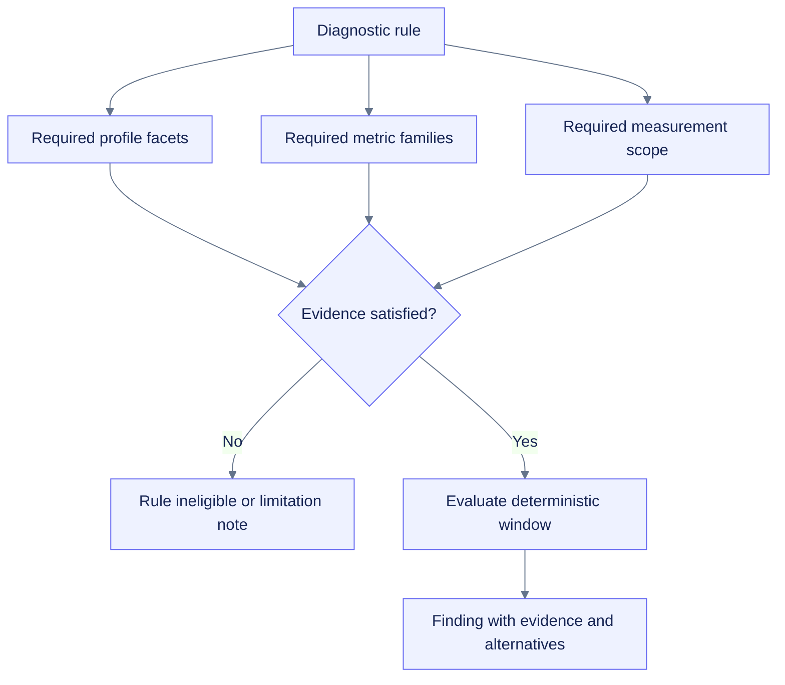

# Platform diagnostics

**Path:** `docs/planning/generalize-notebook-runtime-observer/platform-diagnostics.md`  
**Purpose:** Define how generic, provider-specific, storage-specific, and server-informed diagnostics activate from profile evidence without overclaiming platform facts.  
**Status:** Proposed  
**Load/use when:** Implementing TASK-128, extending the diagnostic catalog, writing platform remediation copy, or validating support-tier behavior.

## Diagnostic principle

The diagnostic engine remains deterministic and evidence-based. Platform awareness changes eligibility and explanatory copy, not the underlying requirement for measurable evidence, confidence, alternatives, limitations, hysteresis, cooldown, and recovery.

A detected platform name is insufficient to activate a rule. A platform diagnostic requires the specific profile facets and metric evidence named by the rule.

## Diagnostic classes

| Class | Examples | Activation source |
|---|---|---|
| Generic runtime | CPU saturation, RAM pressure/growth, disk pressure, sampler lag, queue pressure | Generic observations and scope |
| Accelerator/framework | GPU idle with workload evidence, VRAM pressure, provider degradation | GPU/framework observations and capability evidence |
| Colab-specific | Mounted Drive I/O risk, `/content` ephemerality, TPU telemetry limitation | Colab provider plus relevant storage/device evidence |
| Deepnote-specific | Object-backed `/work` high-frequency-write risk, `/tmp` finalization risk | Deepnote provider plus storage profile and write pattern |
| Jupyter/server-informed | Kernel-local versus server-level discrepancy, configured quota pressure | Optional authenticated server evidence plus kernel evidence |
| Support/evidence quality | Stale profile, conflicting provider claim, unsupported enhanced transport | Profile conflicts, freshness, and support evidence |

## Eligibility contract

Each rule declares:

- required profile facets;
- acceptable confidence and freshness;
- required metric families and units;
- acceptable measurement scopes;
- minimum evidence window;
- activation/recovery thresholds;
- alternative explanations;
- platform-specific remediation copy;
- generic fallback copy;
- limitations and support-tier requirements.

## Copy and certainty rules

- Use “possible” or “likely” when evidence is indirect.
- Name the scope: process tree, container-visible, server-reported, or unknown.
- Name missing companion evidence.
- Never describe a missing quota as unlimited.
- Never call a container-visible value host-wide.
- Never recommend keepalive, timeout bypass, reconnect automation, quota circumvention, automatic deletion, runtime restart, or workload mutation.
- Recommendations remain user-controlled and non-destructive.

## Platform-specific examples

### Colab Drive I/O risk

Eligible only when:

- Colab provider evidence is present;
- the relevant path is classified as mounted Drive;
- observed write latency/throughput or operation pattern supports the finding.

Do not trigger solely because `/content/drive` exists. Remediation may recommend staging active work locally and finalizing a consolidated artifact, but must not mount Drive or move/delete files automatically.

### Deepnote object-backed workspace pressure

Eligible only when:

- Deepnote provider evidence is present or the storage class is directly evidenced;
- the active working destination is object-backed/persistent;
- frequent small writes or measured latency support the finding.

The rule should explain `/tmp` as fast/ephemeral and `/work` as persistent/object-backed only when platform evidence is current. It must not assume all project storage behaves identically or copy data without explicit action.

### Jupyter server evidence mismatch

Eligible only when an optional authenticated provider supplies server-level evidence. A kernel-only installation cannot diagnose sibling-kernel or server-wide contention. If server evidence is absent, report the limitation rather than inferring it.

### Provider/profile degradation

Conflicting, stale, timed-out, or truncated profile evidence may produce a support-quality finding. The finding should identify affected capabilities and fallback behavior without exposing raw environment values or provider internals.

## Catalog migration

Existing Colab rules migrate through three steps:

1. Separate generic metric logic from platform-specific eligibility/copy.
2. Add explicit profile and scope prerequisites.
3. Preserve legacy finding identifiers where semantics are unchanged; version/supersede identifiers when semantics materially change.

Historical reports remain interpretable. New reports carry catalog version, profile version/digest, scope, and limitations.

## Task mapping

| Work | Tasks |
|---|---|
| Profile/scope prerequisites | TASK-110, TASK-123 |
| Storage evidence | TASK-124, TASK-125 |
| Generalize catalog and copy | TASK-128 |
| Persist/export evidence | TASK-114, TASK-140 |
| Representative platform validation | TASK-153, TASK-154, TASK-155 |
| Security/privacy negatives | TASK-156 |

## Validation matrix

- Generic findings remain unchanged under generic Python/IPython profiles.
- Colab-specific rules do not activate under Jupyter or Deepnote from name similarity alone.
- Drive rules require mounted-Drive evidence.
- Deepnote storage rules require profile/storage/write evidence.
- Server-informed rules are impossible without the optional authenticated provider.
- Conflicting/stale profile evidence suppresses or qualifies affected findings.
- Finding evidence, alternatives, limitations, and remediation survive Markdown/HTML/bundle export.
- No rule mutates user workloads or platform state.
- False-positive review uses representative traces, not only synthetic threshold fixtures.

## Definition of done

Platform diagnostics are complete when all current rules have explicit generic/platform eligibility, old finding semantics are preserved or versioned, cross-platform false activations are prevented, representative platform traces exercise eligible rules, and every recommendation remains local, transparent, and user-controlled.
