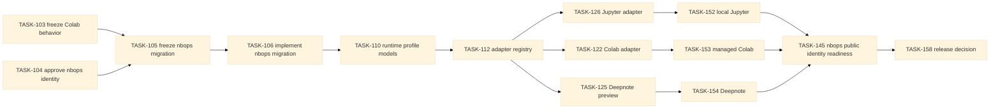

# Task graph: `nbops` identity migration and notebook-runtime generalization

**Path:** `docs/planning/generalize-notebook-runtime-observer/task-graph.md`  
**Purpose:** Human-readable dependency waves and sequence lock mirrored by `task-graph.json`.  
**Status:** Proposed

## Sequence lock

`TASK-103` → `TASK-105` → `TASK-106` → runtime-profile foundation. `TASK-104` is the completed identity decision.

## A — evidence and contracts

- `TASK-100-audit-current-coupling`
- `TASK-101-research-platform-boundaries`
- `TASK-102-write-follow-on-contracts`
- `TASK-103-freeze-colab-compatibility-fixtures`
- `TASK-104-approve-nbops-canonical-identity`
- `TASK-105-freeze-nbops-migration-fixtures`
- `TASK-106-implement-nbops-identity-migration`

## B — runtime profile foundation

- `TASK-110-implement-runtime-profile-models`
- `TASK-111-implement-evidence-validation`
- `TASK-112-implement-adapter-registry`
- `TASK-113-implement-support-tier-evaluator`
- `TASK-114-persist-profile-and-scope`
- `TASK-115-expose-read-only-profile`

## C — environments, scope, and storage

- `TASK-120-implement-generic-python-adapter`
- `TASK-121-implement-ipython-adapter`
- `TASK-122-extract-colab-adapter`
- `TASK-123-implement-measurement-scope`
- `TASK-124-implement-storage-profile-registry`
- `TASK-125-implement-deepnote-preview-adapter`
- `TASK-126-implement-jupyter-profile-adapter`
- `TASK-127-spike-optional-server-provider`
- `TASK-128-generalize-platform-diagnostics`

## D — display and accessibility

- `TASK-130-unify-semantic-dashboard-model`
- `TASK-131-regress-static-universal-baseline`
- `TASK-132-implement-transport-capability-registry`
- `TASK-133-keep-colab-comm-experimental`
- `TASK-134-validate-semantic-parity`
- `TASK-135-enforce-cross-platform-payload-bounds`

## E — migration, examples, and adoption

- `TASK-140-migrate-run-and-export-schemas`
- `TASK-141-preserve-legacy-bundle-readers`
- `TASK-142-preserve-colab-behavior-and-legacy-compatibility`
- `TASK-143-add-platform-evidence-examples`
- `TASK-144-generate-evidence-backed-support-docs`
- `TASK-145-validate-nbops-public-identity-readiness`
- `TASK-146-evaluate-optional-package-extras`

## F — representative validation and release

- `TASK-150-run-profile-contract-matrix`
- `TASK-151-run-generic-python-ipython-runtime`
- `TASK-152-run-local-jupyter-runtime`
- `TASK-153-run-managed-colab-runtime`
- `TASK-154-run-deepnote-runtime`
- `TASK-155-run-jupyterhub-server-boundary`
- `TASK-156-run-security-privacy-negative-matrix`
- `TASK-157-run-cross-platform-performance-matrix`
- `TASK-158-make-generalization-release-decision`

## Critical dependency flow

## Boundary

This graph authorizes local package/import/CLI/artifact migration to `nbops` within task scopes. It does not authorize installs, network/package resolution, external platform access, remote repository rename, registry publication, deployment, or OpenSpec apply/sync/archive.
