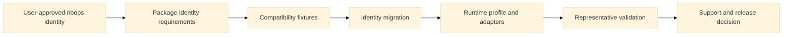

# Traceability matrix

**Path:** `docs/planning/generalize-notebook-runtime-observer/traceability-matrix.md`  
**Purpose:** Map every behavior requirement to scenarios, tasks, validation, and status.  
**Status:** Active

| Requirement | Scenarios | Tasks | Validation | Status |
|---|---|---|---|---|
| `REQ-IDN-001` | New installation uses the canonical distribution; New code imports the canonical package | `TASK-104-approve-nbops-canonical-identity`; `TASK-105-freeze-nbops-migration-fixtures`; `TASK-106-implement-nbops-identity-migration`; `TASK-150-run-profile-contract-matrix` | Identity fixtures, clean wheel/import/CLI/default/artifact scan | Proposed |
| `REQ-IDN-002` | Colab quickstart preserves the flagship wedge; Non-Colab documentation remains truthful | `TASK-106-implement-nbops-identity-migration`; `TASK-122-extract-colab-adapter`; `TASK-143-add-platform-evidence-examples`; `TASK-144-generate-evidence-backed-support-docs` | Identity fixtures, clean wheel/import/CLI/default/artifact scan | Proposed |
| `REQ-IDN-003` | Existing local notebook uses the legacy import; Historical OpenSpec identifier remains stable | `TASK-103-freeze-colab-compatibility-fixtures`; `TASK-105-freeze-nbops-migration-fixtures`; `TASK-106-implement-nbops-identity-migration`; `TASK-142-preserve-colab-behavior-and-legacy-compatibility` | Identity fixtures, clean wheel/import/CLI/default/artifact scan | Proposed |
| `REQ-IDN-004` | New Colab output uses the canonical directory; Legacy artifact remains readable | `TASK-105-freeze-nbops-migration-fixtures`; `TASK-106-implement-nbops-identity-migration`; `TASK-140-migrate-run-and-export-schemas`; `TASK-141-preserve-legacy-bundle-readers` | Identity fixtures, clean wheel/import/CLI/default/artifact scan | Proposed |
| `REQ-RTP-001` | Profile is composed from available evidence; Profile survives portable export | `TASK-110-implement-runtime-profile-models`; `TASK-111-implement-evidence-validation`; `TASK-112-implement-adapter-registry`; `TASK-115-expose-read-only-profile`; `TASK-150-run-profile-contract-matrix` | Model/schema/property tests | Proposed |
| `REQ-RTP-002` | Conflicting evidence remains visible; Sensitive raw evidence is minimized | `TASK-110-implement-runtime-profile-models`; `TASK-111-implement-evidence-validation`; `TASK-112-implement-adapter-registry`; `TASK-115-expose-read-only-profile`; `TASK-150-run-profile-contract-matrix` | Model/schema/property tests | Proposed |
| `REQ-RTP-003` | Unknown notebook provider does not block observation; IPython does not imply a hosted provider | `TASK-110-implement-runtime-profile-models`; `TASK-111-implement-evidence-validation`; `TASK-112-implement-adapter-registry`; `TASK-115-expose-read-only-profile`; `TASK-150-run-profile-contract-matrix` | Model/schema/property tests | Proposed |
| `REQ-SCP-001` | Container-visible value is not called host-wide; Process-tree value remains distinct | `TASK-123-implement-measurement-scope`; `TASK-150-run-profile-contract-matrix`; `TASK-157-run-cross-platform-performance-matrix` | Scope and limit-source tests plus runtime matrix | Proposed |
| `REQ-SCP-002` | Missing limit is not unlimited; Limit source is retained | `TASK-123-implement-measurement-scope`; `TASK-150-run-profile-contract-matrix`; `TASK-157-run-cross-platform-performance-matrix` | Scope and limit-source tests plus runtime matrix | Proposed |
| `REQ-SCP-003` | Kernel-only install remains kernel-scoped; Authorized server evidence is additive | `TASK-123-implement-measurement-scope`; `TASK-150-run-profile-contract-matrix`; `TASK-157-run-cross-platform-performance-matrix` | Scope and limit-source tests plus runtime matrix | Proposed |
| `REQ-ADP-001` | Provider and frontend may differ; Multiple adapters contribute safely | `TASK-112-implement-adapter-registry`; `TASK-120-implement-generic-python-adapter`; `TASK-121-implement-ipython-adapter`; `TASK-122-extract-colab-adapter`; `TASK-125-implement-deepnote-preview-adapter`; `TASK-126-implement-jupyter-profile-adapter` | Adapter merge/failure/side-effect tests | Proposed |
| `REQ-ADP-002` | Broken provider detector does not abort; Cleanup failure is contained | `TASK-112-implement-adapter-registry`; `TASK-120-implement-generic-python-adapter`; `TASK-121-implement-ipython-adapter`; `TASK-122-extract-colab-adapter`; `TASK-125-implement-deepnote-preview-adapter`; `TASK-126-implement-jupyter-profile-adapter` | Adapter merge/failure/side-effect tests | Proposed |
| `REQ-ADP-003` | Detection is read-only; Explicit platform override cannot fabricate scope | `TASK-112-implement-adapter-registry`; `TASK-120-implement-generic-python-adapter`; `TASK-121-implement-ipython-adapter`; `TASK-122-extract-colab-adapter`; `TASK-125-implement-deepnote-preview-adapter`; `TASK-126-implement-jupyter-profile-adapter` | Adapter merge/failure/side-effect tests | Proposed |
| `REQ-STO-001` | Ephemeral and persistent locations differ; Unknown storage remains unknown | `TASK-124-implement-storage-profile-registry`; `TASK-125-implement-deepnote-preview-adapter`; `TASK-154-run-deepnote-runtime` | Storage classification, containment, and platform runtime tests | Proposed |
| `REQ-STO-002` | High-frequency writes stay local when configured; Legacy output remains compatible | `TASK-124-implement-storage-profile-registry`; `TASK-125-implement-deepnote-preview-adapter`; `TASK-154-run-deepnote-runtime` | Storage classification, containment, and platform runtime tests | Proposed |
| `REQ-STO-003` | Unmounted destination fails safely; Final copy is explicit | `TASK-124-implement-storage-profile-registry`; `TASK-125-implement-deepnote-preview-adapter`; `TASK-154-run-deepnote-runtime` | Storage classification, containment, and platform runtime tests | Proposed |
| `REQ-DSP-001` | Unknown frontend remains usable; Compatible IPython renders static output | `TASK-130-unify-semantic-dashboard-model`; `TASK-131-regress-static-universal-baseline`; `TASK-132-implement-transport-capability-registry`; `TASK-134-validate-semantic-parity` | Static/browser/transport semantic parity tests | Proposed |
| `REQ-DSP-002` | Unavailable enhanced transport falls back; Experimental transport is explicit | `TASK-130-unify-semantic-dashboard-model`; `TASK-131-regress-static-universal-baseline`; `TASK-132-implement-transport-capability-registry`; `TASK-134-validate-semantic-parity` | Static/browser/transport semantic parity tests | Proposed |
| `REQ-DSP-003` | Chart failure preserves data access; Transport does not change metric meaning | `TASK-130-unify-semantic-dashboard-model`; `TASK-131-regress-static-universal-baseline`; `TASK-132-implement-transport-capability-registry`; `TASK-134-validate-semantic-parity` | Static/browser/transport semantic parity tests | Proposed |
| `REQ-SUP-001` | Detected platform is not automatically supported; Support evidence is inspectable | `TASK-113-implement-support-tier-evaluator`; `TASK-144-generate-evidence-backed-support-docs`; `TASK-158-make-generalization-release-decision` | Evidence-record promotion/downgrade tests | Proposed |
| `REQ-SUP-002` | Promotion requires all mandatory gates; Stale evidence is visible | `TASK-113-implement-support-tier-evaluator`; `TASK-144-generate-evidence-backed-support-docs`; `TASK-158-make-generalization-release-decision` | Evidence-record promotion/downgrade tests | Proposed |
| `REQ-SUP-003` | Deepnote-specific profile fails; Jupyter server provider absent | `TASK-113-implement-support-tier-evaluator`; `TASK-144-generate-evidence-backed-support-docs`; `TASK-158-make-generalization-release-decision` | Evidence-record promotion/downgrade tests | Proposed |
| `REQ-DIA-001` | Drive warning requires Drive evidence; Object-backed storage warning is scoped | `TASK-128-generalize-platform-diagnostics`; `TASK-150-run-profile-contract-matrix` | Diagnostic activation/suppression/golden tests | Proposed |
| `REQ-DIA-002` | Provider limitation is not overclaimed; Generic copy replaces unsupported platform copy | `TASK-128-generalize-platform-diagnostics`; `TASK-150-run-profile-contract-matrix` | Diagnostic activation/suppression/golden tests | Proposed |
| `REQ-MIG-001` | New three-cell notebook uses nbops; Existing local notebook receives bounded compatibility; New runtime profile is additive | `TASK-103-freeze-colab-compatibility-fixtures`; `TASK-105-freeze-nbops-migration-fixtures`; `TASK-106-implement-nbops-identity-migration`; `TASK-142-preserve-colab-behavior-and-legacy-compatibility` | Legacy/current import/artifact/schema matrix | Proposed |
| `REQ-MIG-002` | Old bundle remains readable; New artifact declares current identity and version | `TASK-105-freeze-nbops-migration-fixtures`; `TASK-106-implement-nbops-identity-migration`; `TASK-140-migrate-run-and-export-schemas`; `TASK-141-preserve-legacy-bundle-readers` | Legacy/current import/artifact/schema matrix | Proposed |
| `REQ-MIG-003` | Partial migration fails the release gate; Historical identifiers remain provenance | `TASK-104-approve-nbops-canonical-identity`; `TASK-105-freeze-nbops-migration-fixtures`; `TASK-106-implement-nbops-identity-migration`; `TASK-145-validate-nbops-public-identity-readiness` | Legacy/current import/artifact/schema matrix | Proposed |
| `REQ-SEC-001` | Environment marker is reduced; Connection secrets are excluded | `TASK-111-implement-evidence-validation`; `TASK-127-spike-optional-server-provider`; `TASK-135-enforce-cross-platform-payload-bounds`; `TASK-156-run-security-privacy-negative-matrix` | Security/privacy negative matrix | Proposed |
| `REQ-SEC-002` | Unauthenticated request is rejected; Kernel package works without server integration | `TASK-111-implement-evidence-validation`; `TASK-127-spike-optional-server-provider`; `TASK-135-enforce-cross-platform-payload-bounds`; `TASK-156-run-security-privacy-negative-matrix` | Security/privacy negative matrix | Proposed |
| `REQ-SEC-003` | Adapter cannot widen product authority; Transport failure does not trigger reconnect automation | `TASK-111-implement-evidence-validation`; `TASK-127-spike-optional-server-provider`; `TASK-135-enforce-cross-platform-payload-bounds`; `TASK-156-run-security-privacy-negative-matrix` | Security/privacy negative matrix | Proposed |

## Identity convergence rule

`REQ-IDN-*` and `REQ-MIG-*` fail when current install/import/CLI/default/artifact/docs surfaces disagree on `nbops`, or when a historical identifier is presented as current rather than legacy/provenance.

## Flow

