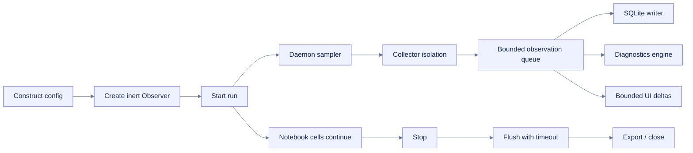

# Design: `colab-observer`

**Path:** `openspec/changes/build-colab-observer/design.md`  
**Purpose:** Define the proposed architecture, contracts, alternatives, and implementation boundaries.  
**Status:** Proposed

## Summary

Use a single publishable Python package as the product core, plus a private TypeScript dashboard workspace and a Fumadocs application in the same repository. The observer samples through isolated collectors on a daemon thread, moves observations through a bounded in-process queue, persists them to SQLite by default, evaluates deterministic diagnostic rules, and streams compact deltas into a progressively enhanced notebook widget. Static summaries and semantic tables remain available when the widget layer is unsupported.

## Goals and non-goals

### Goals

- Start in one call without blocking notebook execution.
- Keep core installation and cold-start cost low in ephemeral runtimes.
- Make every missing or approximate capability explicit.
- Preserve raw local evidence and generate portable reports.
- Make the live experience polished without making JavaScript a correctness dependency.
- Keep privacy, accessibility, and Colab-policy boundaries architectural rather than aspirational.

### Non-goals

- Hosted ingestion, remote dashboards, multi-user workspaces, or long-term SaaS retention.
- Guaranteed accelerator telemetry beyond what the runtime/provider exposes.
- Automatic workload tuning or mutation.
- A frontend framework or web server exposed as a public runtime service.

## Context and assumptions

- ASSUMPTION-001: Colab environments remain Linux notebook runtimes with Python package installation available, but exact Python, GPU, driver, and widget behavior can vary.
- ASSUMPTION-002: A two-second default core cadence is useful and low enough overhead, but performance tests may adjust it before release.
- ASSUMPTION-003: SQLite is available through Python’s standard library and is the safest zero-extra-dependency durable store.
- ASSUMPTION-004: Rich live charts are progressive enhancement; static summaries, accessible tables, and exports are the portability baseline.
- ASSUMPTION-005: Framework imports must remain optional and lazy to avoid changing user environments or importing large libraries solely for monitoring.

## Proposed repository architecture

```text
colab-observer/
├── AGENTS.md
├── pyproject.toml
├── uv.lock
├── package.json
├── pnpm-lock.yaml
├── pnpm-workspace.yaml
├── .pre-commit-config.yaml
├── src/colab_observer/
│   ├── AGENTS.md
│   ├── api.py
│   ├── config.py
│   ├── models.py
│   ├── observer.py
│   ├── sampler.py
│   ├── events.py
│   ├── collectors/
│   │   ├── AGENTS.md
│   │   ├── base.py
│   │   ├── runtime.py
│   │   ├── cpu.py
│   │   ├── memory.py
│   │   ├── disk.py
│   │   ├── network.py
│   │   ├── process.py
│   │   ├── gpu_nvml.py
│   │   ├── gpu_nvidia_smi.py
│   │   ├── pytorch.py
│   │   ├── tensorflow.py
│   │   ├── jax.py
│   │   └── tpu.py
│   ├── diagnostics/
│   │   ├── engine.py
│   │   ├── rules.py
│   │   └── catalog.py
│   ├── stores/
│   │   ├── base.py
│   │   ├── sqlite.py
│   │   └── duckdb.py
│   ├── exports/
│   │   ├── tabular.py
│   │   ├── reports.py
│   │   └── bundle.py
│   ├── ui/
│   │   ├── AGENTS.md
│   │   ├── transport.py
│   │   ├── notebook.py
│   │   ├── fallback.py
│   │   └── static/
│   └── integrations/
├── packages/dashboard-ui/
│   ├── AGENTS.md
│   └── src/
├── notebooks/
│   ├── AGENTS.md
│   └── colab-observer-quickstart.ipynb
├── examples/
├── tests/
├── apps/docs/
│   ├── AGENTS.md
│   └── ...
├── openspec/
└── .github/
    ├── AGENTS.md
    └── workflows/
```

The repository is a workspace for development convenience, but only `colab-observer` is a published runtime package. `packages/dashboard-ui` is private and compiles assets into the Python wheel. `apps/docs` is a support surface.

## Public API design

```python
from colab_observer import Observer, ObserverConfig, observe, start_observer

observer = observe(
    project="my-run",
    output_dir="/content/colab-observer/my-run",
    interval_s=2.0,
    collect_gpu=True,
    collect_processes=True,
    persist=True,
)

observer.display()
observer.stop()
observer.export_report(format="html")
observer.export_report(format="markdown")
observer.export_bundle()
```

Contract decisions:

- `Observer(config)` constructs an inert object.
- `Observer.start()` starts a run and returns `self`.
- `observe(...)` constructs and starts for notebook ergonomics.
- `start_observer(...)` is an explicit alias for discoverability.
- `stop()` is idempotent and flushes bounded pending work.
- `display()` may be called before or after start; it renders capability/status guidance rather than failing when enhanced UI is unavailable.
- `export_report()` and `export_bundle()` return concrete local paths and never upload.
- Context-manager use is supported for scripts, but notebook examples use explicit lifecycle calls.

## Runtime lifecycle and concurrency



Use one daemon sampling thread with monotonic scheduling, collector-specific cadences, and a bounded queue. A single writer owns the default database connection. This avoids notebook event-loop conflicts and prevents unbounded backpressure. Every batch records requested time, actual time, lag, duration, and skipped collectors. Collector exceptions become structured capability events rather than terminating the run.

Startup is transactional. After public preflight succeeds, any registry, collector, sampler, writer, store, or diagnostic initialization failure must unwind owned resources best-effort, clear live handles, expose a bounded error category, and leave the observer in `failed` rather than `starting`. A fatal sampler infrastructure exception is a distinct loss boundary: the daemon contains it, closes collectors, emits and best-effort persists a sanitized critical event, and allows `stop()` to produce `stopped_with_loss`. Raw provider or internal exception text is never part of portable evidence.

The default cadence proposal is:

| Collector group | Default cadence | Rationale |
|---|---:|---|
| CPU, memory, disk capacity, network counters | 2 s | Useful live signal at modest cost. |
| NVIDIA GPU summary | 2 s | Aligns with primary live bottleneck view. |
| Disk/process I/O and top processes | 10 s | More expensive and less volatile. |
| Static runtime/framework inventory | Once and on explicit refresh | Avoid repeated imports/probes. |
| Diagnostics evaluation | On relevant samples, at most every 2 s | Preserve evidence windows without a second polling loop. |

## Observation data model

One versioned envelope represents scalar observations:

```text
schema_version, run_id, sequence, observed_at_utc, monotonic_ns,
metric, value_number | value_text, unit, labels, source,
quality(exact|estimated|stale|unavailable), collection_duration_ms
```

Separate normalized records hold run metadata, process snapshots, events, and diagnostics. Labels are bounded and normalized to avoid cardinality explosions. Units use explicit machine-readable strings. Missing values are not coerced to zero. An unavailable observation carries provenance and unit metadata but no numeric or textual value.

Public constructors, decoders, root JSON Schemas, wheel-bundled schemas, and the TypeScript protocol must agree exactly on scalar types, mutually exclusive numeric/text/unavailable value modes, required units for numeric evidence, finite values, identifier bounds, label types, unique filters, and offset-aware timestamps. Boundary decoding fails closed rather than coercing strings, booleans, duplicate filters, naive datetimes, or structurally incomplete payloads into evidence.

## Collector architecture

Collectors implement a small internal protocol: identity, capability probe, default cadence, collect, and close. The registry resolves optional providers without importing frameworks unnecessarily.

- `psutil` provides core system/process counters. The first non-blocking CPU percentage sample is treated as warm-up rather than evidence.
- The official NVIDIA Python binding for NVML is the primary GPU provider; a strict argument-list `nvidia-smi` query is the fallback.
- PyTorch, TensorFlow, and JAX collectors run only when the framework is already importable and enabled; they never install or mutate it.
- TPU support reports detection, topology/device information, and explicit telemetry limitations. It does not invent utilization.
- Google Drive behavior is inferred only from mounted path/filesystem evidence and measured I/O; no account or Drive API access is required.

## Storage and export design

### Default store

Choose SQLite for the first stable release:

- available without an additional database dependency;
- durable and inspectable after a notebook session;
- supports transactional batches and indexes;
- appropriate for one writer and concurrent readers;
- easy to bundle and convert.

Use batched transactions, bounded WAL growth, prepared statements, and periodic checkpoints. Database write failure must fall back to an in-memory bounded buffer and surface a critical event; it must not crash the notebook.

### Optional analytical store

Offer DuckDB as an optional extra for direct analytical export/query, not as a core dependency or second mandatory write path. Revisit making it default only after installation, wheel size, and Colab cold-start measurements.

### Export bundle

```text
<run-id>/
├── README.md
├── report.html
├── summary.md
├── run.json
├── environment.json
├── metrics.csv
├── metrics.jsonl
├── processes.csv
├── diagnostics.jsonl
├── observer.sqlite
├── MANIFEST.json
└── checksums.sha256
```

Bundle creation uses a staging directory, validates required files, records schema/package versions and redaction status, computes hashes, and then creates the zip. Partial exports are labeled as partial and preserve the failure event.

Run IDs remain opaque logical identifiers. They are never joined directly into filesystem paths. A dedicated artifact-name function preserves already-safe single-segment identifiers and maps unsafe, reserved, Unicode, dotted, separator-bearing, or traversal-like identifiers to a deterministic hash-prefixed name in a disjoint filesystem namespace. The original run ID remains in SQLite, manifests, reports, and exported metadata. Final publication uses same-filesystem atomic replacement where possible, removes temporary/partial files on failure, and preserves an existing valid destination rather than reporting a corrupt artifact as complete.

Public schemas use stable non-network URN identifiers and ship in both the source tree and wheel. Readers make compatibility decisions from the bundled schema and declared schema version; schema identity never requires a network fetch or asserts control of an external domain.

## Dashboard architecture

### Decision

Use a progressively enhanced local notebook surface with a static renderer as the supported baseline:

- a modern script-free Python renderer with bounded SVG sparklines, diagnostic panels, semantic tables, responsive layout, reduced-motion behavior, and forced-color support;
- a narrow versioned snapshot/delta/control schema shared by Python and a private TypeScript workspace;
- an opt-in experimental direct Colab kernel-comm adapter using self-contained inline output code;
- no public share URL, runtime CDN, product-controlled endpoint, required localhost web server, background polling, or hidden reconnect;
- bounded incremental payloads and explicit bounded-history queries rather than full-history retransmission;
- text, semantic HTML, tables, and export surfaces when any enhanced transport is unsupported or declined.

The inspected current Colab custom-widget-manager implementation references a hosted `gstatic` manager asset, so it does not satisfy the strict no-runtime-CDN invariant and is not the default activation path. A direct kernel-comm candidate based on a first-party Colab helper pattern exists behind an explicit experimental function. It remains outside `Observer.display()` and the package root until real managed-Colab, browser-network, and accessibility evidence passes. See `docs/planning/build-colab-observer/widget-transport-spike.md`.

### UI data strategy

- Raw history remains in the store.
- The static renderer consumes a bounded in-memory history and keeps chart/table parity.
- The candidate transport carries sequence-numbered snapshots/deltas and explicit recovery state.
- Pausing updates freezes presentation but does not silently stop collection.
- Range and metric changes request bounded existing history; they cannot execute code or widen configured retention.
- UI transport loss does not affect persistence or diagnostics.
- Automatic push/delta streaming remains deferred until a real Colab transport proves stable and local-only.

### Accessibility model

Charts are summaries, not the only representation. Each visualization has:

- a programmatic title and concise textual interpretation;
- an accessible data table with units and time range;
- keyboard-operable filters and range controls;
- non-color severity and series encodings;
- reduced-motion behavior and a live-update pause;
- visible focus and no hover-only details;
- a high-contrast theme and responsive behavior in narrow output areas.

## Diagnostics engine

Rules consume typed observation windows and emit findings containing:

```text
finding_id, rule_id, first_seen, last_seen, status, severity,
confidence, title, explanation, evidence[], suggested_actions[],
related_metrics[], cooldown_until
```

Rules use activation and recovery thresholds, minimum durations, hysteresis, and cooldowns. They never change the workload. “Leak” findings are phrased as sustained growth consistent with a possible leak, with evidence and limitations.

Initial catalog:

- accelerator idle while CPU is saturated;
- sustained VRAM pressure;
- sustained RAM pressure or growth;
- disk capacity pressure;
- high local or mounted-Drive I/O latency;
- framework allocation with low accelerator utilization;
- resource-heavy processes;
- checkpoint/storage growth risk;
- sampler lag or monitor overhead;
- unavailable or degraded telemetry.

## Privacy and security design

Default collection excludes environment variable values, tokens, notebook cells, file contents, shell history, usernames, hostnames where unnecessary, full process command lines, and full package inventories. Process names and resource counters are permitted; command lines and package snapshots require explicit opt-in and redaction. Paths in reports are normalized or reduced to approved roots. Opaque run IDs and labels are treated as data, never path segments; export paths are derived through the deterministic containment boundary described above.

Subprocess calls use fixed executables, argument arrays, timeouts, output limits, and no shell. Frontend assets are local and use a restrictive rendering policy. Reports escape untrusted text and serialize JSON-LD safely in the docs app.

## Docs and delivery design

- `apps/docs`: Next.js App Router + Fumadocs + Tailwind CSS v4 + Fumadocs shadcn preset and shadcn/ui primitives.
- Product docs generate `llms.txt`, `llms-full.txt`, and `ai-index.json` as optional AI-reader aids, while conventional metadata, canonical URLs, sitemap, robots, JSON-LD, structured headings, and accessible content remain primary.
- Vercel Git integration is the default deployment proposal: previews for pull requests and production from the protected release branch. Deployment remains approval-gated.
- Python development uses `uv`; Node work uses `pnpm`. The package build backend should prioritize reproducible inclusion of prebuilt frontend assets; the final choice between Hatchling and `uv_build` is verified by wheel-content tests before implementation starts.

## Alternatives considered

| Decision | Preferred | Alternatives | Why not the alternatives now |
|---|---|---|---|
| Live UI | Static dashboard + explicitly opt-in direct comm candidate | Custom-widget manager, Gradio server, localhost port iframe, terminal-only TUI | The custom manager currently conflicts with the no-runtime-CDN invariant; server/port approaches add exposure; TUI is not notebook-native. |
| Store | SQLite core | DuckDB core, CSV-only, in-memory only | SQLite has no extra DB dependency and supports durable transactional history; CSV-only weakens recovery/query. |
| Sampler | Daemon thread + bounded queue | Asyncio task, subprocess agent, synchronous cell loop | Notebook event loops vary; subprocess lifecycle and IPC add complexity; synchronous loops block cells. |
| Frontend | Native DOM/SVG for the transport spike; framework decision deferred | Preact/ECharts, React-heavy app, Plotly | The native spike minimizes trust and build surface. Freeze a framework only after managed-Colab transport, size, performance, and accessibility evidence justify it. |
| Diagnostics | Deterministic rules | LLM inference, opaque anomaly model | Explainable, offline, testable, lower privacy and dependency risk. |
| Core config | Dataclasses/enums/protocols | Pydantic in core | Reduces cold-start and dependency cost; validation surface is small and controlled. |
| Storage analytics | Optional DuckDB | Mandatory DuckDB | Defers wheel/install overhead until measured. |

## Rollout and rollback

1. Release an internal development version with core sampling, SQLite, static output, and exports.
2. Add GPU and framework adapters behind extras and capability tests.
3. Keep enhanced transport explicitly opt-in until managed-Colab promotion evidence passes; preserve static output as the supported default and fallback.
4. Publish a pre-1.0 release only after CPU-only and GPU Colab smoke tests, wheel asset verification, accessibility audit, and privacy/export review.
5. Roll back a faulty enhanced UI by disabling the widget adapter and retaining static output; roll back a collector by capability-disable configuration without changing stored schema.

## Validation strategy

- Contract tests for schema, lifecycle, idempotence, redaction, and export manifests.
- Fake-provider collector tests plus hardware-gated GPU smoke tests.
- Timing, queue overflow, disk-full, malformed provider output, and interrupted-stop tests.
- Browser/widget tests for keyboard operation, semantic names, contrast, reduced motion, table parity, and responsive output.
- Clean Colab CPU/GPU notebook smoke runs with artifact capture.
- Package wheel inspection proving local frontend assets and no unintended files.
- Docs build, links, metadata, structured data, accessibility, and AI-export checks.
- OpenSpec strict validation when the current local tool supports the proposed commands.

## Open questions

- Confirm current Colab widget-manager behavior on CPU and GPU images before selecting auto-enable defaults.
- Benchmark Preact/ECharts bundle size and first-render time against a smaller custom SVG proof of concept.
- Decide whether package builds use Hatchling or `uv_build` after a wheel-data spike; continue using `uv` for dependency and environment management either way.
- Establish concrete overhead budgets from benchmarks rather than guessing in requirements.
