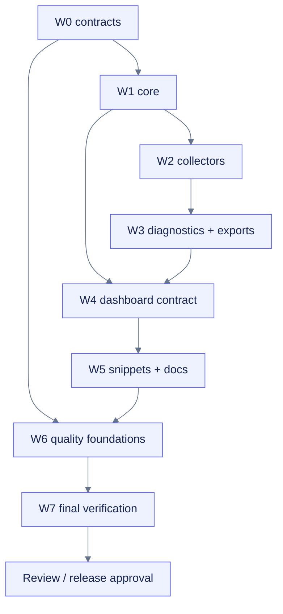

# Tasks: Build `colab-observer`

**Path:** `openspec/changes/build-colab-observer/tasks.md`  
**Purpose:** Dependency-aware, path-scoped implementation and validation plan.  
**Status:** CPU-first product hardening implemented locally; reproducibility, real Colab, enhanced UI, and release validation remain active.

## Legend

- `[x]` means the full task acceptance criteria are satisfied in this workspace.
- `[~]` means a useful, validated first-build subset is implemented but the original acceptance criteria still have named gaps.
- `[ ]` means blocked or intentionally deferred; see the first-build status table and durable loop ledger.
- `[P]` means parallel-safe only after dependencies are complete and only for the non-overlapping write scope shown.
- Verified commands are recorded in `AGENTS.md` and `docs/planning/build-colab-observer/validation.md`.
- Install, commit, push, publishing, Vercel, GitHub environment, and secret changes require explicit approval.

## Hardening status snapshot

**Evidence date:** 2026-07-25  
**Workspace:** reconstructed from the verified 2026-07-17 source ZIP into `/mnt/data/colab-observer-next-runtime-20260725`; no Git remote or owning repository was supplied.  
**Counts:** 17 complete, 24 partial, 4 blocked/deferred.

| Status | Task IDs | Evidence / remaining boundary |
|---|---|---|
| Complete | TASK-004, TASK-011, TASK-012, TASK-013, TASK-014, TASK-020, TASK-021, TASK-022, TASK-023, TASK-024, TASK-025, TASK-030, TASK-031, TASK-033, TASK-034, TASK-040, TASK-045 | Contract fixtures; terminal-aware lifecycle; bounded/loss-aware sampler and writer; hardened SQLite; field-isolated and cardinality-bounded collectors/providers; diagnostics; reports; deterministic exports; a versioned bounded Python/JSON-Schema/TypeScript dashboard contract; and the accessible static fallback satisfy their local acceptance surfaces. |
| Partial | TASK-001, TASK-002, TASK-003, TASK-010, TASK-032, TASK-041, TASK-042, TASK-043, TASK-044, TASK-046, TASK-050, TASK-051, TASK-052, TASK-053, TASK-054, TASK-055, TASK-060, TASK-061, TASK-062, TASK-063, TASK-070, TASK-071, TASK-073, TASK-074 | Validated subsets exist. Local terminal-control, fatal-worker, strict-provider-field, cardinality-bound, export-range, filesystem-alias, Drive-normalization, module-discovery, Chromium, and Jupyter-kernel evidence covers material portions of public contracts, security, rendering, and notebook export behavior. Remaining gaps are owner/license/repository decisions, reviewed lockfiles, type/lint/pre-commit execution, optional DuckDB evidence, managed-Colab execution, full process drilldowns, frozen docs build, remote CI, representative performance, dependency security review, and manual assistive-technology testing. |
| Blocked/deferred | TASK-064, TASK-065, TASK-072, TASK-075 | Deploy/publish setup, the real Colab CPU/NVIDIA/TPU matrix, and verify/sync/archive require representative runtime evidence, ownership decisions, complete validation, and explicit approval. |

Current hardening evidence lives in `docs/planning/build-colab-observer/runtime-evidence-hardening-20260725.md`, `runtime-boundary-hardening-20260717.md`, `final-assurance-hardening-20260716.md`, `representative-runtime-hardening-20260716.md`, `contract-lifecycle-hardening.md`, and `validation.md`. Original task acceptance criteria remain authoritative; fake/provider fixtures do not establish real Colab accelerator compatibility.

## Wave 0 — Preflight and contracts

- [~] TASK-001-ground-repository
  - Goal: Confirm target repository state, existing files, license intent, package-name availability, supported Colab/Python images, and repo-native commands.
  - Read: root files, active OpenSpec change, current Colab and registry evidence
  - Write scope: `docs/planning/build-colab-observer/context-map.md`, `source-registry.md`, `PLANS.md`
  - Validation: evidence paths and assumptions ledger are complete
  - Done when: no implementation command or existing convention is guessed

- [~] TASK-002-freeze-public-contracts
  - Goal: Resolve remaining API, schema, privacy, capability-state, and compatibility decisions.
  - Depends on: TASK-001-ground-repository
  - Read: all delta specs, `design.md`, decision records
  - Write scope: `openspec/changes/build-colab-observer/**`, `docs/planning/build-colab-observer/requirements-map.md`
  - Validation: OpenSpec strict validation when available; traceability review
  - Done when: public behavior is testable and design-only details remain outside specs

- [~] TASK-003-scaffold-workspaces
  - Goal: Create the Python project, private dashboard workspace, docs app boundary, tests, and nested agent guidance without implementing product behavior.
  - Depends on: TASK-002-freeze-public-contracts
  - Read: `architecture.md`, `agents-instruction-map.md`, `quality-automation.md`
  - Write scope: root manifests/config; `src/`; `packages/dashboard-ui/`; `apps/docs/`; `tests/`; nested `AGENTS.md`
  - Validation: lockfiles parse; package/workspace discovery; no overwrite of unreviewed files
  - Done when: empty workspaces import/build with explicit commands

- [x] TASK-004-add-contract-fixtures
  - Goal: Add typed sample envelopes, fake clocks/providers, golden exports, and accessibility fixture data before core implementation.
  - Depends on: TASK-003-scaffold-workspaces
  - Read: metrics and export specs
  - Write scope: `tests/fixtures/`, `tests/contract/`, `schemas/`
  - Validation: schema/golden fixture checks
  - Done when: core components can be implemented against deterministic evidence

## Wave 1 — Core observer and persistence

- [~] TASK-010-implement-models-config
  - Goal: Implement validated configuration, enums, observation/event/diagnostic models, and version constants.
  - Depends on: TASK-004-add-contract-fixtures
  - Read: runtime, metrics, export, security specs
  - Write scope: `src/colab_observer/config.py`, `models.py`, `tests/unit/test_config.py`, `test_models.py`
  - Validation: unit tests, type check, schema round trip
  - Done when: invalid and privacy-sensitive configurations fail clearly
  - Validated subset: Python constructors, decoders, root schemas, and wheel-bundled schemas now agree on scalar types, exact field sets, identity/control-character rules, metric/run/unit/source bounds, label types/collisions, finite numeric values, aware timestamps, JSON-compatible metadata, and value-free unavailable observations. Contract tests cover schema-valid maxima and reject coercive untrusted payloads. Drive dot-segment classification and optional module-discovery failures are now also covered. Ruff/ty and Python 3.11/3.12 execution remain open.

- [x] TASK-011-implement-observer-lifecycle
  - Goal: Implement inert construction, start, status, idempotent stop/close, context-manager support, and run identity.
  - Depends on: TASK-010-implement-models-config
  - Read: runtime spec and lifecycle design
  - Write scope: `src/colab_observer/api.py`, `observer.py`, `__init__.py`, lifecycle tests
  - Validation: lifecycle, rerun, double-stop, interrupted-start tests
  - Done when: public lifecycle behavior matches the spec
  - Validated subset: startup is transactional after preflight. Initialization failures close owned collectors/writer/sampler best-effort, clear live handles, expose bounded error state, and leave the observer `failed`. A fatal sampler now reports failed/non-running immediately, terminal phase markers and notes are rejected before entering a dead queue, stale global registrations are cleared, invalid flush deadlines fail before waiting, and idempotent clean/loss-aware stop behavior remains covered.

- [x] TASK-012-implement-sampler-queue
  - Goal: Implement monotonic scheduling, collector cadences, bounded queue, lag/overflow events, and graceful shutdown.
  - Depends on: TASK-011-implement-observer-lifecycle
  - Read: collector design and metrics model
  - Write scope: `src/colab_observer/sampler.py`, `events.py`, sampler tests
  - Validation: fake-clock timing, slow collector, queue overflow, shutdown timeout tests
  - Done when: sampler failures are bounded and observable
  - Validated subset: collector failures remain isolated; fatal worker-infrastructure failures are contained, sanitized, best-effort persisted, collectors are closed, and status becomes failed/non-running before explicit stop. Writer close failures are routed through bounded loss evidence, and observer shutdown records `stopped_with_loss` rather than leaving a falsely active run.

- [x] TASK-013-implement-sqlite-store
  - Goal: Implement schema creation/migration, one-writer batching, indexes, checkpoints, read queries, and persistence failure events.
  - Depends on: TASK-010-implement-models-config
  - Read: metrics model and export spec
  - Write scope: `src/colab_observer/stores/base.py`, `sqlite.py`, SQLite tests
  - Validation: transaction, concurrent read, disk-full simulation, restart/readback tests
  - Done when: observations survive a normal stop and partial write failures are explicit

- [x] TASK-014-wire-core-pipeline
  - Goal: Connect lifecycle, sampler, store, event stream, and status snapshots through bounded interfaces.
  - Depends on: TASK-012-implement-sampler-queue, TASK-013-implement-sqlite-store
  - Read: architecture and contracts
  - Write scope: core integration files and `tests/integration/test_core_pipeline.py`
  - Validation: CPU-only end-to-end fake run
  - Done when: one run samples, persists, stops, and reopens deterministically

## Wave 2 — Collectors

- [x] TASK-020-core-system-collectors [P]
  - Goal: Implement runtime, CPU, memory, disk, and network collectors with unit/source/quality metadata and warm-up handling.
  - Depends on: TASK-014-wire-core-pipeline
  - Write scope: corresponding `collectors/*.py`; dedicated `tests/unit/collectors/test_system_*.py`
  - Validation: fake counter, wraparound, permission, unavailable-field tests
  - Done when: CPU-only contract scenarios pass
  - Validated hardening: unknown/non-positive CPU counts, impossible/coercive percentages, malformed memory/disk/network/process/Drive fields, counter resets, permission races, and provider exceptions remain unavailable rather than fabricated while valid sibling fields survive. Per-core CPU rows are capped with bounded truncation evidence.

- [x] TASK-021-process-collector [P]
  - Goal: Implement bounded top-process snapshots and redaction-aware opt-ins.
  - Depends on: TASK-014-wire-core-pipeline
  - Write scope: `collectors/process.py`; `tests/unit/collectors/test_process.py`
  - Validation: permission-denied, process-exit race, redaction, row-limit tests
  - Done when: process data is useful without default command-line leakage

- [x] TASK-022-nvidia-collectors [P]
  - Goal: Implement primary NVIDIA provider and strict fallback query/parser with provider provenance.
  - Depends on: TASK-014-wire-core-pipeline
  - Write scope: `collectors/gpu_nvml.py`, `gpu_nvidia_smi.py`; dedicated provider tests
  - Validation: fake NVML, malformed fallback, timeout, multi-GPU, unavailable-field tests
  - Done when: GPU paths degrade cleanly without hardware
  - Validated subset: provider construction and probe failures are bounded at registry resolution, rejected provider instances are closed, malformed fields remain unavailable without erasing valid siblings, and non-integral/negative/excessive NVML device counts are rejected before unbounded enumeration. CPU-only operation continues with an unavailable GPU capability. Real hardware remains under TASK-072.

- [x] TASK-023-framework-collectors [P]
  - Goal: Implement lazy, opt-in PyTorch, TensorFlow, and JAX adapters.
  - Depends on: TASK-014-wire-core-pipeline
  - Write scope: framework collector files and dedicated tests
  - Validation: not-installed, already-imported, device present/absent, import-failure tests
  - Done when: framework collectors never install or mutate frameworks
  - Validated hardening: already-loaded framework adapters reject coercive/non-finite fields independently, preserve valid sibling evidence, and do not import absent frameworks or mutate framework/device state.

- [x] TASK-024-tpu-drive-collectors [P]
  - Goal: Implement best-effort TPU/device detection and mounted-path/Drive I/O evidence without account APIs.
  - Depends on: TASK-014-wire-core-pipeline
  - Write scope: `collectors/tpu.py`, mounted-path helpers, dedicated tests
  - Validation: detected/no-utilization, absent TPU, unmounted path, slow I/O fixtures
  - Done when: limitations are explicit and no synthetic utilization appears

- [x] TASK-025-integrate-collector-registry
  - Goal: Add probes, registry, cadence policy, capability states, provider selection, and collector-level performance events.
  - Depends on: TASK-020-core-system-collectors, TASK-021-process-collector, TASK-022-nvidia-collectors, TASK-023-framework-collectors, TASK-024-tpu-drive-collectors
  - Write scope: `collectors/base.py`, registry/init, collector integration tests
  - Validation: mixed-capability matrix and failure-isolation tests
  - Done when: all requested capabilities resolve to an honest status
  - Validated hardening: built-in constructor failures, malformed optional module metadata, and GPU provider construction/probe failures are isolated without aborting unrelated collectors.

## Wave 3 — Diagnostics and exports

- [x] TASK-030-implement-diagnostics-engine
  - Goal: Implement windowed rule evaluation, activation/recovery thresholds, hysteresis, cooldown, suppression, and finding lifecycle.
  - Depends on: TASK-025-integrate-collector-registry
  - Write scope: `src/colab_observer/diagnostics/engine.py`; engine tests
  - Validation: state-transition and flapping tests
  - Done when: deterministic findings are reproducible from fixtures

- [x] TASK-031-implement-diagnostic-catalog
  - Goal: Implement and document the initial bottleneck/pressure/degradation rules and remediation copy.
  - Depends on: TASK-030-implement-diagnostics-engine
  - Read: `diagnostics-rules.md`
  - Write scope: `diagnostics/rules.py`, `catalog.py`; per-rule tests
  - Validation: positive, negative, alternative-explanation, and recovery fixtures
  - Done when: every rule exports evidence, confidence, limitation, and non-destructive guidance

- [~] TASK-032-implement-tabular-exports [P]
  - Goal: Implement range-aware CSV/JSONL and optional DuckDB export adapters.
  - Depends on: TASK-025-integrate-collector-registry
  - Write scope: `exports/tabular.py`, `stores/duckdb.py`, export tests
  - Validation: schema fidelity, missing values, labels, time-range, optional-extra tests
  - Done when: exported records round-trip without false zeros or lost provenance
  - Validated subset: CSV, JSONL, and summary exports preserve schema/provenance and inclusive bounded ranges. Extreme elapsed ranges that exceed datetime or SQLite timestamp domains fail before writing. The optional DuckDB adapter remains deliberately deferred pending dependency and representative-runtime evidence.

- [x] TASK-033-implement-reports [P]
  - Goal: Generate redacted Markdown and self-contained HTML summaries with accessible tables and escaped content.
  - Depends on: TASK-031-implement-diagnostic-catalog
  - Write scope: `exports/reports.py`, report templates, report snapshot/accessibility tests
  - Validation: HTML escaping, offline assets, semantic headings/tables, partial data tests
  - Done when: reports remain readable without scripts or network

- [x] TASK-034-implement-bundle-export
  - Goal: Stage, validate, manifest, hash, and zip run artifacts with partial-failure semantics and size controls.
  - Depends on: TASK-032-implement-tabular-exports, TASK-033-implement-reports
  - Write scope: `exports/bundle.py`; bundle tests
  - Validation: deterministic file list, checksum, corruption, low-disk, partial-report tests
  - Done when: bundle integrity and redaction state are machine-verifiable
  - Validated hardening: generated per-run directory aliases and pre-existing bundle partial symlinks fail closed; publication uses an attempt-owned same-directory temporary file.

## Wave 4 — Accessible notebook dashboard

- [x] TASK-040-freeze-ui-message-contract
  - Goal: Define versioned snapshot/delta/control messages, bounded history queries, and transport recovery behavior.
  - Depends on: TASK-014-wire-core-pipeline, TASK-031-implement-diagnostic-catalog
  - Write scope: `schemas/dashboard-message.schema.json`, wheel-bundled schema, `src/colab_observer/ui/protocol.py`, `packages/dashboard-ui/src/protocol.ts`, contract tests
  - Validation: JSON Schema fixtures, Python protocol tests, TypeScript typecheck, dependency-free consistency check
  - Done when: frontend and Python can evolve without implicit payload contracts
  - Evidence: schema version `1.0.0`, bounded snapshot/delta/control/history messages, recovery flag, cross-language enum/version checks, and malicious-control rejection pass locally

- [~] TASK-041-build-dashboard-shell
  - Goal: Build responsive overview, navigation, themes, status cards, warning list, and loading/error/empty states.
  - Depends on: TASK-040-freeze-ui-message-contract
  - Write scope: `packages/dashboard-ui/src/shell/**`; component tests/stories
  - Validation: keyboard order, responsive snapshots, theme checks
  - Done when: shell works with fixture data and no live transport
  - Validated subset: the Python static shell provides responsive status cards, warnings, diagnostic/empty/error states, light/dark/forced-colors behavior, and fixture tests. Local Chromium confirms named landmarks, 320 px reflow without page overflow, visible keyboard focus, dark/light table contrast, and no remote requests. The private TypeScript shell is not implemented.

- [~] TASK-042-build-charts-tables-controls
  - Goal: Add bounded SVG charts, table parity, range/series filters, process table, drilldowns, and export/copy controls.
  - Depends on: TASK-041-build-dashboard-shell
  - Write scope: `packages/dashboard-ui/src/features/**`; UI tests
  - Validation: chart/table parity, keyboard operation, exact-value access, large-series performance
  - Done when: no chart is the sole access path to data
  - Validated subset: bounded script-free SVG sparklines have semantic trend-table parity; the experimental comm view adds bounded history filtering, exact rows, presentation pause/resume, and local CSV copy/download. Local Chromium confirms the seven-control keyboard order, formula neutralization, row headers, and narrow/wide rendering. Process drilldowns and representative long-series/browser performance remain open.

- [~] TASK-043-implement-dashboard-accessibility
  - Goal: Add semantic regions, accessible names/descriptions, focus management, live-region policy, reduced motion, high contrast, non-color encodings, and target sizing.
  - Depends on: TASK-042-build-charts-tables-controls
  - Read: accessibility spec and manual test script
  - Write scope: dashboard UI accessibility utilities/styles/tests
  - Validation: axe, keyboard script, screen-reader spot checks, contrast, reduced-motion snapshots
  - Done when: WCAG 2.2 AA release checklist has no known blocker
  - Validated subset: semantic regions/tables, Chromium accessibility-tree role/name checks, named status and control groups, row headers, native controls, visible focus, keyboard disclosure/control order, reduced motion, forced colors, non-color labels, unique heading IDs, malicious-text escaping, 24-pixel minimum target checks, 320 px reflow, and tested dark/light table contrast pass automated local Chromium checks. Manual screen-reader, browser zoom, multiple-browser, and managed-notebook conformance remain open.

- [~] TASK-044-integrate-widget-transport
  - Goal: Integrate an explicit local-only notebook transport, disclose activation, handle snapshot recovery without hidden reconnect, and avoid public endpoints or runtime CDNs.
  - Depends on: TASK-040-freeze-ui-message-contract, TASK-043-implement-dashboard-accessibility
  - Write scope: `src/colab_observer/ui/colab_comm.py`, `notebook.py`, protocol/static assets, transport integration tests
  - Validation: Jupyter/Colab adapter tests, missing manager, rejected activation, transport loss, wheel asset tests
  - Done when: enhanced display is local, bounded, and optional
  - Validated subset: an opt-in direct Colab comm candidate has no public endpoint, runtime CDN, polling, automatic manager activation, or hidden reconnect. Fake-comm and local Chromium tests cover exact run identity, bounded controls, pause/resume, history-provider failure containment, malformed-label/cross-run/wrong-version/stale-delta isolation, later-message recovery, CSV safety and cleanup, resize, and zero remote requests. Managed-Colab promotion evidence remains open.

- [x] TASK-045-build-static-fallback
  - Goal: Implement text, HTML summary, semantic tables, refresh behavior, and capability guidance independent of the widget layer.
  - Depends on: TASK-040-freeze-ui-message-contract
  - Write scope: `src/colab_observer/ui/fallback.py`; fallback tests
  - Validation: no-JavaScript rendering, screen-reader structure, unavailable-capability tests
  - Done when: monitoring remains usable without custom widgets

- [~] TASK-046-run-dashboard-integration
  - Goal: Validate live deltas, pause semantics, history queries, diagnostics, exports, fallback, and performance against end-to-end fixtures.
  - Depends on: TASK-044-integrate-widget-transport, TASK-045-build-static-fallback
  - Write scope: UI integration/e2e tests and validation evidence
  - Validation: browser/widget e2e, payload/backpressure, focus, resize, long-run tests
  - Done when: enhanced and fallback paths share the same truthful data contract
  - Validated subset: schema builders, static dashboard, fake comm, a 9/9 TypeScript/Node runtime smoke, local Chromium, and a real local Jupyter kernel share the versioned observation/display/export contract. Browser tests cover accessibility-tree semantics, target sizing, live delta/pause/history/error/recovery, keyboard focus, 320 px resize, dark/forced-color behavior, stale/malformed messages, and local CSV controls. Managed-Colab comm/widget loss and representative long-run browser tests remain open.

## Wave 5 — Notebook adoption and documentation

- [~] TASK-050-create-colab-snippets
  - Goal: Create source-controlled install/start, display, and stop/export snippets with safe rerun and output-path behavior.
  - Depends on: TASK-034-implement-bundle-export; TASK-046 is waived only for the validated static-fallback snippet branch and remains required before enhanced-widget release
  - Write scope: `notebooks/colab_monitor_snippet.py`, snippet source fragments, snippet tests
  - Validation: static safety scan and source/docs equality
  - Done when: snippets contain no hidden behavior and return concrete paths
  - Validated subset: the supported start/display/stop-export API path executes in a real local Jupyter kernel, emits script-free semantic HTML, persists without drops, stops cleanly, and returns report/bundle paths. A passive `run_managed_colab_smoke.py` runner now fails closed outside Colab and can capture the same path without installing, mounting Drive, opening comms, or starting network services. Managed Colab copy-paste execution remains open.

- [~] TASK-051-create-example-notebooks [P]
  - Goal: Build quickstart, CPU-only, PyTorch, TensorFlow, JAX, and degraded-capability examples from shared snippet sources.
  - Depends on: TASK-050-create-colab-snippets
  - Write scope: `notebooks/*.ipynb`, `examples/**`, notebook-specific tests
  - Validation: notebook structure/output hygiene and smoke execution where supported
  - Done when: examples are reproducible and do not duplicate drifting snippets
  - Validated subset: canonical notebook structure/output hygiene passes, and a generated three-cell-equivalent local Jupyter run validates the shared API flow. Managed Colab and framework-specific example execution remain open.

- [~] TASK-052-scaffold-fumadocs-site [P]
  - Goal: Create the Fumadocs app, shadcn-aligned Tailwind theme, content source, navigation, search, and accessible component baseline.
  - Depends on: TASK-003-scaffold-workspaces
  - Write scope: `apps/docs/**` excluding generated API/snippet pages owned by later tasks
  - Validation: locked install, typecheck, build, route smoke, theme/keyboard checks
  - Done when: docs shell is production-buildable and product-first

- [~] TASK-053-write-product-docs
  - Goal: Publish quickstart, API, metrics/schema, dashboard, accessibility, diagnostics, exports, troubleshooting, security, examples, integrations, contributing, roadmap, and changelog guidance.
  - Depends on: TASK-051-create-example-notebooks, TASK-052-scaffold-fumadocs-site
  - Write scope: `apps/docs/content/docs/**`, docs source generators
  - Validation: link, snippet, API/schema, terminology, and content-coverage checks
  - Done when: all public capabilities and limitations are documented

- [~] TASK-054-add-seo-ai-ready-docs
  - Goal: Add canonical metadata, sitemap, robots, social images, breadcrumbs, safe JSON-LD, Markdown access, `llms.txt`, `llms-full.txt`, and `ai-index.json` generation.
  - Depends on: TASK-053-write-product-docs
  - Write scope: docs metadata/routes/generators/public outputs
  - Validation: structured-data parse, canonical/robots/sitemap, generated-index drift, XSS fixture tests
  - Done when: conventional SEO is primary and AI aids are accurate and bounded

- [~] TASK-055-audit-docs-accessibility
  - Goal: Validate docs navigation, search, code blocks, tabs, copy controls, diagrams, tables, motion, contrast, and mobile behavior.
  - Depends on: TASK-054-add-seo-ai-ready-docs
  - Write scope: docs-only accessibility repairs and evidence
  - Validation: axe, keyboard, contrast, reduced motion, screen-reader spot checks
  - Done when: docs meet the same WCAG 2.2 AA target as the dashboard

## Wave 6 — Quality, CI/CD, release readiness

- [~] TASK-060-configure-pre-commit
  - Goal: Add fast staged hooks, explicit heavy-check stages, generated-asset checks, notebook hygiene, secret/large-file guards, and prohibited-behavior policy.
  - Depends on: TASK-003-scaffold-workspaces
  - Write scope: `.pre-commit-config.yaml`, tool configs, `scripts/check_*`, contributor docs
  - Validation: clean full run plus negative fixtures
  - Done when: hooks are deterministic, documented, and do not hide broad rewrites
  - Validated subset: source-configured hooks and dependency-free guards pass; default pytest/coverage gates disable ambient plugin auto-loading and explicitly enable the required coverage plugin. The executable pre-commit runner remains unavailable.

- [~] TASK-061-add-python-ci [P]
  - Goal: Add locked Python matrix, lint/type/unit/integration/package checks, coverage evidence, and clean-wheel smoke tests.
  - Depends on: TASK-060-configure-pre-commit
  - Write scope: `.github/workflows/ci-python.yml`, Python CI scripts
  - Validation: workflow lint and local command parity
  - Done when: supported versions and package contents are exercised
  - Validated subset: the hermetic Python 3.13 local gate, explicit coverage plugin, package build, and extracted-wheel smoke pass. Frozen dependencies and Python 3.11/3.12 runners remain unavailable.

- [~] TASK-062-add-ui-docs-ci [P]
  - Goal: Add locked TypeScript/docs format, lint, type, unit, build, accessibility, link, metadata, and generated-index checks.
  - Depends on: TASK-060-configure-pre-commit
  - Write scope: `.github/workflows/ci-web.yml`, web CI scripts
  - Validation: workflow lint and local command parity
  - Done when: dashboard assets and docs cannot drift silently

- [~] TASK-063-add-notebook-policy-ci [P]
  - Goal: Add notebook structure, output, secret, snippet-sync, policy, and CPU-only smoke validation with hardware-gated job definitions.
  - Depends on: TASK-060-configure-pre-commit
  - Write scope: `.github/workflows/ci-notebooks.yml`, notebook scripts
  - Validation: safe negative fixtures and CPU-only smoke
  - Done when: distributed notebooks are inspectable and policy-safe

- [ ] TASK-064-plan-vercel-deployment
  - Goal: Configure preview/production docs deployment only after explicit approval, using protected environments and no secrets in untrusted jobs.
  - Depends on: TASK-055-audit-docs-accessibility, TASK-062-add-ui-docs-ci
  - Read: `vercel-deploy-plan.md`
  - Write scope: Vercel/docs deployment config and workflow only after approval
  - Validation: preview smoke, headers, canonical domain, rollback drill
  - Approval required: yes
  - Done when: preview and production boundaries are reviewable and reversible

- [ ] TASK-065-plan-package-release
  - Goal: Configure protected, provenance-aware PyPI release automation and changelog/version process only after explicit approval.
  - Depends on: TASK-061-add-python-ci, TASK-063-add-notebook-policy-ci
  - Write scope: release workflow/config/docs only after approval
  - Validation: dry-run artifact build/inspection; no publication in planning
  - Approval required: yes
  - Done when: publication cannot be triggered from normal pull-request CI

## Wave 7 — Final verification and handoff

- [~] TASK-070-run-performance-soak
  - Goal: Measure idle/active observer overhead, queue lag, UI payload, database growth, long-run stability, and export cost on representative runtimes.
  - Depends on: TASK-034-implement-bundle-export, TASK-046-run-dashboard-integration
  - Write scope: benchmarks, evidence, bounded performance repairs
  - Validation: documented methodology and raw evidence
  - Done when: release budgets are evidence-based and regressions are gated

- [~] TASK-071-run-security-privacy-audit
  - Goal: Audit collection, subprocess, rendering, reports, integrations, assets, dependencies, workflows, secrets, and policy-negative tests.
  - Depends on: TASK-061-add-python-ci, TASK-062-add-ui-docs-ci, TASK-063-add-notebook-policy-ci
  - Write scope: security fixes, threat model, validation evidence
  - Validation: policy scan, secret scan, artifact audit, malicious fixture tests
  - Done when: no critical/high unresolved issue is hidden
  - Validated subset: local alias-containment, subprocess-output/cardinality bounds, terminal-control rejection, fatal-worker/writer failure containment, strict field-level provider isolation, export-range overflow rejection, archive/path safety, secrets, prohibited behavior, rendering, and malformed-payload negatives pass. Managed runtime, resolved dependency, and manual accessibility audit remain open.

- [ ] TASK-072-run-colab-smoke-matrix
  - Goal: Execute clean CPU and representative NVIDIA Colab notebooks, plus documented best-effort TPU checks when available.
  - Depends on: TASK-051-create-example-notebooks, TASK-070-run-performance-soak, TASK-071-run-security-privacy-audit
  - Write scope: validation evidence and compatibility docs only unless repairs are needed
  - Validation: install/start/display/collect/diagnose/stop/export evidence
  - Done when: supported and degraded runtime claims match observed behavior

- [~] TASK-073-run-final-accessibility-audit
  - Goal: Run dashboard and docs automated plus manual keyboard, screen-reader, contrast, zoom, high-contrast, and reduced-motion checks.
  - Depends on: TASK-055-audit-docs-accessibility, TASK-072-run-colab-smoke-matrix
  - Write scope: accessibility repairs and conformance report
  - Validation: WCAG 2.2 AA matrix and known-exception ledger
  - Done when: no blocking accessibility defect remains

- [~] TASK-074-build-release-candidate
  - Goal: Build wheel, sdist, frontend assets, docs, notebooks, checksums, SBOM/provenance evidence where supported, and release notes without publishing.
  - Depends on: TASK-065-plan-package-release, TASK-072-run-colab-smoke-matrix, TASK-073-run-final-accessibility-audit
  - Write scope: generated release artifacts outside tracked source plus release docs
  - Validation: clean-environment install, artifact manifest, docs build, policy scan
  - Approval required: artifact build is allowed; publication is not
  - Done when: candidate is reproducible and inspectable
  - Validated subset: fixed-epoch offline wheel/sdist reproduction, extracted-wheel smoke, checksums, bounded SBOM/provenance, source/validation/distribution archive audit, and fresh-source validation are produced locally; representative runtime, locked docs, and public release gates remain open.

- [ ] TASK-075-finalize-verify-sync-readiness
  - Goal: Reconcile OpenSpec, tests, docs, task state, PLANS, risks, decisions, traceability, and release blockers; recommend verify/sync/archive only after implementation completion and user approval.
  - Depends on: TASK-074-build-release-candidate
  - Write scope: OpenSpec/planning/status docs
  - Validation: full quality suite and OpenSpec strict validation
  - Done when: readiness decision and residual risks have evidence

## Runtime evidence implementation state (2026-07-25)

- Verified all supplied July 17 source, validation, and distribution hashes and reconstructed the authoritative source into an isolated workspace before mutation.
- Rejected phase markers and user notes after stop or fatal sampler failure; rejected invalid/non-finite flush deadlines before waiting; cleared stale active-observer registration.
- Made fatal sampler infrastructure failure immediately observable as failed/non-running and contained writer close failures as bounded loss-aware terminal evidence.
- Added strict shared provider-number validation so malformed CPU, memory, disk, network, process, Drive, NVML, and framework fields become unavailable while valid siblings survive.
- Capped per-core CPU output at 4,096 rows and NVML device enumeration at 64 devices, with bounded failure/truncation evidence.
- Rejected elapsed export ranges that overflow datetime or SQLite timestamp domains before artifact creation.
- Current settled pre-reconciliation gate: 249 tests pass; branch-aware combined coverage is 87.4176% against an 85% gate.
- Direct comm remains experimental/non-default; managed Colab, Python 3.11/3.12, reviewed locks/toolchain, manual accessibility, ownership, publication, and deployment remain open.
- Task counts remain 17 complete, 24 partial, and 4 blocked/deferred because the original representative acceptance boundaries have not changed.

## Representative-runtime implementation state (2026-07-16)

- Reconstructed the source only after verifying the declared 2026-07-13 ZIP SHA-256.
- Hardened configuration and all exported evidence models against ambiguous sequences, scalar coercion, mixed labels, invalid JSON metadata, naive timestamps, control/format characters, unknown fields, and non-finite values.
- Made unavailable observations value-free across Python and both schema copies; missing evidence remains distinct from zero.
- Replaced external web-domain schema identifiers with stable offline URNs.
- Separated logical run identity from filesystem artifact naming. Traversal, separators, reserved/dotted names, and unsafe Unicode map deterministically to a disjoint hash-prefixed single segment while manifests retain the original run ID.
- Hardened atomic publication cleanup for tabular reports, SQLite copies, report files, and final bundles.
- Final local gate: 208 tests pass; combined line-and-branch coverage is 87.1906% against an 85% gate.
- TypeScript/Node 9/9, Chromium 21/21, Jupyter 10/10, lifecycle/export smoke, default/stress benchmarks, 30-second soak, PyTorch, and JAX evidence remain clean and non-representative of managed Colab.
- Task counts remain 17 complete, 24 partial, and 4 blocked/deferred because reviewed locks/toolchain, Python 3.11/3.12, managed Colab/accelerators/Drive/direct comm, manual accessibility, and public release identity are still open.

## Contract/lifecycle implementation state (2026-07-13)

- Recovered the full source from the verified release-evidence ZIP after the declared workspace proved partial.
- Repaired observation value-mode/unit/timestamp drift and dashboard payload/filter drift across Python, root schemas, wheel schemas, and TypeScript-facing behavior.
- Added full dependency-free dashboard payload validation at the Python boundary.
- Contained optional NVIDIA provider constructor/probe failures and closed rejected providers.
- Made observer startup transactional and fatal sampler infrastructure failures loss-aware, bounded, sanitized, and best-effort persistent.
- Final local gate: 142 tests pass; combined line-and-branch coverage is 87.5430% against an 85% gate.
- Local Chromium 21/21, TypeScript/Node 9/9, Jupyter 10/10, lifecycle/export smoke, benchmarks, isolated 30-second soak, PyTorch, and JAX evidence remain clean.
- Boundary: managed Colab, Python 3.11/3.12, reviewed locks/toolchain, manual accessibility, public ownership, publication, and deployment remain open. Task counts remain 17 complete, 24 partial, 4 blocked/deferred because the original representative acceptance boundaries have not changed.

## Representative-evidence implementation state (2026-07-12)

- Local Chromium: 21/21 browser checks pass across accessibility-tree semantics, target sizing, 320 px/wide, light/dark/forced-colors/reduced-motion, keyboard order, bounded controls, malformed/stale-message recovery, formula safety, cleanup, and zero remote requests.
- Local Jupyter: 10/10 kernel checks pass for static HTML display, persistence, clean stop, reports, and portable bundle export.
- Material repairs: invalid incoming comm payloads no longer terminate the consumer, table foreground now inherits in dark mode, dashboard landmarks/status/control semantics are explicit, and unavailable-card typography is bounded.
- Boundary: direct comm remains experimental and non-default; no managed Colab or WCAG conformance claim is made.

## Hardening implementation state (2026-07-11)

| State | Count | IDs |
|---|---:|---|
| Complete | 17 | TASK-004-add-contract-fixtures, TASK-011-implement-observer-lifecycle, TASK-012-implement-sampler-queue, TASK-013-implement-sqlite-store, TASK-014-wire-core-pipeline, TASK-020-core-system-collectors, TASK-021-process-collector, TASK-022-nvidia-collectors, TASK-023-framework-collectors, TASK-024-tpu-drive-collectors, TASK-025-integrate-collector-registry, TASK-030-implement-diagnostics-engine, TASK-031-implement-diagnostic-catalog, TASK-033-implement-reports, TASK-034-implement-bundle-export, TASK-040-freeze-ui-message-contract, TASK-045-build-static-fallback |
| Partial | 24 | TASK-001-ground-repository, TASK-002-freeze-public-contracts, TASK-003-scaffold-workspaces, TASK-010-implement-models-config, TASK-032-implement-tabular-exports, TASK-041-build-dashboard-shell, TASK-042-build-charts-tables-controls, TASK-043-implement-dashboard-accessibility, TASK-044-integrate-widget-transport, TASK-046-run-dashboard-integration, TASK-050-create-colab-snippets, TASK-051-create-example-notebooks, TASK-052-scaffold-fumadocs-site, TASK-053-write-product-docs, TASK-054-add-seo-ai-ready-docs, TASK-055-audit-docs-accessibility, TASK-060-configure-pre-commit, TASK-061-add-python-ci, TASK-062-add-ui-docs-ci, TASK-063-add-notebook-policy-ci, TASK-070-run-performance-soak, TASK-071-run-security-privacy-audit, TASK-073-run-final-accessibility-audit, TASK-074-build-release-candidate |
| Blocked/deferred | 4 | TASK-064-plan-vercel-deployment, TASK-065-plan-package-release, TASK-072-run-colab-smoke-matrix, TASK-075-finalize-verify-sync-readiness |

`[~]` means a validated subset exists but at least one listed acceptance boundary remains. Fake-provider tests do not establish real hardware support. Authored configuration does not establish a successful locked build, CI run, deployment, or publication.

## Dependency overview

## Stop conditions

Stop and report before dependency installation not already approved, secret access, commits/pushes/PRs, package publication, Vercel setup/deployment, cloud/account/DNS/payment changes, untrusted workflow permission expansion, public tunnel creation, destructive file cleanup, or any keepalive/timeout-bypass implementation.
