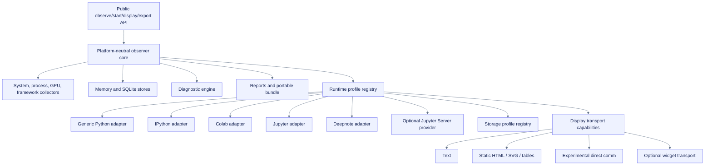

# Design: Generalize the notebook runtime observer

**Path:** `openspec/changes/generalize-notebook-runtime-observer/design.md`  
**Purpose:** Define architecture, identity migration, contracts, tradeoffs, security, validation, and rollout for the `nbops` platform-neutral core with a Colab flagship adapter.  
**Status:** Proposed

## Context

The current package already has a reusable core but exposes several Colab assumptions through runtime detection, output defaults, storage preflight, Drive/TPU collectors, diagnostics, docs, and UI transport. The design must preserve the validated Colab product while ensuring future platforms do not inherit false assumptions or misleading scope.

A Python package running inside a notebook kernel can directly observe its process, descendants, and operating-system evidence visible from that runtime. It cannot assume ownership of the notebook document, the Jupyter server, sibling kernels, workspace quotas, scheduler state, or host resources. Those require separate evidence sources and permissions.

## Design principles

1. **Scope before value:** every metric declares what it measures before displaying the number.
2. **Capabilities before platform branches:** behavior follows evidence and capabilities, not a monolithic provider enum.
3. **Generic core, thin adapters:** adapters describe environment behavior and evidence; they do not own lifecycle, stores, exports, or diagnostic execution.
4. **Static first:** text and semantic script-free HTML/SVG/table output are the universal correctness baseline.
5. **Evidence-gated support:** support labels are release claims backed by runtime artifacts.
6. **No mutation by detection:** profiling performs no mounts, installs, API calls, server changes, or device mutations.
7. **Additive migration:** existing API, run databases, reports, and bundles remain readable.
8. **Colab-first product strategy:** architecture broadens before positioning does.

## Alternatives considered

| Option | Pros | Cons | Decision |
|---|---|---|---|
| Keep all Colab-specific | Sharp scope, least immediate refactor | Coupling spreads; later platforms become forks; generic behavior remains under-described | Reject as long-term architecture |
| Adopt `nbops` before first publication and generalize behind it | Canonical identity matches architecture; lowest migration cost | Requires controlled local package/import/artifact migration | **Selected** |
| `nbops` core with Colab flagship adapter | Reuses current work, preserves positioning, supports evidence-gated expansion | Requires careful scope/profile and migration model | **Selected** |
| Separate packages per platform | Simple local logic | Duplicated releases, docs, bugs, schemas, and support | Reject |
| Server-extension-first Jupyter product | Strong server-wide evidence | Requires installation/auth/admin rights; incompatible with many hosted notebooks | Defer as optional integration |
| Generic third-party adapter plugin API | Ecosystem extensibility | Premature security, compatibility, and support burden | Out of scope |

## Target architecture



## Boundary model

```text
Core owns:
- lifecycle and idempotency
- sampling, queues, lag, and loss
- observation/event/finding schemas
- stores and queries
- diagnostic rule engine
- export and report integrity
- static/text display model
- redaction and privacy defaults

Adapters may contribute:
- bounded detection evidence
- provider/frontend/kernel identifiers
- execution/resource/limit scope
- storage locations and advisory policy
- display/download capabilities
- platform-specific collectors
- platform-specific diagnostics and copy
- support evidence identifiers

Adapters must not:
- install packages or enable extensions
- mount storage or call account APIs
- start public services
- alter notebook lifecycle
- bypass runtime limits
- change device allocation
- own core persistence or export behavior
- emit raw secrets or unbounded provider output
```

## Runtime profile model

A single `platform="colab"` field is insufficient because one environment can combine:

- a hosted provider;
- a Jupyter-compatible frontend;
- an IPython kernel;
- a container-visible resource boundary;
- cgroup-derived limits;
- object-backed and ephemeral storage;
- static HTML plus provider-specific transports.

The profile is therefore faceted and versioned.

```text
RuntimeProfile
├── schema_version
├── provider
│   ├── id
│   ├── version/release evidence
│   ├── confidence
│   └── evidence keys
├── frontend
│   ├── id
│   ├── capabilities
│   └── confidence
├── kernel
│   ├── language
│   ├── implementation
│   └── version
├── scope
│   ├── execution_scope
│   ├── resource_scope
│   ├── limit_source
│   └── limitations
├── storage_locations[]
│   ├── path role
│   ├── storage class
│   ├── persistence expectation
│   ├── throughput posture
│   └── confidence
├── display_transports[]
├── support_tier
├── evidence[]
├── conflicts[]
└── generated_at
```

### Facet vocabulary

| Facet | Initial values | Notes |
|---|---|---|
| Provider | `generic`, `colab`, `deepnote`, `jupyterhub`, `unknown` | Provider and frontend are separate. |
| Frontend | `terminal`, `ipython`, `jupyterlab`, `notebook`, `colab`, `deepnote`, `vscode`, `unknown` | Detection may remain unverified without frontend evidence. |
| Execution scope | `python-process`, `process-tree`, `kernel`, `container`, `server`, `host`, `unknown` | Multiple scopes can coexist per metric family. |
| Resource scope | `self`, `process-tree`, `container-visible`, `server-visible`, `host-visible`, `unknown` | Never infer host scope from `/proc` alone. |
| Limit source | `cgroup`, `rlimit`, `platform`, `server`, `environment`, `unknown` | Absence of a limit is not evidence of unlimited capacity. |
| Storage class | `ephemeral-local`, `persistent-local`, `mounted-cloud`, `object-backed-workspace`, `unknown` | Advice is capability-based. |
| Transport | `text`, `static-html`, `svg`, `table`, `csv`, `direct-comm`, `widget`, `download` | Support can vary independently. |
| Support tier | `validated`, `preview`, `experimental`, `unverified`, `unsupported` | Separate from product priority. |

## Evidence merge and conflict rules

Adapters return evidence claims rather than mutating a shared profile directly.

```text
ProfileEvidence
- adapter_id
- facet
- claimed_value
- confidence
- source_type
- source_key or bounded description
- observed_at
- limitations
- sensitivity
```

Merge policy:

1. Explicit user configuration wins only for requested behavior, not for fabricated measurement scope.
2. Strong, direct runtime evidence outranks heuristic environment-variable evidence.
3. Platform-specific evidence outranks generic fallback for the same facet when confidence is higher.
4. Conflicting high-confidence claims are retained as conflicts; the profile does not silently choose.
5. Unknown remains unknown when no evidence meets the threshold.
6. Raw values that may contain account, workspace, host, or credential data are redacted or reduced to bounded booleans/enums.
7. Serialization is deterministic so fixtures and support bundles are comparable.

## Measurement scope

Each observation retains existing metric source and quality and gains or derives:

- `execution_scope`
- `resource_scope`
- `limit_source`
- `profile_id` or profile digest
- optional `device_scope`
- limitations when evidence is estimated, partial, or provider-visible only

The system must distinguish:

- process self from process tree;
- kernel process from notebook document;
- container-visible totals from physical host totals;
- server-wide evidence from kernel-local evidence;
- quotas/limits from current usage;
- unknown limits from unlimited resources.

A profile-level default may reduce repetition in storage, but portable exports must preserve enough scope metadata to interpret each metric later.

## Adapter registry

The registry is ordered, deterministic, allowlisted, and internal for this change.

```text
RuntimeAdapter protocol
- adapter_id
- priority
- detect(context) -> bounded evidence list
- capabilities(profile) -> capability declarations
- storage_profiles(profile) -> storage location declarations
- collectors(profile, config) -> optional collector factories
- diagnostics(profile) -> diagnostic rule IDs and copy variants
- display_transports(profile) -> transport declarations
- close() -> best-effort cleanup
```

Rules:

- Adapter construction and detection failures are isolated.
- Each detector has a bounded execution budget.
- No detector imports absent heavyweight frameworks.
- No detector performs network access by default.
- The core always includes a generic Python fallback.
- IPython is a capability adapter, not proof of JupyterLab or Deepnote.
- Colab/Deepnote/Jupyter adapters can coexist when evidence supports multiple facets.
- Unknown or conflicting evidence does not crash observation.

## Platform adapters

### Generic Python

- Always available.
- Process, process-tree, operating-system, container-visible, and framework evidence only.
- Text output always; static HTML only when an IPython display capability is present.
- Local output defaults to a user-selected or current working directory, never a provider-specific path.

### IPython

- Adds rich display capability when IPython is active.
- Uses MIME representations and semantic static HTML/SVG/table output.
- Does not imply Jupyter server, notebook document, or hosted provider access.

### Google Colab

- Preserves `/content`, Drive, TPU/XLA presence, Colab warnings, and policy boundaries.
- Direct comm remains experimental and explicitly activated.
- No custom widget route that requires runtime CDN is promoted under the current invariant.
- No keepalive, anti-idle, reconnect automation, or limit bypass.

### JupyterLab / Notebook 7

- Initial support target is Python kernel plus IPython static display.
- Frontend identity is evidence-gated.
- No server-wide claims without the optional server provider.
- Validate both local single-user and at least one JupyterHub-like deployment before broad claims.

### Deepnote

- Initial target is preview/static mode.
- Detect provider with bounded local evidence only.
- Model `/tmp` as fast ephemeral staging and `/work` as persistent/object-backed workspace storage when representative evidence confirms the current platform behavior.
- Batch SQLite writes locally and copy finalized artifacts to persistent storage by explicit user action or configured output policy.
- Do not attempt to replace Deepnote’s own machine-performance view; emphasize history, diagnostics, frameworks, accessibility, and support bundles.
- Do not install/replace Jupyter components.

### Optional Jupyter Server provider

- Separate optional extra or companion module.
- Explicit install and enablement only.
- Authenticated and authorized endpoints.
- Local/server-admin controlled, no public bind by default.
- Exposes only bounded server/process/quota evidence required by the observer.
- Never exports server tokens or connection files.
- Prefer interoperation with `jupyter-resource-usage` when present rather than duplicating or conflicting with it.
- Kernel-only package remains fully useful without it.

## Storage profiles

Storage behavior is selected from capabilities, not provider names alone.

| Profile | Typical use | Default observer posture |
|---|---|---|
| Ephemeral local | Fast runtime disk, lost on restart | Primary sampling DB and temporary report generation; warn before finalization if persistence is desired. |
| Persistent local | User-controlled durable filesystem | Safe default output when available and writable. |
| Mounted cloud | Drive/NFS/FUSE-like mount | Batch writes locally; avoid high-frequency metadata churn; copy/finalize explicitly. |
| Object-backed workspace | Persistent but higher-latency/small-file-sensitive workspace | Stage DB and reports locally; publish consolidated artifacts; expose latency evidence and limitations. |
| Unknown | Unclassified path | Conservative behavior, no durability or performance promise. |

The package never mounts or migrates storage automatically. Storage recommendations are advisory and explain tradeoffs.

## Display and transport strategy

### Universal baseline

- Plain text snapshot.
- Semantic script-free HTML.
- Locally generated SVG charts.
- Equivalent summaries and data tables.
- CSV export for every charted series.
- Keyboard-readable and screen-reader-friendly structure.
- No network, public port, hosted backend, or runtime CDN.

### Enhanced transports

Enhanced transports are capability-gated and must preserve fallback parity.

| Transport | Status | Promotion gate |
|---|---|---|
| IPython static display | Baseline | Representative IPython/Jupyter smoke plus fallback tests |
| Colab direct comm | Experimental | Managed Colab lifecycle, disconnect, iframe, network, malformed-message, and accessibility evidence |
| Standard widget | Deferred/optional | Local assets, no CDN, frontend compatibility, failure/fallback evidence |
| Jupyter Server channel | Optional | Explicit authenticated extension, admin approval, security review |

No transport may start polling, reconnect, or keepalive behavior that affects notebook session lifetime.

## Diagnostics architecture

Generic rules depend only on generic metrics and scopes. Platform rules require matching profile evidence.

```text
DiagnosticCatalog
├── generic
│   ├── RAM pressure/growth
│   ├── disk pressure
│   ├── GPU idle/VRAM pressure
│   ├── sampler/queue/provider degradation
│   └── process hot spots
├── storage-profile
│   ├── ephemeral persistence risk
│   ├── mounted-cloud metadata latency
│   └── object-backed small-file/write-amplification risk
├── colab
│   ├── Drive staging guidance
│   ├── Colab runtime/environment warnings
│   └── accelerator availability limitations
├── deepnote
│   ├── `/tmp` staging/persistence warning
│   └── project hardware lifecycle limitations
└── jupyter-server
    ├── server/quota pressure
    └── sibling-kernel context, only with authorized evidence
```

Platform copy must not activate from provider name alone when the evidence required by the rule is absent.

## Support-tier model

Product priority and evidence maturity are independent.

| Dimension | Example |
|---|---|
| Product priority | Flagship, first-class target, secondary target, future candidate |
| Evidence tier | Validated, preview, experimental, unverified, unsupported |

A platform becomes `validated` only when the current release has:

- representative environment identity;
- install/import/start/display/stop/export smoke;
- unsupported-capability behavior;
- persistence and artifact integrity;
- performance/soak evidence;
- privacy/security negatives;
- static fallback and accessibility evidence appropriate to the claimed surface;
- exact version/date and known limitations.

Docs and support matrices must show both dimensions and date each claim.

## Public API and schema migration

### Preserve

- `ObserverConfig`
- `Observer`
- `observe()`
- `start_observer()`
- `stop()`
- `display()`
- `export_report()`
- `export_bundle()`
- `nbops` import path and CLI
- a temporary legacy import shim where compatibility fixtures require it
- current Colab behavior while default product directories and current docs migrate to `nbops`

### Additive candidates

```python
observer.runtime_profile
observer.capabilities
observer.support_evidence

ObserverConfig(
    runtime_profile="auto",
    output_policy="auto",
    display_transport="auto",
    platform_overrides=None,
)
```

Names above are implementation candidates, not behavior-spec requirements. The design should initially expose a read-only profile and keep adapter registration private.

### Schema evolution

- Increment run/export schema versions when profile fields become persisted.
- Readers accept legacy records without profile fields and represent them as unknown/legacy.
- New writers preserve logical run identity and existing observation semantics.
- Unknown future facets remain ignorable when safe.
- Report/bundle manifests include profile digest, support tier, and limitations.
- Golden fixtures cover old-to-new read and new-to-old failure behavior.

## Naming and package strategy

The canonical local identity is fixed as `nbops` before adapter extraction:

```text
Product / repository / distribution / import / CLI  -> nbops
Source package target                                -> src/nbops/
Flagship adapter copy                                -> nbops for Google Colab
```

This decision does not authorize remote repository mutation, registry reservation, publication, domain changes, or announcements. Those are separate evidence and approval gates.

One distribution remains the default. Optional extras may be introduced only when a real dependency boundary is demonstrated; platform-specific packages are not created.

A prior import shim is evidence-gated. It is added only when target-repository or external-usage evidence proves a compatibility obligation, and it delegates to `nbops` rather than evolving independently.

## Rollout sequence

1. Freeze existing Colab behavior and compatibility fixtures.
2. Add profile/scope models and generic fallback without changing defaults.
3. Move Colab detection/storage/diagnostics into an adapter behind compatibility tests.
4. Validate generic Python/IPython/Jupyter static behavior.
5. Add Deepnote preview evidence and storage profile.
6. Spike optional Jupyter Server evidence provider.
7. Reconcile examples, docs, support matrix, reports, and bundles.
8. Run cross-version and cross-platform release matrix.
9. Validate `nbops` identity convergence and make a separate public release/readiness decision.

## Rollback

- Keep current Colab code paths available behind a compatibility adapter until representative validation passes.
- Profile fields are additive and optional for legacy readers.
- If adapter resolution is unstable, fall back to generic Python + IPython static behavior and preserve captured conflicts.
- If a platform-specific detector causes regressions, disable only that adapter and report unavailable capability evidence.
- If migration introduces report/schema drift, retain the prior schema writer behind a temporary compatibility flag until readers and fixtures are repaired.
- Remote repository transfer and public registry publication are not part of this rollout; the local package/import/artifact migration to `nbops` is part of it.

## Validation design

Validation is layered and evidence-specific:

- Structural OpenSpec validation for the follow-on change.
- Contract/property tests for profile evidence, merge/conflict rules, scopes, storage classes, support tiers, and serialization.
- Compatibility tests proving current Colab APIs/defaults and legacy bundles remain valid.
- Generic Python and IPython no-provider tests.
- JupyterLab/Notebook 7 representative runtime smoke.
- Deepnote representative runtime/storage smoke.
- Optional Jupyter Server authentication/authorization and no-public-bind tests.
- Static display semantic/table/CSV parity across environments.
- Platform-adapter failure, timeout, cardinality, malformed-value, and privacy negative tests.
- Cross-version package/wheel tests on Python 3.11, 3.12, and 3.13.
- Observer overhead and storage behavior measured separately per environment.
- Docs support claims generated from evidence records rather than hand-maintained marketing text.

## Unresolved risks

- Managed notebook providers can change undocumented environment signals.
- Frontend identity may be impossible to prove from the kernel alone.
- JupyterHub deployments vary widely in cgroups, spawners, permissions, and server extensions.
- Deepnote support evidence requires access to a real project and current hardware/storage behavior.
- The short `nbops` brand requires a descriptive tagline and strong Colab-specific landing copy.
- Optional server integration can create maintenance and security burden disproportionate to demand.
- Support-tier drift requires dated evidence and release automation to remain trustworthy.
