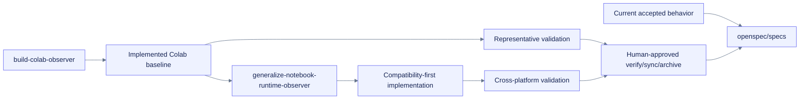

# OpenSpec accepted specs directory

**Path:** `openspec/specs/README.md`  
**Purpose:** Guardrail for accepted behavior and the dependency between the implemented Colab baseline and proposed notebook-runtime generalization.  
**Status:** Reference  
**Load/use when:** Reviewing accepted behavior, active proposed changes, implementation order, or archive/sync readiness.

`openspec/specs/` is reserved for current accepted behavior. This repository currently carries active change artifacts and must not imply that either change has been archived into accepted specs.

## Active changes

| Change | Role | Current state | Dependency rule |
|---|---|---|---|
| [`build-colab-observer`](../changes/build-colab-observer/proposal.md) | Colab-first implementation and local evidence baseline | Implemented locally, final-with-known-risks, not archived | Remains authoritative for current public API/defaults and executed evidence |
| [`generalize-notebook-runtime-observer`](../changes/generalize-notebook-runtime-observer/proposal.md) | Proposed platform-neutral core and evidence-gated adapters | Planning-ready, implementation not started | Must read and preserve the baseline before changing shared behavior |

## Source-of-truth boundary

> [!source] Evidence rule
> Proposed delta specs are not accepted behavior until implementation, validation, and a human-approved verify/sync/archive workflow are complete. Local Jupyter evidence does not automatically establish generic Jupyter, JupyterHub, Deepnote, or hosted-notebook support.
