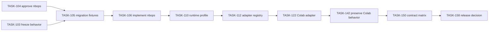

# Tasks: adopt `nbops` and generalize notebook runtime observability

**Path:** `openspec/changes/generalize-notebook-runtime-observer/tasks.md`  
**Purpose:** Dependency-aware implementation and representative-evidence plan.  
**Status:** Proposed

## Legend

- `[P]` means parallel-safe only when dependencies are complete, write scopes do not overlap, and validation is independent.
- `[x]` means the planning/research task has executed evidence in this bundle.
- External installs, runtimes, publication, deployment, Git mutation, and OpenSpec lifecycle actions remain approval-gated.

## 1. A — evidence and contracts

- [x] TASK-100-audit-current-coupling [P]
  - Goal: Audit Current Coupling
  - Depends on: none
  - Read: `openspec/changes/build-colab-observer/`, `src/`, `docs/planning/build-colab-observer/`
  - Write scope: `docs/planning/generalize-notebook-runtime-observer/context-map.md`, `docs/planning/generalize-notebook-runtime-observer/architecture.md`
  - Validation: Review path inventory and coupling table.
  - Done when: Current generic and Colab-specific surfaces are mapped with evidence.
  - Stop if: Stop for approval-gated installs, network, server enablement, external repository/registry/domain action, Git mutation, publishing, deployment, or archive/sync.

- [x] TASK-101-research-platform-boundaries [P]
  - Goal: Research Platform Boundaries
  - Depends on: none
  - Read: `official Jupyter, IPython, Deepnote, Colab, WCAG, and jupyter-resource-usage sources`
  - Write scope: `docs/planning/generalize-notebook-runtime-observer/source-registry.md`, `docs/planning/generalize-notebook-runtime-observer/research.md`
  - Validation: Review dated source registry.
  - Done when: Current platform facts, conflicts, confidence, and recheck triggers are recorded.
  - Stop if: Stop for approval-gated installs, network, server enablement, external repository/registry/domain action, Git mutation, publishing, deployment, or archive/sync.

- [x] TASK-102-write-follow-on-contracts [P]
  - Goal: Write Follow On Contracts
  - Depends on: TASK-100-audit-current-coupling, TASK-101-research-platform-boundaries
  - Read: `current OpenSpec change and planning evidence`
  - Write scope: `openspec/changes/generalize-notebook-runtime-observer/`
  - Validation: Validate spec headings, normative language, scenarios, task IDs, and JSON contracts.
  - Done when: Proposal, behavior deltas, design, task graph, risks, migration, and validation agree.
  - Stop if: Stop for approval-gated installs, network, server enablement, external repository/registry/domain action, Git mutation, publishing, deployment, or archive/sync.

- [x] TASK-103-freeze-colab-compatibility-fixtures
  - Goal: Freeze Colab Behavior and Legacy Compatibility Fixtures
  - Depends on: TASK-102-write-follow-on-contracts
  - Read: `current public API, current source/import graph, Colab defaults, run/bundle fixtures, notebook snippets, identity and migration specs`
  - Write scope: `tests/contract/`, `tests/fixtures/`, `docs/planning/generalize-notebook-runtime-observer/PLANS.md`, `docs/planning/generalize-notebook-runtime-observer/validation.md`, `docs/planning/generalize-notebook-runtime-observer/traceability-matrix.md`
  - Validation: Run focused public-behavior, Colab, notebook, legacy-artifact, and policy contract tests.
  - Done when: Supported lifecycle, defaults, reports, bundles, static fallback, policy boundaries, and Colab behavior are frozen without treating the prior package path as canonical.
  - Stop if: Stop if behavior cannot be captured without choosing an unapproved breaking change.

- [x] TASK-104-approve-nbops-canonical-identity
  - Goal: Approve nbops Canonical Identity
  - Depends on: TASK-102-write-follow-on-contracts
  - Read: `explicit user decision dated 2026-08-22`, `ADR-016`, `package-identity spec`, `naming and compatibility plans`
  - Write scope: `openspec/changes/generalize-notebook-runtime-observer/`, `docs/planning/generalize-notebook-runtime-observer/`, `CODEX_KICKOFF_PROMPT.md`
  - Validation: Run active-surface identity, OpenSpec structure, link, task, and manifest reconciliation checks.
  - Done when: The exact canonical current product, local repository, distribution, import package, CLI, source target, default artifact namespace, and current documentation identity is nbops; stable historical identifiers are explicitly provenance.
  - Stop if: Stop if the user supersedes the decision or an authoritative legal or registry conflict requires a new ADR.

- [x] TASK-105-freeze-nbops-migration-fixtures
  - Goal: Freeze nbops Identity Migration Fixtures
  - Depends on: TASK-103-freeze-colab-compatibility-fixtures, TASK-104-approve-nbops-canonical-identity
  - Read: `package-identity spec, migration plan, package metadata, current import/CLI/default/artifact behavior`
  - Write scope: `tests/contract/`, `tests/fixtures/`, `tests/security/`, `docs/planning/generalize-notebook-runtime-observer/validation.md`, `docs/planning/generalize-notebook-runtime-observer/traceability-matrix.md`
  - Validation: Run source-package, wheel metadata, import, CLI, default path, artifact identity, legacy read, and identity-drift tests.
  - Done when: Executable tests distinguish canonical nbops behavior from verified legacy compatibility and fail any mixed current identity.
  - Stop if: Stop if compatibility cannot be captured without an unapproved breaking behavior change.

- [x] TASK-106-implement-nbops-identity-migration
  - Goal: Implement nbops Identity Migration
  - Depends on: TASK-105-freeze-nbops-migration-fixtures
  - Read: `ADR-016, naming strategy, compatibility migration, package metadata, current source/import graph, snippets, examples, schemas, reports, and TASK-103/TASK-105 fixtures`
  - Write scope: `pyproject.toml`, `src/nbops/`, `the verified prior source-package path under src/ only for migration or an evidence-backed shim`, `tests/`, `notebooks/`, `examples/`, `schemas/`, `apps/docs/`, `docs/planning/generalize-notebook-runtime-observer/`
  - Validation: TASK-103/TASK-105 fixtures; clean source and wheel import; CLI smoke; stale-current-identity scan; package inspection; artifact-reader tests; notebook synchronization.
  - Done when: Current product, local repository metadata, distribution, import, CLI, source ownership, docs, snippets, defaults, schemas, and new artifacts identify nbops; Google Colab is an adapter; supported behavior and prior artifacts remain readable.
  - Stop if: Stop before remote repository mutation, registry/domain reservation, publication, network resolution, deployment, or OpenSpec apply/sync/archive without approval.

## 2. B — runtime profile foundation

- [x] TASK-110-implement-runtime-profile-models
  - Goal: Implement Runtime Profile Models
  - Depends on: TASK-106-implement-nbops-identity-migration
  - Read: `runtime-profile behavior specs and design`
  - Write scope: `src/nbops/runtime_profile.py`, `src/nbops/models.py`, `schemas/`, `src/nbops/schemas/`
  - Validation: Unit/property tests and schema validation.
  - Done when: Typed profile, facet, evidence, confidence, conflict, support-tier, scope, storage, and transport models serialize deterministically.
  - Stop if: Stop for approval-gated installs, network, server enablement, external repository/registry/domain action, Git mutation, publishing, deployment, or archive/sync.

- [x] TASK-111-implement-evidence-validation
  - Goal: Implement Evidence Validation
  - Depends on: TASK-110-implement-runtime-profile-models
  - Read: `security and runtime-profile specs`
  - Write scope: `src/nbops/runtime_profile.py`, `tests/unit/test_runtime_profile.py`
  - Validation: Negative/property tests.
  - Done when: Evidence is bounded, allowlisted, redacted, finite, timestamped, and rejects malformed or sensitive values.
  - Stop if: Stop for approval-gated installs, network, server enablement, external repository/registry/domain action, Git mutation, publishing, deployment, or archive/sync.

- [x] TASK-112-implement-adapter-registry
  - Goal: Implement Adapter Registry
  - Depends on: TASK-111-implement-evidence-validation
  - Read: `adapter and merge design`
  - Write scope: `src/nbops/adapters/`, `tests/unit/test_adapter_registry.py`
  - Validation: Registry order, timeout, cardinality, failure, and conflict tests.
  - Done when: Adapters contribute evidence and capabilities deterministically; conflicts and failures remain isolated.
  - Stop if: Stop for approval-gated installs, network, server enablement, external repository/registry/domain action, Git mutation, publishing, deployment, or archive/sync.

- [x] TASK-113-implement-support-tier-evaluator [P]
  - Goal: Implement Support Tier Evaluator
  - Depends on: TASK-110-implement-runtime-profile-models
  - Read: `support-tier requirements and validation matrix`
  - Write scope: `src/nbops/support.py`, `tests/unit/test_support_tiers.py`
  - Validation: Tier promotion/downgrade tests.
  - Done when: Support tiers are derived from named evidence gates and expose stale/blocked status.
  - Stop if: Stop for approval-gated installs, network, server enablement, external repository/registry/domain action, Git mutation, publishing, deployment, or archive/sync.

- [ ] TASK-114-persist-profile-and-scope
  - Goal: Persist Profile And Scope
  - Depends on: TASK-110-implement-runtime-profile-models
  - Read: `store/export schemas and migration plan`
  - Write scope: `src/nbops/stores/`, `src/nbops/exports/`, `schemas/`, `tests/unit/test_sqlite_store.py`, `tests/unit/test_export_queries.py`
  - Validation: Schema migration, golden read/write, and deterministic export tests.
  - Done when: Run metadata and portable artifacts retain profile/scope/version/limitations without breaking legacy reads.
  - Stop if: Stop for approval-gated installs, network, server enablement, external repository/registry/domain action, Git mutation, publishing, deployment, or archive/sync.

- [ ] TASK-115-expose-read-only-profile
  - Goal: Expose Read Only Profile
  - Depends on: TASK-112-implement-adapter-registry, TASK-114-persist-profile-and-scope
  - Read: `public API compatibility policy`
  - Write scope: `src/nbops/observer.py`, `src/nbops/api.py`, `src/nbops/__init__.py`
  - Validation: API/import compatibility tests.
  - Done when: Callers can inspect a read-only profile and capability view without changing current observer calls.
  - Stop if: Stop for approval-gated installs, network, server enablement, external repository/registry/domain action, Git mutation, publishing, deployment, or archive/sync.

## 3. C — environments, scope, and storage

- [ ] TASK-120-implement-generic-python-adapter [P]
  - Goal: Implement Generic Python Adapter
  - Depends on: TASK-112-implement-adapter-registry
  - Read: `generic fallback requirements`
  - Write scope: `src/nbops/adapters/generic_python.py`, `tests/unit/test_generic_adapter.py`
  - Validation: Unknown-provider and no-IPython tests.
  - Done when: Every runtime receives a truthful generic Python/process/container-visible baseline.
  - Stop if: Stop for approval-gated installs, network, server enablement, external repository/registry/domain action, Git mutation, publishing, deployment, or archive/sync.

- [ ] TASK-121-implement-ipython-adapter [P]
  - Goal: Implement Ipython Adapter
  - Depends on: TASK-112-implement-adapter-registry
  - Read: `IPython display evidence and static baseline`
  - Write scope: `src/nbops/adapters/ipython.py`, `tests/unit/test_ipython_adapter.py`
  - Validation: IPython present/absent/malformed tests.
  - Done when: IPython capability is detected without implying Jupyter/provider/server identity.
  - Stop if: Stop for approval-gated installs, network, server enablement, external repository/registry/domain action, Git mutation, publishing, deployment, or archive/sync.

- [ ] TASK-122-extract-colab-adapter
  - Goal: Extract Colab Adapter
  - Depends on: TASK-106-implement-nbops-identity-migration, TASK-103-freeze-colab-compatibility-fixtures, TASK-112-implement-adapter-registry
  - Read: `current Colab runtime/config/Drive/TPU/diagnostic/comm paths`
  - Write scope: `src/nbops/adapters/colab.py`, `src/nbops/collectors/`, `src/nbops/diagnostics/`, `src/nbops/ui/`
  - Validation: Full Colab compatibility fixture suite and local fail-closed harness.
  - Done when: Colab-specific behavior is adapter-owned under `nbops` while frozen Colab behavior and legacy compatibility fixtures remain green.
  - Stop if: Stop for approval-gated installs, network, server enablement, external repository/registry/domain action, Git mutation, publishing, deployment, or archive/sync.

- [ ] TASK-123-implement-measurement-scope
  - Goal: Implement Measurement Scope
  - Depends on: TASK-110-implement-runtime-profile-models, TASK-120-implement-generic-python-adapter
  - Read: `measurement-scope requirements`
  - Write scope: `src/nbops/collectors/`, `src/nbops/models.py`, `tests/unit/`
  - Validation: Scope/limit tests across process, container, unknown, and optional server evidence.
  - Done when: Metrics, summaries, reports, and exports preserve truthful scope and limit provenance.
  - Stop if: Stop for approval-gated installs, network, server enablement, external repository/registry/domain action, Git mutation, publishing, deployment, or archive/sync.

- [ ] TASK-124-implement-storage-profile-registry
  - Goal: Implement Storage Profile Registry
  - Depends on: TASK-112-implement-adapter-registry
  - Read: `storage-profile requirements and migration`
  - Write scope: `src/nbops/storage_profiles.py`, `src/nbops/config.py`, `tests/unit/test_storage_profiles.py`
  - Validation: Path, persistence, staging, alias, and preflight tests.
  - Done when: Locations are classified safely and working/artifact destinations preserve legacy output behavior.
  - Stop if: Stop for approval-gated installs, network, server enablement, external repository/registry/domain action, Git mutation, publishing, deployment, or archive/sync.

- [ ] TASK-125-implement-deepnote-preview-adapter [P]
  - Goal: Implement Deepnote Preview Adapter
  - Depends on: TASK-124-implement-storage-profile-registry, TASK-121-implement-ipython-adapter
  - Read: `Deepnote evidence plan`
  - Write scope: `src/nbops/adapters/deepnote.py`, `tests/unit/test_deepnote_adapter.py`
  - Validation: Fixture tests plus representative Deepnote runtime validation before promotion.
  - Done when: Deepnote detection and `/work`/`/tmp` guidance are bounded, read-only, preview-tier, and fail back to generic behavior.
  - Stop if: Stop for approval-gated installs, network, server enablement, external repository/registry/domain action, Git mutation, publishing, deployment, or archive/sync.

- [ ] TASK-126-implement-jupyter-profile-adapter [P]
  - Goal: Implement Jupyter Profile Adapter
  - Depends on: TASK-121-implement-ipython-adapter
  - Read: `Jupyter architecture boundary`
  - Write scope: `src/nbops/adapters/jupyter.py`, `tests/unit/test_jupyter_adapter.py`
  - Validation: Local JupyterLab/Notebook 7 fixtures and runtime smoke.
  - Done when: Jupyter frontend/kernel evidence is separate from server/provider/host claims.
  - Stop if: Stop for approval-gated installs, network, server enablement, external repository/registry/domain action, Git mutation, publishing, deployment, or archive/sync.

- [ ] TASK-127-spike-optional-server-provider
  - Goal: Spike Optional Server Provider
  - Depends on: TASK-126-implement-jupyter-profile-adapter
  - Read: `server extension boundary and security requirements`
  - Write scope: `packages/jupyter-server-provider/`, `docs/planning/generalize-notebook-runtime-observer/jupyter-server-extension-boundary.md`, `tests/integration/`
  - Validation: Authn/authz, no-public-bind, least-privilege, disable, and absence fallback tests.
  - Done when: An explicit authenticated read-only provider can supply bounded server evidence or the spike records a no-go decision.
  - Stop if: Stop for approval-gated installs, network, server enablement, external repository/registry/domain action, Git mutation, publishing, deployment, or archive/sync.

- [ ] TASK-128-generalize-platform-diagnostics
  - Goal: Generalize Platform Diagnostics
  - Depends on: TASK-123-implement-measurement-scope, TASK-124-implement-storage-profile-registry
  - Read: `diagnostics requirements and catalog`
  - Write scope: `src/nbops/diagnostics/`, `tests/unit/test_diagnostics.py`
  - Validation: Catalog fixtures across generic, Colab, Deepnote, Jupyter, stale, and conflicting profiles.
  - Done when: Platform findings activate only from required evidence and generic copy remains available.
  - Stop if: Stop for approval-gated installs, network, server enablement, external repository/registry/domain action, Git mutation, publishing, deployment, or archive/sync.

## 4. D — display and accessibility

- [ ] TASK-130-unify-semantic-dashboard-model
  - Goal: Unify Semantic Dashboard Model
  - Depends on: TASK-114-persist-profile-and-scope, TASK-123-implement-measurement-scope
  - Read: `dashboard protocol and static UI`
  - Write scope: `src/nbops/ui/`, `packages/dashboard-ui/`, `schemas/dashboard-message.schema.json`
  - Validation: Python/JSON Schema/TypeScript parity and snapshot golden tests.
  - Done when: Static and enhanced transports consume one bounded semantic snapshot containing scope/profile/support limitations.
  - Stop if: Stop for approval-gated installs, network, server enablement, external repository/registry/domain action, Git mutation, publishing, deployment, or archive/sync.

- [ ] TASK-131-regress-static-universal-baseline
  - Goal: Regress Static Universal Baseline
  - Depends on: TASK-130-unify-semantic-dashboard-model
  - Read: `static display requirements`
  - Write scope: `src/nbops/ui/dashboard.py`, `src/nbops/ui/fallback.py`, `tests/unit/test_ui_dashboard.py`
  - Validation: No-network browser, semantic, theme, reduced-motion, forced-color, and fallback tests.
  - Done when: Text/static HTML/SVG/table output remains local, script-free, accessible, and provider-neutral.
  - Stop if: Stop for approval-gated installs, network, server enablement, external repository/registry/domain action, Git mutation, publishing, deployment, or archive/sync.

- [ ] TASK-132-implement-transport-capability-registry
  - Goal: Implement Transport Capability Registry
  - Depends on: TASK-130-unify-semantic-dashboard-model, TASK-112-implement-adapter-registry
  - Read: `transport negotiation requirements`
  - Write scope: `src/nbops/ui/transports.py`, `tests/unit/test_display_transports.py`
  - Validation: Capability, selection, activation-declined, failure, and offline tests.
  - Done when: Only available and approved transports activate; failure returns to static output without affecting observation.
  - Stop if: Stop for approval-gated installs, network, server enablement, external repository/registry/domain action, Git mutation, publishing, deployment, or archive/sync.

- [ ] TASK-133-keep-colab-comm-experimental
  - Goal: Keep Colab Comm Experimental
  - Depends on: TASK-122-extract-colab-adapter, TASK-132-implement-transport-capability-registry
  - Read: `existing comm spike and support gates`
  - Write scope: `src/nbops/ui/colab_comm.py`, `tests/unit/test_colab_comm.py`
  - Validation: Mocked regressions plus representative managed-Colab lifecycle matrix.
  - Done when: Direct comm remains explicit/non-default until managed Colab evidence satisfies promotion gates.
  - Stop if: Stop for approval-gated installs, network, server enablement, external repository/registry/domain action, Git mutation, publishing, deployment, or archive/sync.

- [ ] TASK-134-validate-semantic-parity
  - Goal: Validate Semantic Parity
  - Depends on: TASK-131-regress-static-universal-baseline, TASK-132-implement-transport-capability-registry
  - Read: `accessibility and parity requirements`
  - Write scope: `tests/accessibility/`, `tests/integration/`, `scripts/run_browser_smoke.py`
  - Validation: Automated browser checks plus manual AT plan.
  - Done when: Every promoted chart has equivalent summary/table/CSV semantics and unavailable/scope labels across transports.
  - Stop if: Stop for approval-gated installs, network, server enablement, external repository/registry/domain action, Git mutation, publishing, deployment, or archive/sync.

- [ ] TASK-135-enforce-cross-platform-payload-bounds [P]
  - Goal: Enforce Cross Platform Payload Bounds
  - Depends on: TASK-130-unify-semantic-dashboard-model
  - Read: `boundedness/security requirements`
  - Write scope: `src/nbops/ui/`, `tests/security/`
  - Validation: Cardinality, size, malformed-message, injection, and recovery tests.
  - Done when: Profile evidence, histories, tables, labels, errors, and transport messages remain bounded under hostile provider input.
  - Stop if: Stop for approval-gated installs, network, server enablement, external repository/registry/domain action, Git mutation, publishing, deployment, or archive/sync.

## 5. E — migration, examples, and adoption

- [ ] TASK-140-migrate-run-and-export-schemas
  - Goal: Migrate Run And Export Schemas
  - Depends on: TASK-114-persist-profile-and-scope
  - Read: `migration requirements`
  - Write scope: `schemas/`, `src/nbops/schemas/`, `src/nbops/stores/`, `src/nbops/exports/`
  - Validation: Old/new fixture matrix and schema validation.
  - Done when: New schemas are additive/versioned, use current `nbops` identity, and preserve legacy reader behavior.
  - Stop if: Stop for approval-gated installs, network, server enablement, external repository/registry/domain action, Git mutation, publishing, deployment, or archive/sync.

- [ ] TASK-141-preserve-legacy-bundle-readers
  - Goal: Preserve Legacy Bundle Readers
  - Depends on: TASK-140-migrate-run-and-export-schemas
  - Read: `legacy bundles and reports`
  - Write scope: `src/nbops/exports/`, `tests/fixtures/legacy/`, `tests/contract/`
  - Validation: Golden legacy archive/readback tests.
  - Done when: Prior bundles/databases/reports open with unknown/legacy profile metadata and no fabricated values.
  - Stop if: Stop for approval-gated installs, network, server enablement, external repository/registry/domain action, Git mutation, publishing, deployment, or archive/sync.

- [ ] TASK-142-preserve-colab-behavior-and-legacy-compatibility
  - Goal: Preserve Colab Behavior and Bounded Legacy Compatibility
  - Depends on: TASK-106-implement-nbops-identity-migration, TASK-115-expose-read-only-profile, TASK-122-extract-colab-adapter, TASK-124-implement-storage-profile-registry
  - Read: `canonical nbops API, verified migration fixtures, Colab defaults, notebook snippets, and legacy artifacts`
  - Write scope: `src/nbops/`, `src/colab_observer/ (legacy shim only)`, `notebooks/`, `examples/`, `tests/contract/`
  - Validation: Three-cell `nbops` snippet, legacy fixture, clean wheel, API signature, output-default, and identity-drift tests.
  - Done when: Current nbops Colab notebooks retain supported defaults and lifecycle behavior; any verified temporary legacy shim delegates to nbops and has removal criteria; new profile behavior remains optional.
  - Stop if: Stop for approval-gated installs, network, server enablement, external repository/registry/domain action, Git mutation, publishing, deployment, or archive/sync.

- [ ] TASK-143-add-platform-evidence-examples [P]
  - Goal: Add Platform Evidence Examples
  - Depends on: TASK-125-implement-deepnote-preview-adapter, TASK-126-implement-jupyter-profile-adapter, TASK-142-preserve-colab-behavior-and-legacy-compatibility
  - Read: `support matrix and shared snippets`
  - Write scope: `examples/`, `notebooks/`
  - Validation: Notebook/example source sync and supported-runtime smoke tests.
  - Done when: Examples use `nbops` and demonstrate generic, Jupyter, Deepnote preview, Colab, degraded, and scope behavior without unsupported claims.
  - Stop if: Stop for approval-gated installs, network, server enablement, external repository/registry/domain action, Git mutation, publishing, deployment, or archive/sync.

- [ ] TASK-144-generate-evidence-backed-support-docs
  - Goal: Generate Evidence Backed Support Docs
  - Depends on: TASK-113-implement-support-tier-evaluator, TASK-143-add-platform-evidence-examples
  - Read: `support matrix and docs plan`
  - Write scope: `apps/docs/content/docs/`, `docs/planning/generalize-notebook-runtime-observer/platform-support-matrix.md`
  - Validation: Docs contract, stale evidence, and claim-drift tests.
  - Done when: Docs labels and compatibility tables are generated or checked against support evidence records.
  - Stop if: Stop for approval-gated installs, network, server enablement, external repository/registry/domain action, Git mutation, publishing, deployment, or archive/sync.

- [ ] TASK-145-validate-nbops-public-identity-readiness
  - Goal: Validate nbops Public Identity Readiness
  - Depends on: TASK-106-implement-nbops-identity-migration, TASK-144-generate-evidence-backed-support-docs, TASK-150-run-profile-contract-matrix
  - Read: `ADR-016, package metadata, support evidence, migration plan, and current namespace, ownership, and legal-review evidence`
  - Write scope: `docs/planning/generalize-notebook-runtime-observer/naming-packaging-strategy.md`, `docs/planning/generalize-notebook-runtime-observer/decisions/`, `docs/planning/generalize-notebook-runtime-observer/validation.md`
  - Validation: Identity consistency scan, package/repository/domain evidence review, migration completeness checklist, and approval-boundary review.
  - Done when: Canonical local identity remains nbops; external registry, repository, domain, support, and trademark readiness is accepted, blocked, or deferred with evidence; no external action occurs in this task.
  - Stop if: Stop before remote repository creation or rename, registry reservation, domain action, publication, announcement, or legal conclusion without explicit approval and appropriate review.
  - Approval required: yes

- [ ] TASK-146-evaluate-optional-package-extras [P]
  - Goal: Evaluate Optional Package Extras
  - Depends on: TASK-127-spike-optional-server-provider, TASK-144-generate-evidence-backed-support-docs
  - Read: `package strategy`
  - Write scope: `pyproject.toml`, `docs/planning/generalize-notebook-runtime-observer/naming-packaging-strategy.md`
  - Validation: Build metadata and clean-install matrix.
  - Done when: Optional extras are minimal, evidence-backed, and do not split the core distribution.
  - Stop if: Stop for approval-gated installs, network, server enablement, external repository/registry/domain action, Git mutation, publishing, deployment, or archive/sync.

## 6. F — representative validation and release

- [ ] TASK-150-run-profile-contract-matrix
  - Goal: Run Profile Contract Matrix
  - Depends on: TASK-128-generalize-platform-diagnostics, TASK-135-enforce-cross-platform-payload-bounds, TASK-141-preserve-legacy-bundle-readers
  - Read: `all profile/scope/storage/support contracts`
  - Write scope: `tests/`, `validation/`
  - Validation: Hermetic full repository gate and coverage.
  - Done when: Unit, property, mutation, golden, failure, security, and compatibility gates pass.
  - Stop if: Stop for approval-gated installs, network, server enablement, external repository/registry/domain action, Git mutation, publishing, deployment, or archive/sync.

- [ ] TASK-151-run-generic-python-ipython-runtime [P]
  - Goal: Run Generic Python Ipython Runtime
  - Depends on: TASK-120-implement-generic-python-adapter, TASK-121-implement-ipython-adapter, TASK-131-regress-static-universal-baseline
  - Read: `generic and IPython runtime harnesses`
  - Write scope: `validation/generic-python/`, `validation/ipython/`
  - Validation: Clean source/wheel runtime smokes.
  - Done when: Plain Python and IPython evidence confirms fallback, static display, persistence, export, and no-network behavior.
  - Stop if: Stop for approval-gated installs, network, server enablement, external repository/registry/domain action, Git mutation, publishing, deployment, or archive/sync.

- [ ] TASK-152-run-local-jupyter-runtime [P]
  - Goal: Run Local Jupyter Runtime
  - Depends on: TASK-126-implement-jupyter-profile-adapter, TASK-134-validate-semantic-parity
  - Read: `JupyterLab and Notebook 7 harnesses`
  - Write scope: `validation/jupyter/`
  - Validation: Captured environment and clean-wheel matrix.
  - Done when: Supported Python versions and representative JupyterLab/Notebook 7 sessions pass lifecycle, scope, static UI, export, and failure tests.
  - Stop if: Stop for approval-gated installs, network, server enablement, external repository/registry/domain action, Git mutation, publishing, deployment, or archive/sync.

- [ ] TASK-153-run-managed-colab-runtime [P]
  - Goal: Run Managed Colab Runtime
  - Depends on: TASK-122-extract-colab-adapter, TASK-133-keep-colab-comm-experimental, TASK-142-preserve-colab-behavior-and-legacy-compatibility
  - Read: `managed Colab harness`
  - Write scope: `validation/colab/`
  - Validation: Managed runtime evidence and overhead matrix.
  - Done when: CPU and available accelerator/Drive/comm paths are validated in real managed Colab without prohibited behavior.
  - Stop if: Stop for approval-gated installs, network, server enablement, external repository/registry/domain action, Git mutation, publishing, deployment, or archive/sync.

- [ ] TASK-154-run-deepnote-runtime [P]
  - Goal: Run Deepnote Runtime
  - Depends on: TASK-125-implement-deepnote-preview-adapter, TASK-134-validate-semantic-parity, TASK-143-add-platform-evidence-examples
  - Read: `Deepnote harness`
  - Write scope: `validation/deepnote/`
  - Validation: Representative Deepnote evidence pack.
  - Done when: A real Deepnote project validates static display, profile evidence, `/tmp` working behavior, `/work` finalization, export, and failure states.
  - Stop if: Stop for approval-gated installs, network, server enablement, external repository/registry/domain action, Git mutation, publishing, deployment, or archive/sync.

- [ ] TASK-155-run-jupyterhub-server-boundary [P]
  - Goal: Run Jupyterhub Server Boundary
  - Depends on: TASK-127-spike-optional-server-provider, TASK-152-run-local-jupyter-runtime
  - Read: `JupyterHub/server provider harness`
  - Write scope: `validation/jupyterhub/`
  - Validation: Representative deployment evidence or explicit no-go result.
  - Done when: Kernel-only behavior is truthful and any optional server provider passes authn/authz and scope tests.
  - Stop if: Stop for approval-gated installs, network, server enablement, external repository/registry/domain action, Git mutation, publishing, deployment, or archive/sync.

- [ ] TASK-156-run-security-privacy-negative-matrix
  - Goal: Run Security Privacy Negative Matrix
  - Depends on: TASK-150-run-profile-contract-matrix
  - Read: `security requirements and prior negative suites`
  - Write scope: `tests/security/`, `validation/security/`
  - Validation: Security negative matrix and archive audit.
  - Done when: Detection, adapters, storage, transports, server integration, artifacts, and docs preserve privacy and prohibited-behavior boundaries.
  - Stop if: Stop for approval-gated installs, network, server enablement, external repository/registry/domain action, Git mutation, publishing, deployment, or archive/sync.

- [ ] TASK-157-run-cross-platform-performance-matrix
  - Goal: Run Cross Platform Performance Matrix
  - Depends on: TASK-151-run-generic-python-ipython-runtime, TASK-152-run-local-jupyter-runtime, TASK-153-run-managed-colab-runtime, TASK-154-run-deepnote-runtime
  - Read: `performance plan`
  - Write scope: `validation/performance/`
  - Validation: Per-environment benchmark/soak artifacts.
  - Done when: Observer-on/off overhead, lag, memory, persistence, and export behavior are measured per platform without borrowing thresholds.
  - Stop if: Stop for approval-gated installs, network, server enablement, external repository/registry/domain action, Git mutation, publishing, deployment, or archive/sync.

- [ ] TASK-158-make-generalization-release-decision
  - Goal: Make Generalization Release Decision
  - Depends on: TASK-144-generate-evidence-backed-support-docs, TASK-150-run-profile-contract-matrix, TASK-156-run-security-privacy-negative-matrix, TASK-157-run-cross-platform-performance-matrix
  - Read: `all evidence, risks, and `nbops` public-identity readiness gate`
  - Write scope: `docs/planning/generalize-notebook-runtime-observer/finalization-report.md`, `docs/planning/generalize-notebook-runtime-observer/PLANS.md`, `openspec/changes/generalize-notebook-runtime-observer/tasks.md`
  - Validation: Final reconciliation, artifact audit, and human review.
  - Done when: Every task is complete, evidence-blocked, or deferred; support tiers and release/naming decisions are truthful; no publish/archive action occurs without approval.
  - Stop if: Stop for approval-gated installs, network, server enablement, external repository/registry/domain action, Git mutation, publishing, deployment, or archive/sync.

## Dependency spine

The complete machine task graph is `docs/planning/generalize-notebook-runtime-observer/task-graph.json`.
